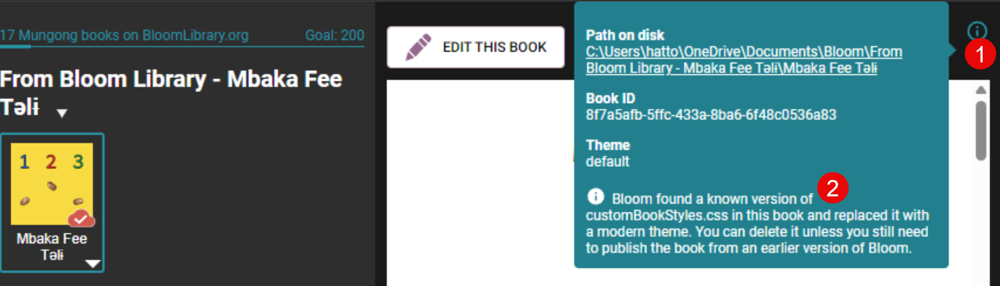
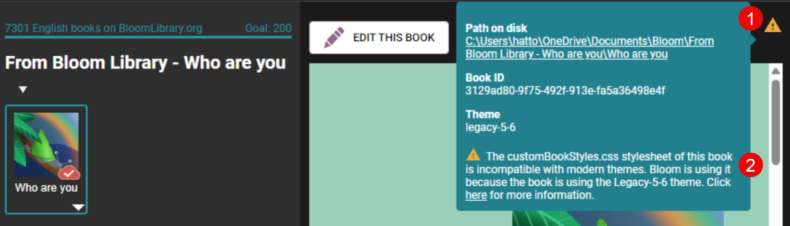
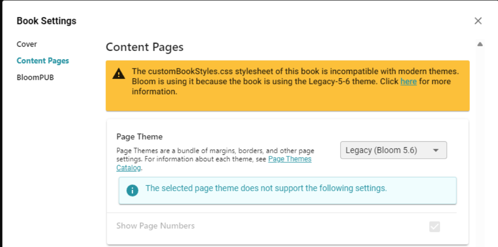
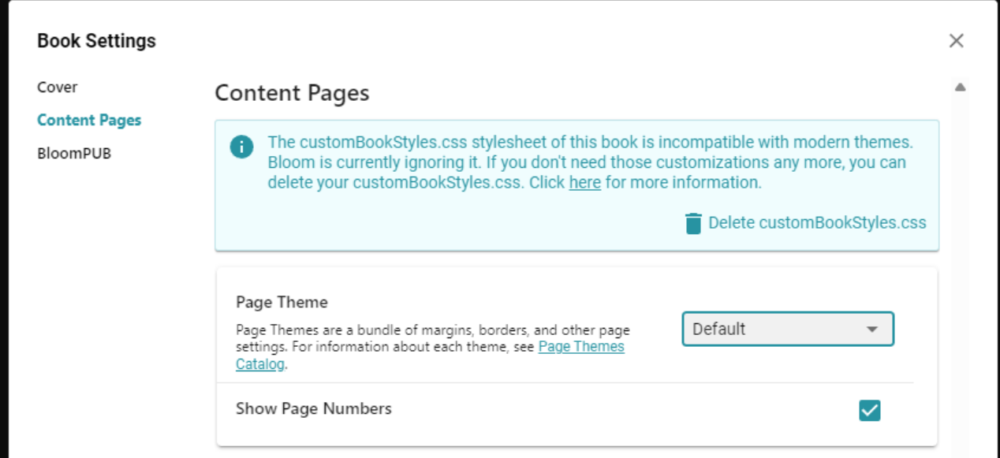

Bloom strives to  maintain a user-friendly page setup with sensible defaults and an intuitive interface for modifications. However, publishers may occasionally require more flexibility. For this, they can leverage the web's stylesheet language "CSS" to overwrite various Bloom page layout rules. Prior to Bloom 6.0, writing margin-related rules was rather challenging. From Bloom 6.0 onward, we have implemented a more straightforward, [simplified margin-setting system](https://www.notion.so/hattonjohn/Create-Appearance-compatible-custom-CSS-and-Themes-7353715969514043badcce3174a809e7). Please note that the old custom rules are not compatible with this new system.

If Bloom 6.0 detects a `customBookStyles.css` file with incompatible rules, it will first see if the Bloom developers have created a migration for that particular file. This will be the case for a handful of the most frequently encountered files. In the following example, clicking on the little “info” icon (1) brings up information about the book.

If Bloom is unable to automatically migrate the book, it will set the book’s Page Theme to “Legacy 5.6”. This theme necessitates disabling many of the Book Settings controls.

In the Edit Tab, the Book Settings dialog will show:

If you choose to switch to a different theme, Bloom will then start ignoring the incompatible `customBookStyles.css` file and show this message:

You will get a similar message, but not offering a Delete button, if your collection has an incompatible `customCollectionStyles.css` . We left out the “Delete” button in this case because you shouldn’t delete `customCollectionStyles.css` until you have switched _every_ book in your collection to a modern theme and are happy with the results.

### Reasons to Avoid Deleting customBookStyles.css {#d4b348faf14b4f37acc838a2ab63b2aa}

There may be circumstances where you wish to integrate your book into the new theme system, yet maintain non-standard margins or similar attributes. By modifying your `customBookStyles.css`, you can substitute the incompatible rules with corresponding ones that utilize [the new CSS variables](/appearance-system-css).

Your `customBookStyles.css` might perform functions beyond margin settings that are incompatible with Bloom 6.0. For instance, it could establish padding on a certain paragraph style, apply a fancy border unachievable with our Text Box Properties, or insert a background image behind specific text blocks. In this scenario, you might want to eliminate incompatible rules while preserving the rest

You may also want to keep an incompatible `customBookStyles.css` temporarily because you or others on your team still want to work on the book using Bloom 5.6 or even because you want to upload it to Bloom Library where it might be downloaded by people still using 5.6.

