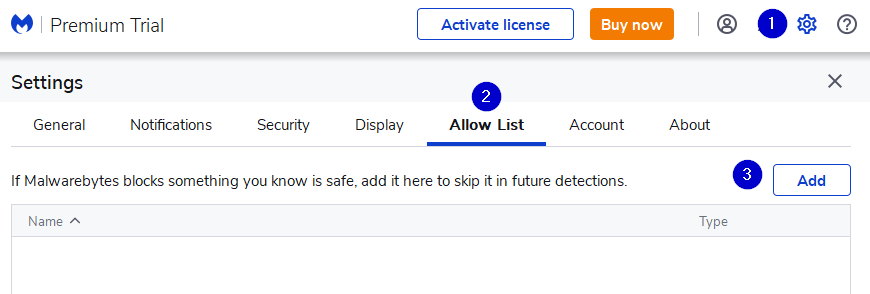
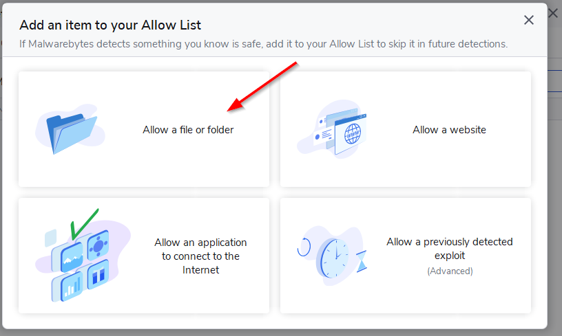

# Malwarebytes {#132f167740c94d7fa955a802fd0a9ae3}

To begin, do the following three steps:

1. Click on the **gear icon** to go to program settings.
2. Click on the **Allow List** tab
3. Click the **Add** button

Next, choose “Allow a file or folder”:

Next, choose “Select a folder” and navigate to the Bloom folder under \AppData\Local\.

Click Done.

If you also use Bloom Beta, then you will need to repeat the process to add the Bloom Beta folder as well. 

In the end, your **Allow List** should now look like this:

