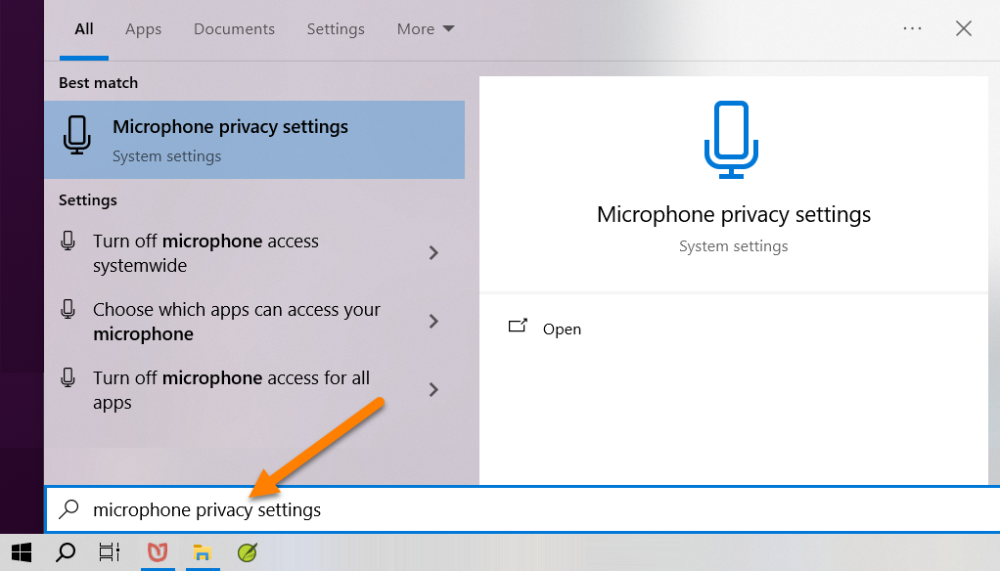
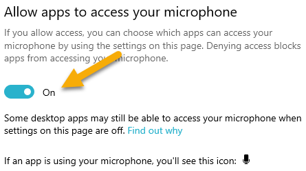
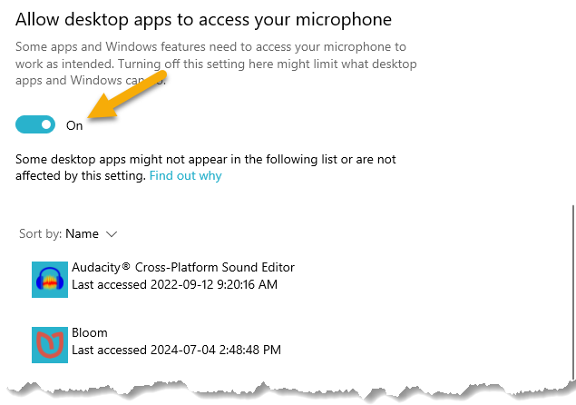

To record audio using Bloom’s [Talking Books Index](/talking-books), you may need to change the privacy settings for your microphone.

To do so, please:

1. Go to the **Windows search bar** (or press the **Windows Key**).
2. In the Windows search bar, type “**Microphone Privacy Settings**” and then press **Enter**:

	

3. After the Windows Settings dialog opens, ensure the slider to **Allow app to access your microphone** is on:

	

4. Scroll further down in the dialog and ensure the slider to **Allow desktop apps to access your microphone** is also on.

