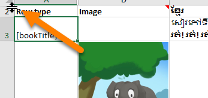
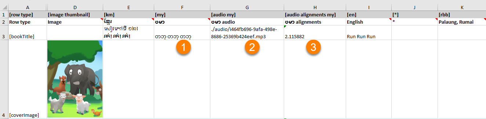

:::caution

These notes outline the process for correcting a book that has been uploaded to the Bloom Library with the incorrect language code. 

This process is intended for the Bloom Librarian or for a highly experienced Bloom support person with Bloom Enterprise status.

Be sure to use the latest version of Bloom Beta.

:::

Sometimes, a Bloom book is uploaded with incorrect language codes. 

For example, a book in Palaung, Rumai (code “rbb”), is uploaded to Bloom Library, but it was incorrectly tagged as **Burmese** (language code “**my**”).

The following procedure will correct the book's language code.

# Step 1: Download the Book for direct editing  {#be5792fd22eb41318b4fff02992db3b7}

When you sign in to Bloom Library with an account authorized to directly edit a book, Bloom Library will grant you access to directly edit the book.

# Step 2: Change the main language settings to the correct language code {#20f4bb19df12805eac78f5037173db73}

# Step 3: Verify Book Settings {#20f4bb19df1280e1962ff2ea76f3f13d}

In particular, 

- **Content Pages &gt; Languages to show in normal text boxes must** be set to the main language and the incorrect language must be deselected.
- **Cover &gt; Front Cover** should show only the main language.

# Step 4: Export the book to a spreadsheet {#7c22772d905f4513b3bf610a21f8b2fb}

Select the book, and right-click to access the **`Export to Spreadsheet…`** function. 

:::note

This operation requires a Bloom Enterprise subscription.

:::

# Step 5: Unhide row 1 {#49832cb981ed476991eafffe8e72f11d}

Hover your mouse just above the number 2 until you see the symbol pointed to below:

Click and drag the mouse to pull down and reveal row 1. 

# Step 6: Find the columns incorrectly tagged {#4cda02613acc40cbacbc889f7b7293d4}

Potentially, there are three: 

1. a column for the **text**;
2. a column for the **audio**
3. a column for the **audio alignments**

For example;

# Step 7: Correct the language codes and descriptions {#9c99572a64d84f30bc519cbe0122a6f6}

Put in the correct language code and descriptions for all columns incorrectly tagged, for rows 1 and 2. 

For example, change “my” to “rbb” and “ဗမာ” to “Palaung, Rumai”:

# Step 8: Change the empty column {#afbb740ebcff4ce0805b7bcf72d439a2}

There will be an _empty_ column for the correct/target language. You should see “[blank]” in several of its cells. 

You need to re-tag this empty column to match the original _incorrect_ language tag. The reason for this is to remove all data that was previously incorrectly tagged in the book when you import the spreadsheet back into it. 

:::🚧

Deleting this column will not do the trick!

:::

# Step 9: Unhide the xmatter rows {#621524ea9046458abf15508620d9ad5d}

Scroll to the last visible row. You should see a discontinuous number. This indicates there are hidden rows. For example:

Select the last rows above and below, right-click, and choose Unhide

# Step 10: Verify the xmatter pages {#76b69a52803247748fe719e3c0f8270c}

It’s hard to predict what you’ll find here, but generally speaking, the credits and licensing should mostly appear in the [*] column, with some other data appearing in the column for whatever national language the book is written in.

# Step 11: Import the spreadsheet {#3d6fa26de1034bb4b6ec80e2fb374ab8}

Import the spreadsheet back into the same book to update it. 

:::caution

Note: a backup of the original book will be placed in: 
`C:\Users\USER NAME\AppData\Local\Temp\bloom pre-import backups`

:::

# Step 12: Verify the book {#bd247ba8e00f4b29922b0c13036424b2}

Verify each page of the book, including audio. 

# Step 13: Upload to Bloom Library {#e62c973ad60040708ecc93e6d1b5b236}

If everything went as expected, under “Text Languages” you should not see the wrong language listed, and the upload should find a match to the original book. 

