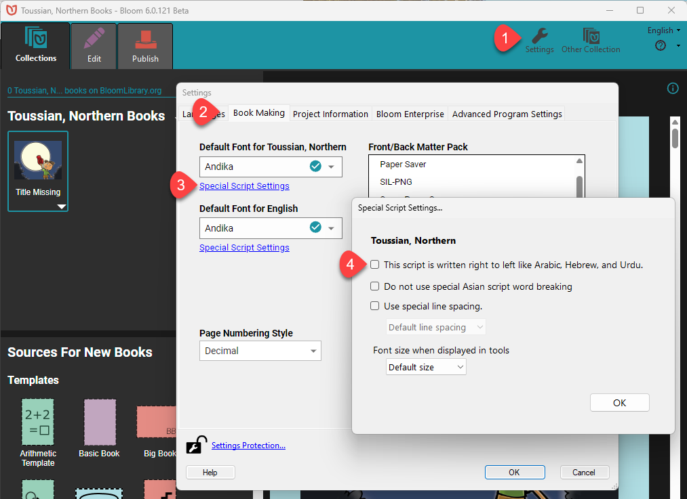

Occasionally, new users accidentally specify — in their language script settings — that their language is a “Right to Left” language. 

They are then surprised when they type sentences for that language into their Bloom book that their cursor is moving “backwards”, that is, the opposite direction from what they expect. 

Fortunately, this is an easy problem to solve:

1. Open **Settings**.
2. Click on the **Book Making** tab.
3. Click on **Special Script Settings**.
4. Untick the box that sets the script to right-to-left.

##  {#6029513e45f546bf857b20961047cb36}

