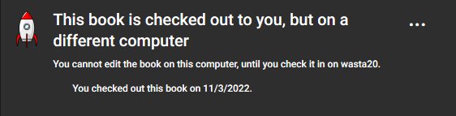
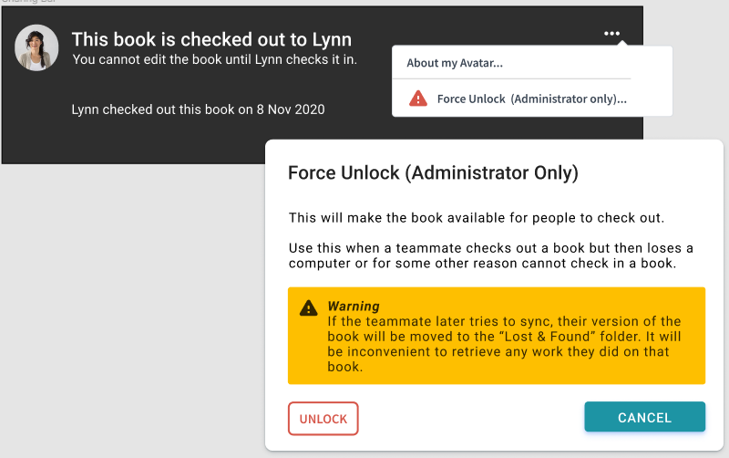
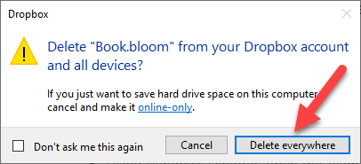

## Check-in / Check-out problems {#6f6500e490414e749a1e84d79bc6ff23}

What happens if there is a delay in synchronization such that two people both have a book checked out?

This should happen only rarely. If it does happen, Dropbox will choose one of the users as the “winner” and one as the “loser”. On the “losing” machine, Bloom will notice within a minute or so that another user is editing the same book. Bloom will send that user back to the Collection tab, and any changes made to the book on the “losing” machine will be removed. Bloom will alert the user to what happened, and why.

What happens if I connect to a Team Collection with multiple computers? 

You can join a Team Collection using multiple computers. To do this, use the same email address to register Bloom on each computer, and launch the `Join this Team Collection.joinBloomTC` file on each machine. (You’ll also need to use the same email address for Dropbox on both computers.)

Be aware that you can check out a book for editing _on only a single computer at a time._ If you have a book checked out on one computer and look at the same book on a different computer, Bloom will inform you that “This book is checked out to you, but on a different computer. You cannot edit the book on this computer, until you have checked it in on [the other computer’s name].”

What happens if someone checks out a book but then becomes unreachable for a long time, and the team wants to edit that book?

The Team Collection Administrator can use the “Force Unlock” command to make the book editable again. 

:::caution

**“Force unlocking” a book is not the same as checking the book in!** 
When the administrator force-unlocks a book, any changes made by the user who originally checked the book out will not be saved to the shared team version. Instead, that version of the book will be moved to a “Lost and Found” folder. If you want to incorporate those changes into the shared team version later, you must do so by hand.

:::

What happens when the long-lost team member comes back online?

On the long-lost team member’s computer, Bloom will notice that the shared team version no longer has a “lock file” that indicates that he or she has that book checked out for editing. It is now likely that there are diverging versions of this book. Bloom will save the force-unlocked version to a special “Lost & Found” folder in Dropbox, remove that user’s edit access, and notify him or her of what just happened. 

If your long-lost teammate has been very productive and you want to use his versions of the books, you’ll need to retrieve them from the “Lost & Found” folder. It’s best to get a Bloom expert to help you do this. If you’re a confident computer user and want to do it yourself, see [Retrieving a Book from Lost & Found](/team-collections-advanced-topics#3f4663c924424e6b93158710b7d00ea2). 

## Bloom Enterprise license problems {#63b5f85ea6c241f9ad21249c25a11143}

What happens if someone tries to join a Team Collection but does not have a Bloom Enterprise License?

Enterprise Licenses are for the project, not people. So anyone joining a Team Collection is joining a collection that already has the Enterprise license set up.

What happens if a Bloom Enterprise License expires on a Team Collection?

The collections will keep working, but they will become disconnected from each other. Without the Bloom Enterprise enabled, the books on the team members’ computers will not synchronize with each other, nor will they have a checked-in/checked-out state.

What happens to a Team Collection when an expired Bloom Enterprise license is renewed? 

Each user will have to rejoin the team collection. (This allows any edits that were done while not in enterprise mode to be properly merged.)

## Naming conflicts {#b772f1af5c9a4ff097a27c675cf52f5c}

What happens if you join a Team Collection but you already have a local collection with that name?

This has several answers.

Usually, the two collections are merged. Books that are unique to either collection are copied to the other. If a book is found in both places and they are not identical, the local version is moved to a special folder called “Lost & Found” and the Team Collection version is copied to the local folder.

If the local collection is found to be already connected to the Team Collection you are trying to join, Bloom will point this out in a message and open it normally. As a special case of this, if you have moved the Team Collection (for example, reorganizing your Dropbox, or switching from a LAN Team Collection to a Dropbox one), joining the collection in the new place will provide a way to reconnect them. (Otherwise, when Bloom can’t find the Team Collection at the old location, it will report that it is “disconnected”.)

What happens if a book has been renamed before a copied collection is merged into a team collection

Recall that if a user tries to join a Team Collection, but already has a collection with the same name as the Team Collection, Bloom will ask the user to _Join and Merge_ the local collection with the Team Collection_._ If the user agrees, Bloom will add the books in the user’s private collection to the Team Collection. 

Now, suppose that Joe got a copy of Fred’s collection. Fred’s collection isn’t a Team Collection — it’s just a regular Bloom collection. Since then, Joe has renamed _Book 1_ to _Joe’s book_, and Fred has renamed _Book 2_ to _Fred’s book_. Joe then makes his collection into a Team Collection, and invites Fred to join it. 

When Fred tries to join the Team Collection, Bloom will see that team collection has a book called _Joe’s book_, and that _Joe’s book_ has the same internal ID number as _Book 1_ in Fred’s local collection. Moreover, Bloom will see that _Book 2_ in the Team Collection has the same internal ID as _Fred’s book_ in Fred’s collection. Bloom has no way of knowing which name is right for each book, but a decision must be made, since we don’t want the resulting collection to end up with two books that have the same internal IDs.

In this situation, the Team Collection wins. Bloom will put Fred’s books _Book 1_ and _Fred’s book_ in a special Lost & Found folder, and update Fred’s local collection to have the Team Collection versions of _Joe’s book_ and _Book 2_.

What happens if two Team Collections have the same name? 

Suppose Fred is creating books in the VMU language. He creates a Team Collection called “VMU books” and shares it with his friend Joe. Joe joins Fred’s “VMU Books” team collection. 

Joe’s friend Sally is also creating books for the VMU language. Sally also creates a Team Collection called “VMU Books”, and shares it with Joe. But when Joe tries to join Sally’s collection, Bloom disables the Join button and tell Joe that he already has a collection called “VMU Books”, and it is not the same collection as the one he is trying to join. 

What to do: 

- _If Fred, Sally, and Joe want to work together, they should decide which collection they should all use._ In this case, they agreed that Sally’s collection was the best.
	- If Sally invites Fred to join her collection, he will get the same warning as Joe did, because he still has a Team Collection with the same name as Sally’s Team Collection. Fred should [remove his Team Collection](/team-collections-advanced-topics#3a6243f616134809b5b9c06e5748094f) and try again. This time Bloom will merge Fred’s local collection with Sally’s Team Collection. Sally’s collection will now contain all the books. Now that Fred’s collection is gone, Joe can join Sally’s collection.
- _If Fred and Sally do not want to work together, they should_ [_choose different names for their Team Collections_](/team-collections-advanced-topics#22fd4aa3440a47b6a7ab9ed66028ca08) _so that Joe can work with them both._

What happens if some books get the same book IDs?

Sometimes, two (or more) books are sent to the Dropbox cloud with the same book ID. It is unclear why this problem might occur, but if it does, the Team Collection administrator will need to resolve the conflict.

The administrator should follow these steps:  

Step 1:

- Using Windows Explorer, open the Team Collection folder under the Dropbox directory
- Open the **Books** folder
- Find the two (or more) **.bloom** files listed in the error report that share the same book ID.

Step 2:

You will need to determine which one of these files is the correct/good version and which ones are not. By [installing BloomPUB Viewer](/bloompub-viewer), you can view and examine these books directly to determine which ones should be deleted. 

Delete the file directly in Dropbox and choose “Delete everywhere” when prompted:

