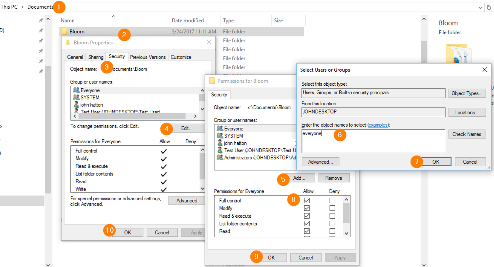

Some users regularly run into an error in which something is preventing Bloom from updating some image files. 

We are investigating this and will put more information here as we learn more. 

Starting with Bloom 5.5, if you get this error, you will be directed to this page for more information.

# Likely Cause {#46e0ea3a084b4ddc95879747bd5c0b6b}

Our leading theory is that these users have some non-Microsoft anti-virus program installed that is aggressively preventing Bloom from working with its own files, particularly .png files (these files are known to be able to carry viruses).

For now, if you run into this problem, please help us learn:

1. If the problem comes and goes, or if it is constant.
2. If you are using an extra antivirus program (beyond the built-in Windows Defender), try telling your antivirus to exclude Bloom. This is called “whitelisting”. For help with this, please refer to [this article](/antivirus-general). If you do not feel comfortable doing that, try temporarily disabling your antivirus.

Let us know if that helps so that we can spread the word to other people.

# Alternate Causes {#7c378e811d6e4b09aeb268125f35f44f}

If you are _not_ using a non-Microsoft anti-virus program and you are encountering this problem, then there are a number of less-likely, yet possible, causes:

## User access settings for Bloom folders {#b97095661c35449cb5309eb6f6d22274}

About once a year, we work with someone whose Windows computer won’t let Bloom access its own files. We don’t know what causes that, but here’s how to fix it:

1. Locate your Bloom folder. Normally this folder is Documents/Bloom.
2. Right click on the folder and choose “Properties”.
3. Click on the “Security” tab.
4. Click Edit.
5. Click Add.
6. Type _everyone_.
7. Click OK.
8. Next to “Full Control”, tick the box next in the “Allow” column.
9. Click OK.
10. Click OK.

## Interference from a backup program {#e95f6a7b22304626878a8b6375b75004}

If you are using a cloud backup program, such as OneDrive, Dropbox, or Google Drive, then it is possible that there could be a very brief disruption when Bloom is trying to access some particular files. If this happens, the problem should resolve itself almost immediately.

