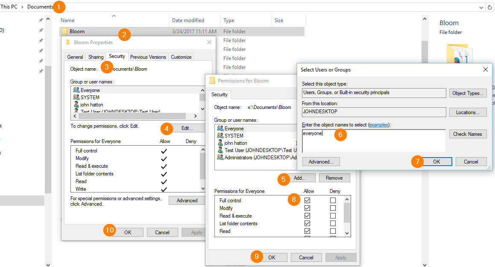

Occasionally someone working in an environment with network administartors and such will find that Bloom is not allowed to access its own files. 

See also:

[Unblock Bloom from Windows Controlled Folder Access](/windows-controlled-folder-access)

We don’t know what causes that, but this fix has sometimes been helpful:

1. Locate your Bloom folder. Normally this folder is Documents/Bloom.
2. Right click on the folder and choose “Properties”.
3. Click on the “Security” tab.
4. Click Edit.
5. Click Add.
6. Type _everyone_.
7. Click OK.
8. Next to “Full Control”, tick the box next in the “Allow” column.
9. Click OK.
10. Click OK.

