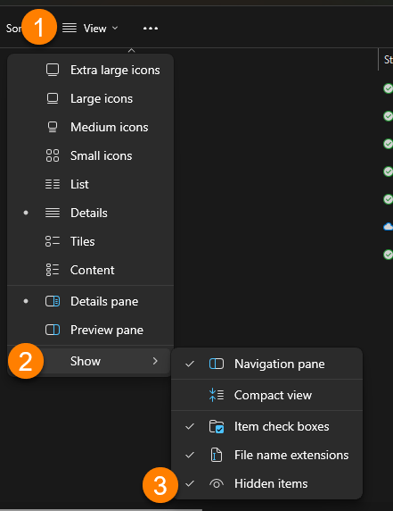
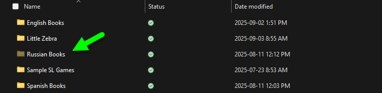
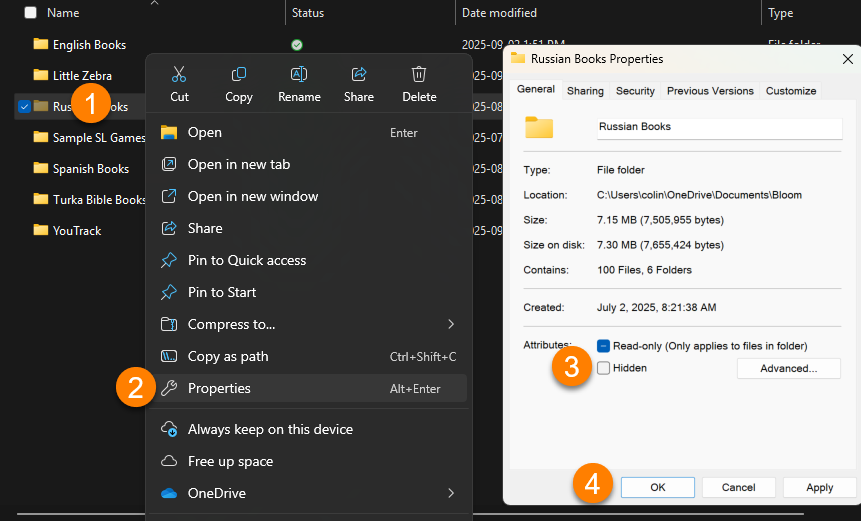
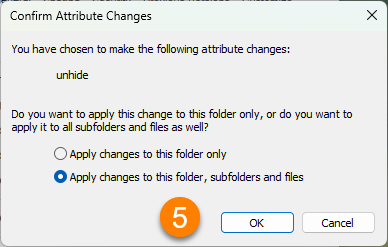

Occasionally someone working in an environment with network administartors and such will find that Bloom is not allowed to access its own files. 

See also:

[Unblock Bloom from Windows Controlled Folder Access](/windows-controlled-folder-access)

We don’t know what causes that, but this fix has sometimes been helpful:

1. Locate your Bloom folder. Normally this folder is Documents/Bloom.
2. Right click on the folder and choose “Properties”.
3. Click on the “Security” tab.
4. Click Edit.
5. Click Add.
6. Type _everyone_.
7. Click OK.
8. Next to “Full Control”, tick the box next in the “Allow” column.
9. Click OK.
10. Click OK.

## Hidden Folders {#2634bb19df1280aaae56f8ab31097086}

Bloom requires all of its files and folders **not to be** **Hidden**.

If you open Windows File Explorer and you do not see a folder called Bloom, then that folder is likely hidden. Or, if you do see the Bloom folder, but you do not see your book collection folder, then it is likely hidden.

To see Hidden folders, you first must show Hidden items in Windows File Explorer:

1. In Windows File Explorer, click **View**.
2. Click **Show**.
3. Click **Hidden items**.

Hidden folders will now appear for that folder and all of its subfolders. 

:::note

Hidden folders will have a slightly faded color as in this example:

:::

To make a Hidden folder visible to Bloom: 

1. Right-click on the folder.
2. An options dialog will appear. Click **Properties**.
3. A Properties dialog will appear. Untick the box **Hidden**.
4. Click **OK**.
5. A “Confirm Attribute Changes” dialog will appear. Click **OK**.

After fixing a Hidden folder problem, relaunch Bloom. The file permissions problem should be fixed.  

