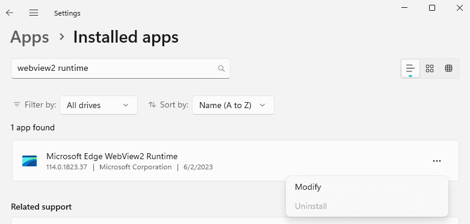

See also: [Installing & Updating WebView2](/webview2) 

Bloom’s user interface is powered by the same browser engine as Microsoft Edge, which is named “WebView2”. If WebView2 were to get damaged in some way, Bloom would not be able to run.  It would direct you to this web page.

If this happens to you, here are some things to try:

## 1) Restart your computer {#78df2d52ce074ef5950792bee1ed9a92}

 We have seen a case where a “zombie” Bloom is running with different WebView2 arguments.

## 2) Delete a folder from temp {#9fae8c7bb27344ee8b8f13f9c2d927a3}

:::tip

Please get in contact with us ([issues@bloomlibrary.org](mailto:issues@bloomlibrary.org)) if you get this far in your troubleshooting. Even if the following instructions work for you, we need to know that this is actually happening to someone!

:::

In File Explorer, navigate to you temp director and delete “Bloom WebView2”:

Delete the contents of that folder. Now run Bloom again.

## 3) Repair WebView2 {#99638cbf03324e9580368a5cd90c4e31}

Click `Modify`, then `Repair`:

## 4) Update Edge {#983e2fdbe56c4746b0bd50e887e42999}

Try [updating Microsoft Edge](/webview2).

## 5) Tell Bloom to use Edge instead {#f275483d6cd94e20a669424e17cc7b61}

:::tip

Please get in contact with us ([issues@bloomlibrary.org](mailto:issues@bloomlibrary.org)) if you get this far. Even if the following instructions work for you, we need to know that this is actually happening to someone!

:::

We have seen a situation where the above does not fix the problem, and have prepared a “nuclear option”: tell Bloom to use the WebView2 that comes with Microsoft Edge. 

First, run Edge and make sure its version is at least that of Bloom’s minimum WebView2 Version (which is 112 as of the time of this writing):

If Edge’s version is too low, update it.

Now you are ready to tell Bloom to use Edge directly.

:::caution

The following has only been tested successfully with Windows 11. For other versions, there is a more complicated approach that we can walk you through, if necessary.

:::

To do this, create an environment variable named “BloomWV2Path” and set it to “edge”:

Close these windows and run Bloom again. If this doesn’t work, or even if it does, please get in contact with us ([issues@bloomlibrary.org](mailto:issues@bloomlibrary.org)).

