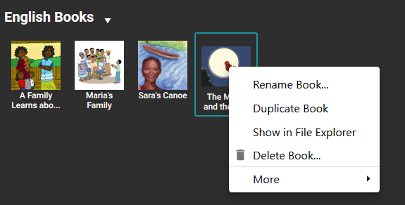
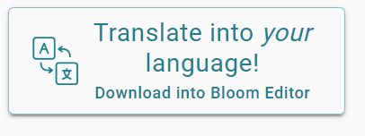
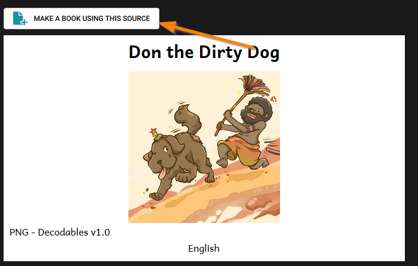
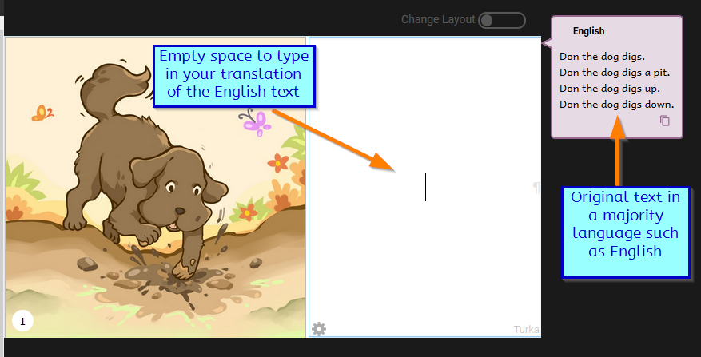

:::caution

This page is a work in progress.

:::

## Mouse: click and right-click {#0d0d7a4e94d9488996a19af18ce23db7}

One example in Bloom where a right-click is needed is when you want to Duplicate or Delete a Book. To access these commands in Bloom, you need to right-click on the book’s thumbnail. Doing so will reveal these commands (and others).

## Shell Book {#a9855df550204e1caffc0d245164ab11}

“Shell Books” (sometimes called “Shells”) are books that have been intentionally designed by their authors to be translated into other languages.

Generally, Shell Books are first made available in languages of wider communication in order to facilitate and encourage easy and simple book production in local languages. 

Most of the books uploaded to Bloom Library are “shell books” because the authors of these books have published them using Creative Commons licensing. This means they can be freely adapted or translated into other languages. 

The Bloom Editor is designed to work well with Shell Books. 

When you explore Bloom Library and you see a book that you like, there is a very high chance that you will see a button like this:

This button means this is a Shell Book and can be translated into your language. 

When you click on this button, the shell book will be downloaded into the Bloom Editor. Once it is downloaded, you can choose to make a new book from that shell book by clicking the button “MAKE A BOOK USING THIS SOURCE”:

On each page of this shell book, you will see the original text in some majority language (the example below has English), as well as an empty space for you to type in your translation:

