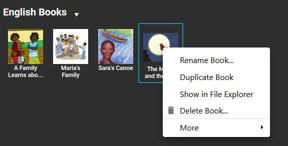
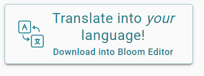
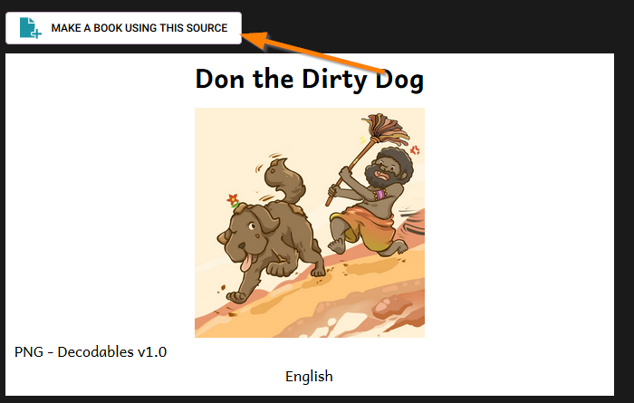
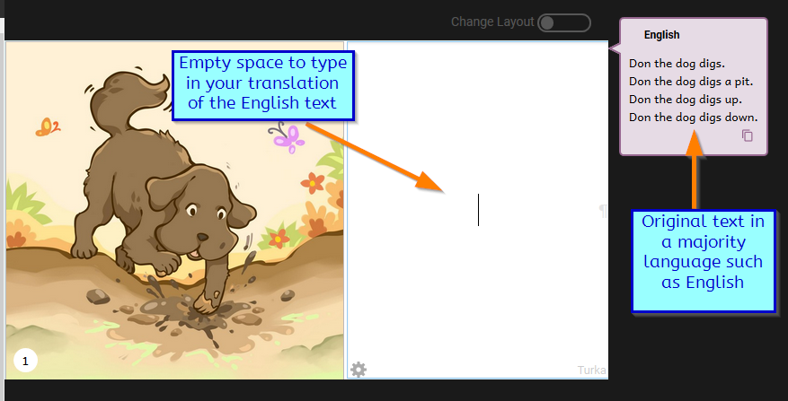
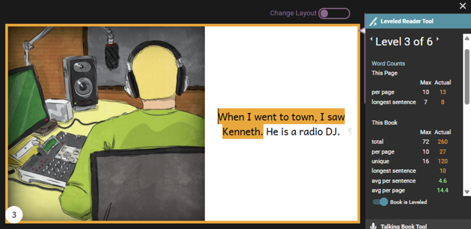

:::caution

This page is a work in progress.

:::

## Mouse: click and right-click {#0d0d7a4e94d9488996a19af18ce23db7}

One example in Bloom where a right-click is needed is when you want to Duplicate or Delete a Book. To access these commands in Bloom, you need to right-click on the book’s thumbnail. Doing so will reveal these commands (and others).

## Shell Book {#a9855df550204e1caffc0d245164ab11}

“Shell Books” (sometimes called “Shells”) are books that have been intentionally designed by their authors to be translated into other languages.

Generally, Shell Books are first made available in languages of wider communication in order to facilitate and encourage easy and simple book production in local languages. 

Most of the books uploaded to Bloom Library are “shell books” because the authors of these books have published them using Creative Commons licensing. This means they can be freely adapted or translated into other languages. 

The Bloom Editor is designed to work well with Shell Books. 

When you explore Bloom Library and you see a book that you like, there is a very high chance that you will see a button like this:

This button means this is a Shell Book and can be translated into your language. 

When you click on this button, the shell book will be downloaded into the Bloom Editor. Once it is downloaded, you can choose to make a new book from that shell book by clicking the button “MAKE A BOOK USING THIS SOURCE”:

On each page of this shell book, you will see the original text in some majority language (the example below has English), as well as an empty space for you to type in your translation:

# Decodable Reader {#f89e2ff182c3471a9cbabefaad5fe4f6}

A **Decodable Reader** is a special kind of leveled reader. A **Decodable Reader** is a book that carefully limits the letters and words used to match what a new student reader is ready for. In Bloom terms, Decodable Readers each have a _stage_ that defines which letters and sight words are appropriate. We use the word _stage_ so we don’t confuse it with the _levels_ of _Leveled Readers._

# Leveled Reader {#32f4bb19df12800e89a9f4f3597c40d9}

A **Leveled Reader** is a book written specifically for a student at a certain stage of reading development — for example, beginner, developing, and advanced levels. Several factors determine whether a book is appropriate for a given level.

:::caution

Creating a set of leveling criteria is usually done by someone with special skills in literacy education. If you do not have a set of specially constructed leveling criteria for your language, you can try the default levels that come with Bloom. 

:::

When a local author creates a leveled book, the Leveled Reader Tool will alert the author when specific criteria are not met.  In this example, the first sentence has 8 words. It is highlighted because the longest sentence for Level 3 (set by a literacy worker for this language) is 7 words. The entire page is highlighted because the word count is 13, but Level 3 requires a maximum of 10.

# Bloom Pack {#32f4bb19df128017a878d6e6a3891d1e}

A Bloom Pack is a computer file containing multiple Shell books or Reader Templates.  The file can be shared with colleagues so they can easily access the shell books or reader templates on their computers. 

Once a colleague has installed Bloom, double-clicking a Bloom Pack file wakes Bloom up and unbundles the templates onto their computer. The next time they run Bloom, they’ll see that those templates are now available to create new books. 

# Shell Book Bloom Pack {#32f4bb19df12804e987cd60f2da2ce78}

A [Shell Book ](/glossary#a9855df550204e1caffc0d245164ab11)Bloom Pack is a file containing multiple shell books. 

When a Shell Book Bloom Pack is installed on a computer, the shell books will appear under “Sources for New Books”. With Creative Commons licensing, [Shell Books ](/glossary#a9855df550204e1caffc0d245164ab11)are designed to allow others to translate them into their language and publish them freely.

# Reader Template {#32f4bb19df1280fdb4a3d77da7c693fd}

A **Reader Template** is a book that has been pre-assigned by a literacy specialist to a specific decodable reader stage (e.g., stage 4) or a specific leveled reader level (e.g., level 6). Generally, a literacy specialist makes a series of Reader Templates and pre-assigns a variety of book settings appropriate for that particular stage or level.

Although a Reader Template is actually a Bloom book, it is called a template because it is generally empty of specific content. Instead, it provides an appropriate structure and book characteristics for a specific stage or level. For example, the font size for an early stage or level may be larger than for a later stage.

# Reader Template Bloom Pack {#32f4bb19df12802891c5f7a73c2ed890}

A **Reader Template Bloom Pack** is a file that bundles up one or more decodable or leveled [**reader templates** ](/glossary#32f4bb19df1280fdb4a3d77da7c693fd)from a Local Language Collection into a single, easy-to-share file.

When a Reader Template Bloom Pack is installed on a computer, the template books will appear under “Sources for New Books”. Each reader template will target a specific reading stage or level.

:::tip

If you give them a new version of the Bloom Pack, your new stages, levels, and vocabulary will replace the old ones.

:::

