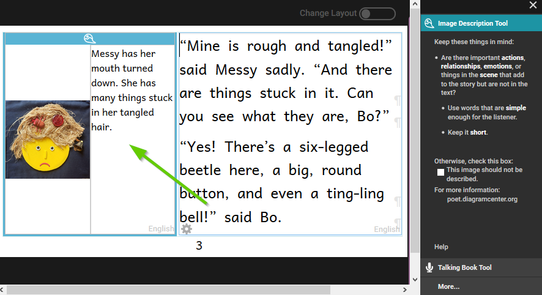
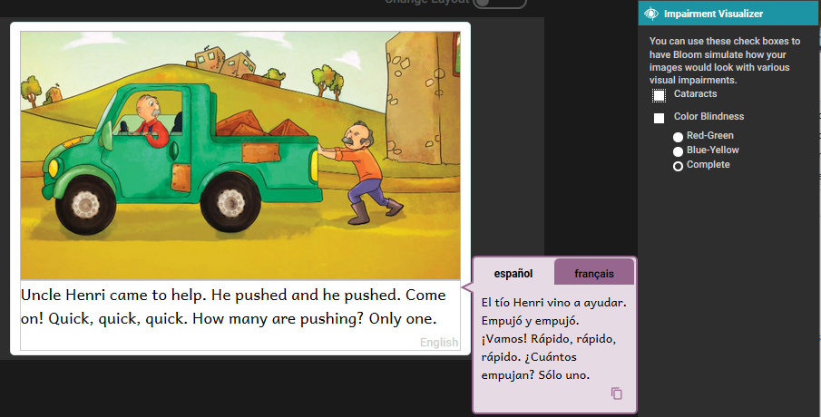
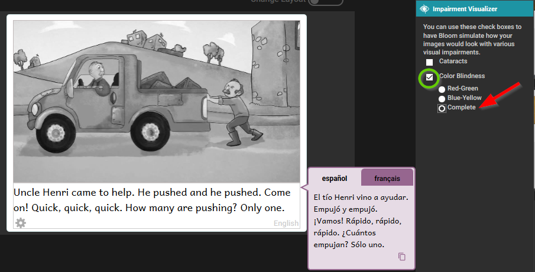
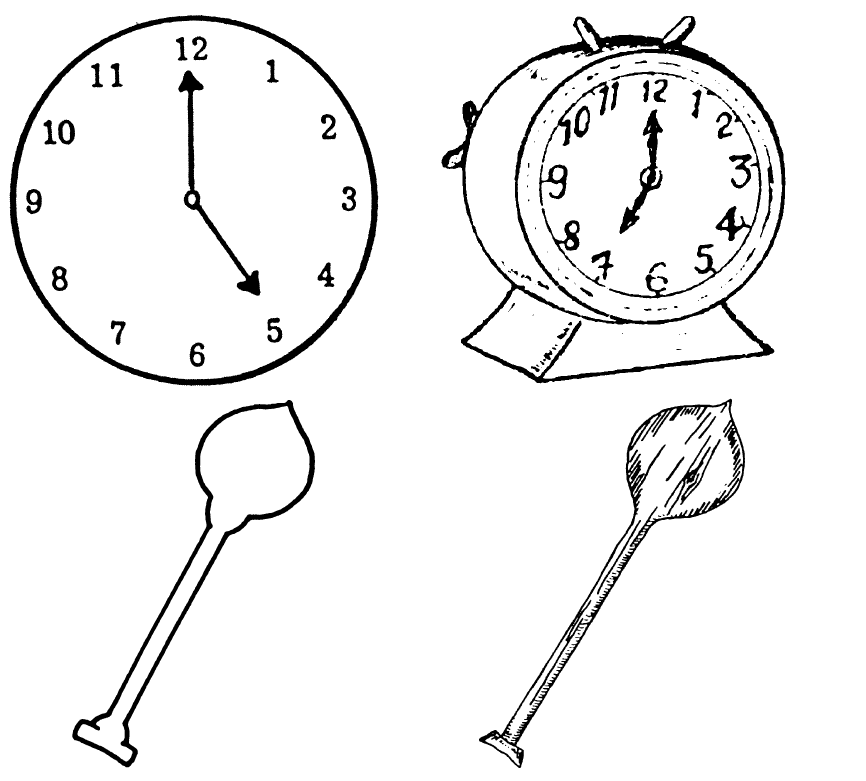
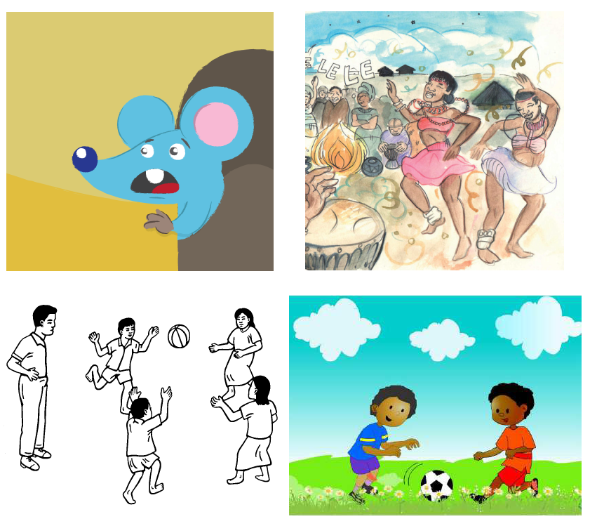

## Creating Accessible Books in Bloom

Accessible books are electronic books that have features to make their content more readily accessible or available to people with visual disabilities. Such features include audio recording of the text, descriptions of images, and text size that can be changed by the person reading the book. Bloom can help you create books with these features and that meet technical accessibility standards.

## What to expect in this module

In this training module, you will learn how to:

- Create image descriptions,
- Record audio of the text in the book and in image descriptions,
- Evaluate whether images need adjustment for visual impairment, and
- Choose images that are going to be easier to perceive

---

## Activating the Image Description Tool

In order to access the Image Description Tool, click on the menu icon at the top right of the screen. 

The toolbar will open. If the Image Description Tool is not listed at the top, click on the “More…” button at the bottom of the toolbar. 

Then activate the **Image Description Tool** by clicking in the check box.

## Create Image Descriptions

Now that the Image Description Tool is open, a space will be created next to the image for adding a text description. You may now type in the text which describes the image. If you are not familiar with how to write image descriptions, you may want to visit:
[poet.diagramcenter.org](http://poet.diagramcenter.org/). 

Once you are satisfied with the image description, you can close the Image Description Tool by clicking on the X above the Image Description Tool window. 

## Recording Audio of Text and Image Descriptions

_Learning to Use Bloom_ tells how to record audio of the text in a book. Those instructions start on page 149. The process is the same for recording the audio of image description text. To make a book accessible, you need to record all of the text as well as all of the image descriptions. Here we will show you how to record the image descriptions.
Begin by switching the active tool from the Image Description Tool to the Talking Book Tool.

If needed, use the Next and Back button to change from one text box to another. If you are recording by sentence, The Next and Back buttons will move one sentence at a time. 

---

## Recording by Sentence or by Text Box

Bloom allows you to record one sentence at a time, or to record the whole text box at one time. Some speakers find that recording the entire text box all at once will give a better recording. Others find it better to record one sentence at a time. 

You can experiment with both approaches to determine which is best for your needs.

Some Bloom users like to record themselves using other audio equipment than the microphone in their computer. They then transfer these audio files to their computer and Import them into Bloom. This imported audio must correspond to an entire text box. 

## Recording Image Descriptions by Text Box

:::tip

This section will assume you are recording your audio on your computer with the Advanced setting, “Record by whole text box”.

:::

Read aloud the highlighted text several times until you are familiar with the text. 

When you are ready to record, click on and hold down the **Speak** button and start reading the highlighted text. While you are recording, the button will turn yellow. 

When you are finished reading, release the **Speak** button and Bloom will stop recording. Now, click the Check button to review your recording. 

## Activating the Impairment Visualizer

The Impairment Visualizer is another tool for creating accessible books. Activate this tool by clicking on More... in the Tool Panel and selecting Impairment Visualizer. 
This tool allows you to select several filters that will show you what the image might look like to someone with several different kinds of visual impairment.
Using this tool, you can evaluate whether an image should be modified so that it is easier to interpret for people with these sorts of visual impairments.
Bloom does not have a tool for editing images. If an image needs to be edited, you will have to use another program to do that.

## Using the Image Visualizer

The first choice shows what the image might look like to someone with cataracts.

For color blindness, there are three possibilities. The first shows what the image might look like to someone with red-green color blindness.

The second option shows what the image might look like to someone with blue-yellow color blindness.

The third option shows what the image might look like to someone with complete color blindness.

## General considerations for choosing images

Choosing images that are appropriate for readers with low vision is a complex subject, but we can consider some general principles.

- In general, simple images are preferable.
- Graphics should be relatively large to make them easier to see.
- It is helpful for objects and key features to have a black outline.
- Black and white line drawings (such as come with the Art of Reading) serve well, but even then some have more details than others.
- If color is used, they should be colors that contrast well with one another.
- In line drawings, the lines should be thick and solid black. Use black and white images rather than grayscale.
- Photographs often have many details that can be hard to distinguish. Only use them if they are simple and not too detailed.

Now we will compare some images to provide some examples of these principles.

## Considerations for choosing images: Amount of detail

Here are some examples of images with more detail compared with images with less detail. All of these images are from the Art of Reading. It will be better to use the images with less detail.

Images with less detail on the left and more detail on the right:

Additional examples of images with less detail on the left and more detail on the right:

## Considerations for choosing images: Thick black lines

These images from the Art of Reading illustrate images that have thick, solid black lines compared to images with thinner, less distinct lines. It will be better to use images with thick, solid lines.
Images with thicker, solid lines on the left and thinner, less distinct lines on the right:

Additional images with thicker, solid lines on the left and thinner, less distinct lines on the right:

## Considerations for choosing images: Color and photos

We all like photos and color illustrations, but they are visually more complex. Below you can compare line drawings to a photo or a color illustration or a simpler color illustration to a more complex one. It will generally be better to use simpler images.

Images that are simpler on the left and more complex on the right:

Additional images that are simpler on the left and more complex on the right:

## Summary

In this training module, you learned how to:

- Gain access to accessible book tools in Bloom,
- Create image descriptions,
- Record audio of the text in the book and in image descriptions,
- Evaluate whether images need adjustment for visual impairment, and
- Choose images that are going to be easier to perceive.
