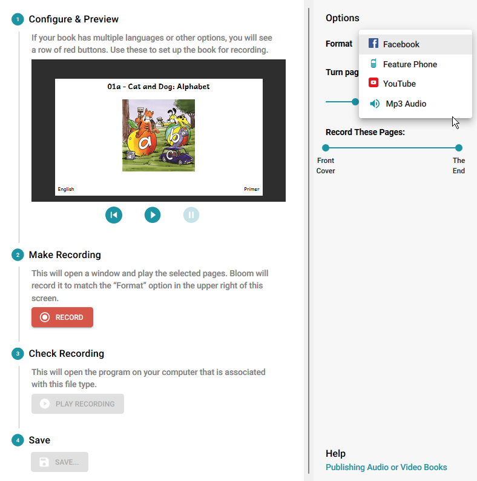
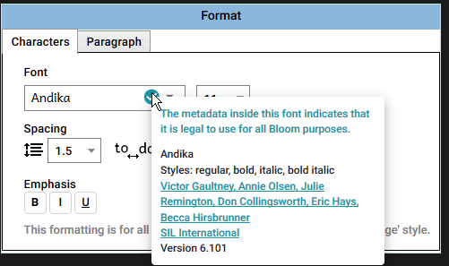
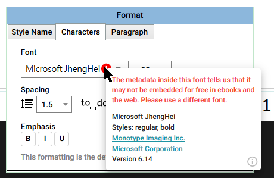
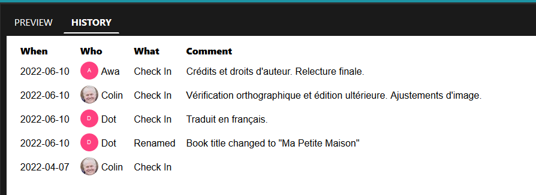
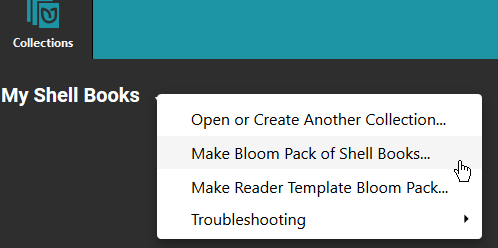
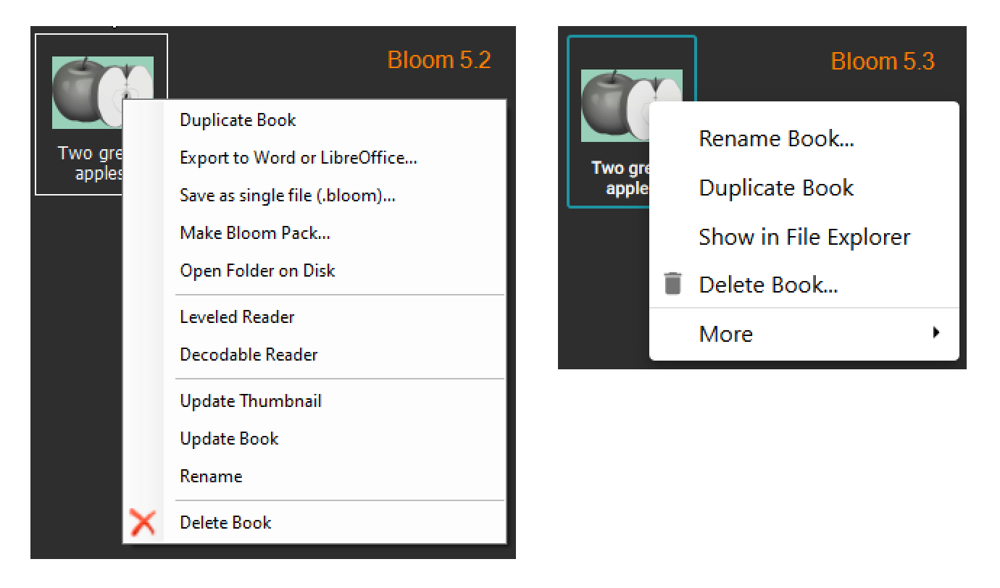
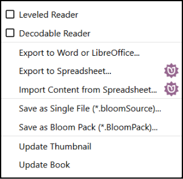
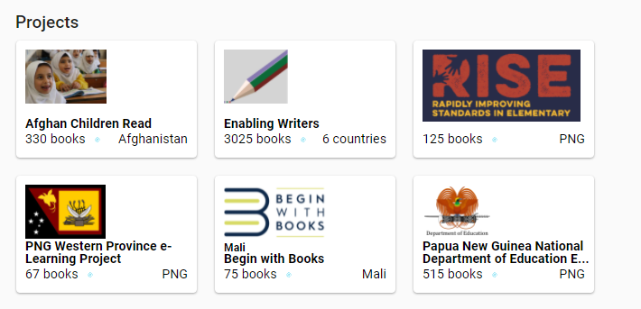
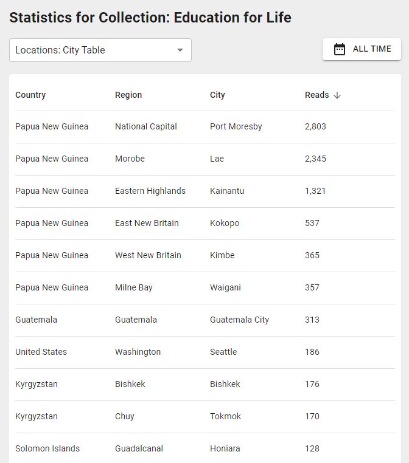

## Publish to Audio or Video

You can now turn your book into a video that can be shared on Facebook or YouTube. You can also make a version that will work on inexpensive “feature phones” or mp3 players. Here is the original [Feature Request](https://community.software.sil.org/t/produce-a-video-of-the-story-being-read-postable-on-youtube-facebook-etc/2267).

## Text Color

To highlight a word or some characters, you can now select some text and set its color.

## New Copyright / License Dialog

We’ve re-worked the copyright / license dialog in order to help you better understand your choices.

## Font License Info

When you’re just making paper or PDF copies of your book, you can use whatever fonts are on your computer. However, many fonts are not freely licensed for use on the web or in ebooks. But how are you supposed to know? It turns out that inside many fonts, there is some metadata that indicates things like what the license is, where the font comes from, and what version of the font you have. Bloom now reads this information and uses color and icons to indicate how safe a font is to use.

# Team Collection: Single Book History

# Startup Time

We made several changes to speed up Bloom’s launch time.

# Menus

In the Collection dropdown menu, we 

- Renamed the “Advanced” submenu to “Troubleshooting”.
- In “Source” collections (which we think should be _very_ rare in 2022), we moved “Make Bloom Pack” from the toolbar to this menu.

We simplified the book menu:

Less-used commands are now under a “More” submenu. In the future, we intend to simplify this further.

# [BloomLibrary.org](http://BloomLibrary.org)

Project cards can now have country names:

We added a map showing where the collection is being read:

And finally, we added city and country tables:

# Bloom Reader

We have changed the name and file extension of Bloom’s digital book publishing format from `Bloom Digital / .bloomd` to `BloomPUB / .bloompub`. All readers have accepted both for some time, and now Bloom Editor and [BloomLibrary.org](http://BloomLibrary.org) both deliver `.bloompub`. The new name is purposely parallel to the better-known `ePUB` format.

