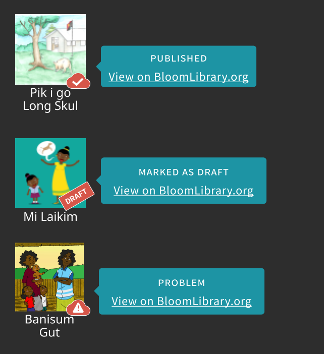
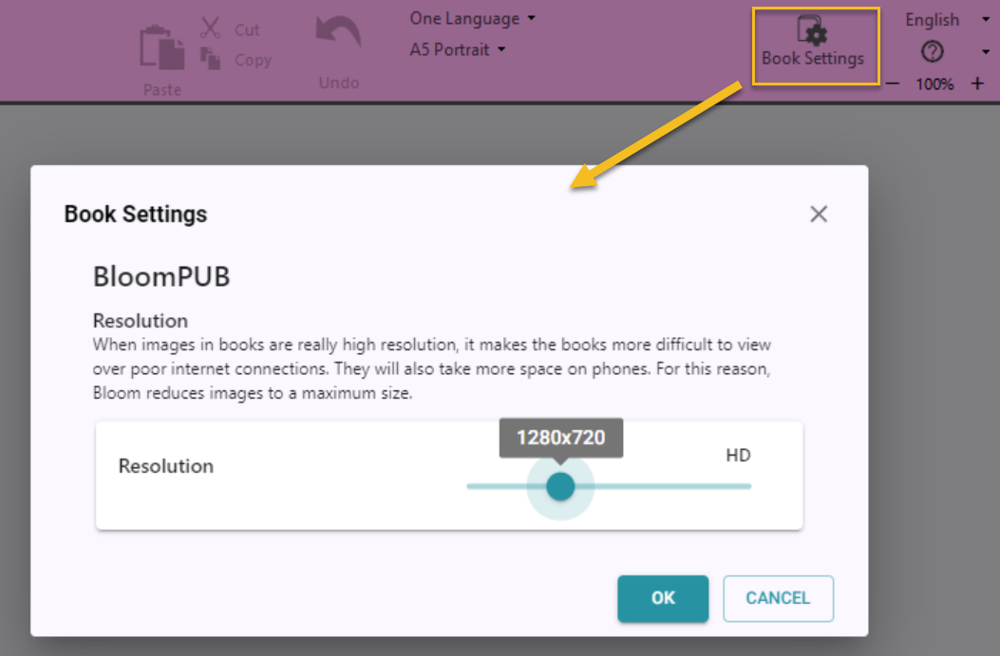
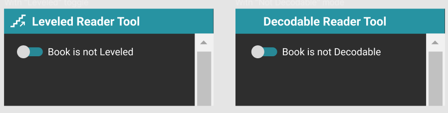

## Collection Tab {#495e77f18305415591b5375d0d1383c9}

### Books on Blorg Progress Bar {#1e394c764431430e9a5cab1940b55ae9}

### Books on Blorg Badges {#47f1b3df61d243b386fb482cd1275861}

## Team Collections  {#79144649f38d455c96c1ab3e0a9a6e8d}

Added “Check Out” event to book history

## Edit Tab {#e49853f40b5d40bbaebc982ce2a1f6d5}

### Book Settings {#a4cdb08934b84f7888672f749d651b78}

## Leveled and Decodable Readers {#f1e7802f9103458d8364af8e62716a3b}

In previous versions, there was a menu command in the Collection tab that you could use to tell Bloom if a book was intended to be _leveled_ or _decodable_. This setting could trigger the cover page to convey this information. In this version, we’ve removed those menu items, and instead, there is now a switch in the reader tools:

## Publish {#2991d3cfca2f447693ce8d395f102667}

Single screen

Coming: Improved security

Coming: Publishers can update, delete, and change book settings on their [BloomLibrary.org](http://bloomlibrary.org/) bookshelves, regardless of the account used to upload the book.

## Bloom Library {#97542ddb00634cd98c176d8f49a09d80}

### Progressive Search Results {#afc86b4f87774c0492ca93fc4f81b830}

### Language Card View of Collections {#2e0c54cdab72401e994298078fc1fc83}

## Other things {#058e8f3eee2a41dd8852d755b5b8d789}

- Improved our OPDS API
- Somewhat improved vertical alignment with overflow in device layouts
- Added an invitation to join the Community Forum
- Added more info to error reports, including Windows 11 info, drive space, and WebView2 version.

[embed]()

