# Bloom **5.2** {#4c5c20e73b1f46758032d5b400c96ff4}

## Decodable Reader {#639c6616be6a4e9aaa36d1fe8eb2a411}

⭐ When the Decodable Reader tool generates a report, it now includes a list of all the usable words for each level. [Feature Request](https://community.software.sil.org/t/new-category-in-the-letter-and-word-report-in-decodable-tool/5291)

## BloomLibrary.org Upload {#7e8cac7703744b2f8d84b7978ba6c12c}

When you upload a book, Bloom checks to see if there is already a book with the same internal ID on the library. If it finds one, it now gives you two choices. You can replace the existing book or upload your book as a new item. The latter option fixes your book’s ID to be unique.

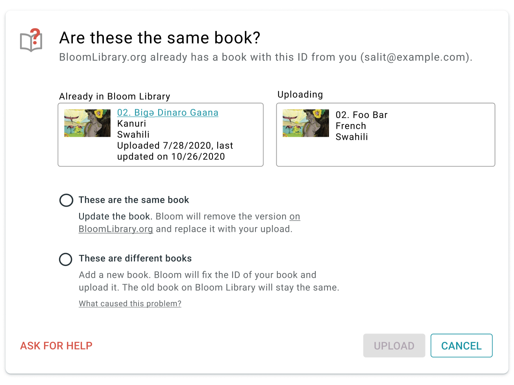

## Team Collections (Bloom Enterprise, Experimental) {#a4bd8a1610684019a565eee6e2889090}

⭐ When you check in a book, you can now type in a short note saying what you did.

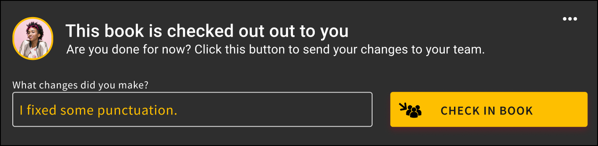

⭐ Bloom now lists check-in notes and other operations in the collection’s history panel.

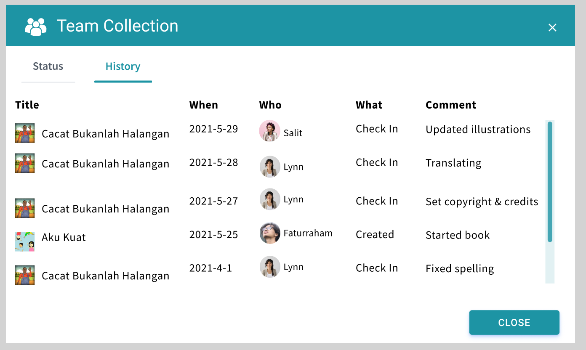

⭐ Team administrators can now force-unlock a book that has someone else has left checked out. This feature is helpful when a computer is lost or when the teammate who checked out the book cannot check it back in for any other reason.

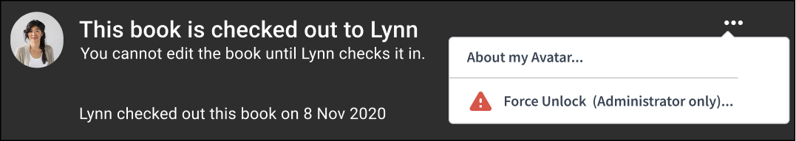

## ⭐ Export / Import Spreadsheet (Bloom Enterprise, Experimental) {#63f3b0f127ab4c92afa51bcdbd74a588}

### Export {#7d1a53e42fea497ea764ca275c8a1664}

You can now export a Bloom book to Excel spreadsheet format in a way that preserves text and images. (Satisfies this [Feature Request](https://community.software.sil.org/t/ability-to-export-source-text/5451))

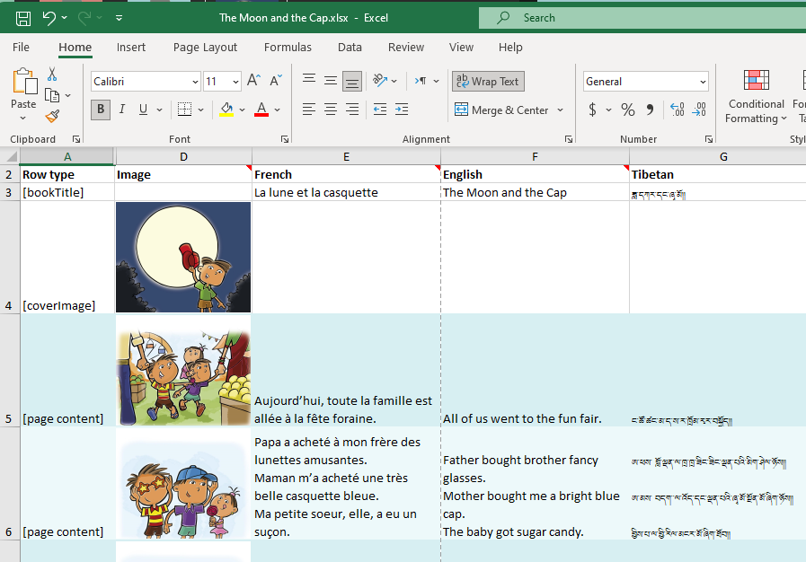

Note that there are currently several things that Bloom does not export: Talking Book audio, Music, Video, Activities.

### Import {#2d36580c8a244a61b094f5dad879da18}

You can now import an Excel spreadsheet _onto_ an existing Bloom book. The target book can be a new empty book you just created or an existing book that you want to update. When importing onto an existing book, Bloom can currently not safely protect some things in the existing book, so if your book has any of these things, it will refuse to do the import. These items in a book prevent it from getting an update through a spreadsheet import: Talking Book audio, Activities.

Bloom’s import/export feature is still a work in progress. Already, for simple books, it will enable you to do many previously difficult things, including:

- Get translations done by people without Bloom, using Excel, Libre Office, or Google Sheets.
- Apply bulk changes to the text in an external editor.
- Fix mistakes where someone typed text into a box with the wrong language.
- Merge text in different languages into a single book

While not fully supported yet, we also expect that this feature will eventually be useful for:

- Making new editions of books designed for paper vs. devices. This is possible because the importer can actually spread content out over a different number of pages.
- Use online translation services like Crowdin to engage translators, including paid ones.

To enable Spreadsheet Import/Export, tick the box under `Collection Settings / Advanced Program Settings / Spreadsheet Import/Export`.

# Collection User Interface {#0a6510ddccf94f9e94240ff743d23638}

## New Collection UI (Experimental) {#50a0ff4b2172443fa965f9576a621590}

As the next phase of our multi-year effort to modernize the Bloom code base, we have completely rewritten the left-hand side of the Collection Tab using Web technologies. This has been a _very large_ undertaking, so we’re making it available as an experimental feature for Bloom 5.2 to give us all more time to test it. With this new interface, Team Collections get nice avatar images of their teammates over books they have checked out:

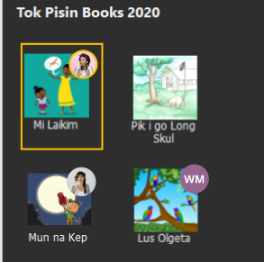

Books with badges showing who has them checked out

Other users will notice only minor improvements to book thumbnail buttons. To enable this new mode, tick the box under `Collection Settings / Advanced Program Settings / Try the New Version of the Collection Tab`.

## Collection Settings {#7d7d6f7e65c24c6ba46dd237cf88344a}

Many Bloom Enterprise projects use their own custom front/back matter packs. Previously in Bloom, everyone could see these in the list of choices. Now, these custom choices are not listed but instead are automatically selected based on the Bloom Enterprise code.

# 5.1 {#2bf1b7fe141a4412a15b7e309fe0ca75}

## Collection Tab {#b0abe655f8d345489c236ebe4aadf55e}

⭐You can now rename a book. Previously, Bloom always used the name of a book’s title. The new name appears under the thumbnail of the book and also the name of the folder on disk (). [Feature Request](https://community.software.sil.org/t/allow-changing-book-filenames/489/14)

## Edit Tab {#97d0ef6072c14b90b11e0eff73f8b1ff}

⭐You can create **hyperlinks** that point to other pages in the same book. This can be used for creating your own simple Table of Contents. When creating ePUBs, these links will be turned into normal text because the feature does not work in ePUBs. [Feature Request](https://community.software.sil.org/t/hyperlink-to-other-pages/1784)

⭐**Duplicate Page Many Times**. You can now enter a number to make many duplicates of a page all at once ([see animation](https://imgur.com/gcrxl5k)).

We made several fixes to the checks in Decodable and Leveled Readers.

### Leveled Reader {#941d88c6624f4865b0a50da4564b798d}

We added a visual notification when pages have too many sentences.

We improved how we count words in complex pages (such as arithmetic pages).

### Overlay Tool (Bloom Enterprise) {#85123c336a06481a92506d47ee8bcfb6}

⭐The Overlay Tool can now add videos [Feature Request](https://community.software.sil.org/t/video-block-that-can-be-place-anywhere-on-top-of-a-comic-page/4763)

⭐The Overlay Tool can now add images on top of the image [Feature Request](https://community.software.sil.org/t/ability-to-place-images-on-images/2982)

(See an animation of these [new overlay features](https://imgur.com/E83qLj6))

## Team Collections (Bloom Enterprise) {#d4a09012143c453186a95e0d11669ba0}

Team Collections are a new feature that helps you safely share a collection within your team, across the internet, without full-time internet access. For this release, we’re going to keep this feature behind the “Experimental” checkbox. For now, we are only supporting Dropbox & LAN environments. Please contact us if you are considering using this. We need your help to fully understand how this will be used, and how the experience goes.

### About Bloom’s use of Dropbox {#f9aa77c7387b441986f23080cd0643a0}

People will be naturally resistant to installing Dropbox. There are two things that may help them. First, once Dropbox is set up, you will not have to actually learn to use Dropbox, as it just sits in the background for Bloom to use, invisibly. Second, we are starting with Dropbox support because it is far superior to Google Drive in one crucial way: when you make a small change to a book, Dropbox will send just a small amount of data over the internet to your teammates. In contrast, Google Drive will send the entire book: all the text, images, recordings, videos, activities, etc. Because we want this feature to work well in environments with slow or expensive internet, we, therefore, decided to put our initial efforts into supporting Dropbox. In the near future, we will attempt to make Google Drive an option for teams with great internet.

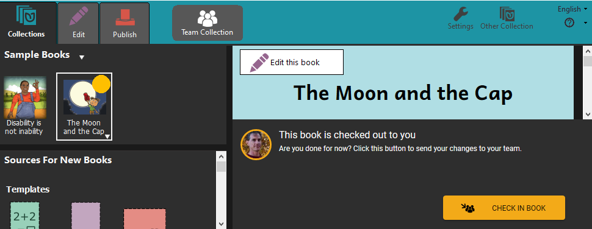

Team Collections debuted in Bloom 5.0 beta. For 5.1, we have added a few small features:

⭐We added a basic History tab to the Team Collection dialog. It currently only tells you the history of check-ins (who edited the book, when). We will be adding more history in future versions.

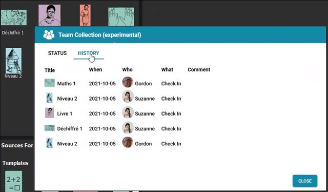

We added a little informational menu option that provides information about the name and “avatar” (picture) associated with books you check out. The dialog also provides links for changing (or setting) the avatar and name.

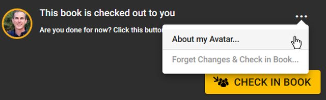

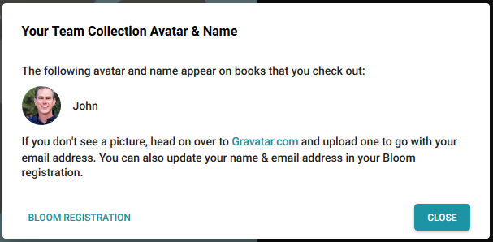

⭐You can now “Forget Changes & Check in Book” if you decide to abandon the changes you’ve made to a book since you checked it out.

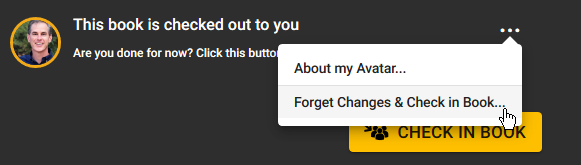

### Images {#b595689ddb5b444f8a006bcafb638a89}

We have removed, from the lower-left corner of images, the button that opened the “Image Description Tool”. We did this because of reports that users were clicking on it, not understanding what was happening and then entering their story text into the image description box. Authors making books for the blind can still use this tool, of course. You just won’t have this convenient shortcut anymore. [Feature Request](https://community.software.sil.org/t/allow-for-image-description-button-to-show-hide/4700)

When Bloom has trouble loading an image and you send us an error report, we now will receive the offending image file. That will help us figure out what the problem is.

## Publish Tab {#8f7901c8b3d94297bb0a9a00bd01eec0}

We added a new tool for making it easy to create a BloomPUB of every book in a collection, with a single command. (Bloom Enterprise)

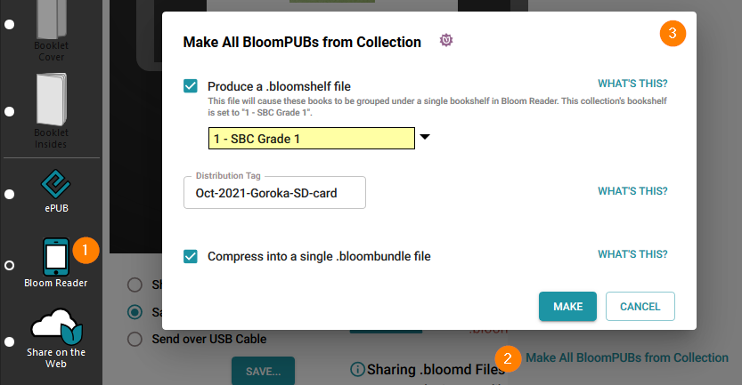

You can now also upload an entire collection or even multiple collections to the Bloom Library. (Bloom Enterprise)

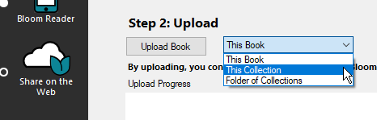

## Bloom Library {#843c55e4736b416f8d19af528fa2220d}

We improved counts and stats on Bloom Library. For example, a collection that contains child collections can now display the total count ([example](https://bloomlibrary.org/kyrgyzstan-OkuuKeremet)).

We added the ability for a project to list its sponsors at the bottom of the page ([example](https://bloomlibrary.org/Begin-with-Books-Mali)).

We added a new page selector for Bloom Player, the engine that powers book reading in Bloom Reader, BloomLibrary.org, and embedded Reading App Builder books.

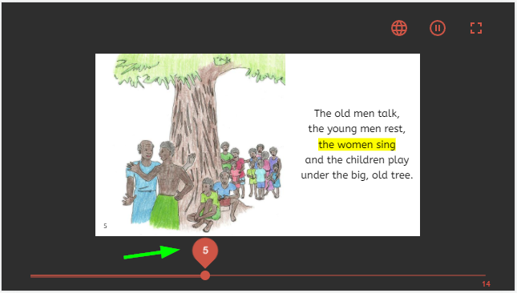

## Other Good Stuff {#7805422b888141989091e2d74847e899}

**Faster Enterprise Subscription Delivery** When projects get a new Enterprise subscription, there is a delay while we build their branding pack (logos, boilerplate text, etc.). Starting with Bloom 5.1, customers don’t have to wait… their Enterprise code will work immediately. Bloom will show a placeholder message on the back cover that shows the subscription name. When an update to Bloom contains the branding files for the subscription, this message will be automatically replaced with the branding images, the next time the books in the collection are edited.

### Work towards a more cross-platform Bloom {#01acfd78344844acbaf88e7e0ed16214}

As with most versions, we did a bunch of behind-the-scenes work towards rewriting making Bloom be more portable to other operating systems. For the most part, you won’t be able to tell the difference.

# 5.0 {#384e85b100f84013afab5581b5804731}

## Collection Tab {#710468c6f41f46289da9d7f47c8938a3}

We made hovering over a book thumbnail show the folder name of the book. This is helpful to see what’s-what when you have multiple copies of a book.

### Bookshelf selector {#b9f1d4e245ad4e8c80cf0831c1ff39d4}

In collection settings, Bloom Enterprise projects that have bookshelves on Bloom Library can now choose the bookshelf that corresponds to the collection. Then when books are uploaded to BloomLibrary.org, they automatically go to the correct bookshelf. This setting also can now be used to automatically choose a back-cover image to show where the book fits in the overall curriculum and choose a cover color based on the grade (this is used for a large MOE project in Kyrgyzstan).

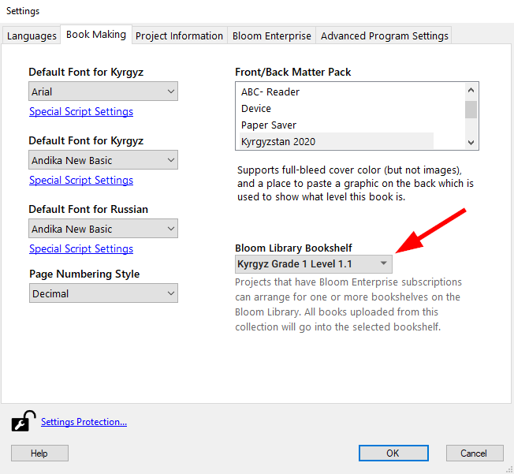

## Edit Tab {#8b1ea1b1c6a442a8a3ef53a890c33736}

### Comic Tool —&gt; Overlay Tool {#4d9eec53de244b68a4eedf7bb60ee7c0}

The Comic Tool is now the “Overlay Tool”. We made this change because this tool is now useful for more than comics and people who were not interested in comics were not finding it.

❗ The Overlay Tool requires a Bloom Enterprise subscription. However, books that contain overlays can be translated into other languages without a Bloom Enterprise subscription. If this change causes you any problems, remember that you can always enable Bloom Enterprise freely if you do not have external funding. If that option does not work for you, please reach out to us at issues@bloomlibrary.org so that we can help you finish your book in some other way.

⭐You can now control the transparency of overlayed text elements and make corners round. You can also show a line that you can use to point to something in a diagram:

⭐You can now make circle text elements. [Feature Request](https://community.software.sil.org/t/circular-comic-captions/3121)

### Talking Book Tool {#2de939653c154ab99b81560dd89fcbda}

You can now pause playback in the Talking Book Tool.

### Widgets {#0af8be723acf41688feec18e12dadff4}

We’ve made it easier to add HTML5 widgets from [Active Presenter](https://atomisystems.com/activepresenter/demo/). No more zipping/unzipping.

There is now a “Widget Page” that gives you a full-screen page to host your html5 interactive widgets. (Widgets are part of Bloom Enterprise).

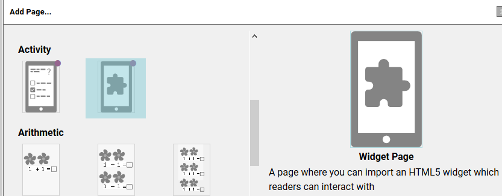

### Leveled Reader {#e54292d592f648f3b128d2523a6458e3}

You can now specify two new limits: Sentences per page and Average count of sentences per page.

We added some new measures: total sentences in book, longest sentence in book, and longest word in the book.

We added a button to copy all the leveled reader measures of a book to the clipboard, in a form that can be pasted into spreadsheets.

Text on Simple Quiz pages is no longer counted when computing whole-book statistics. Note that this change only applies to newly created Quizzes. Contact us for instructions about applying this change to pre-exiting quiz pages.

## Team Collections {#cf52b2d5ee794db69fafd9afcd5fa502}

❗ _NOTE: Team Collections debuted in Bloom 5.0 beta, but did not “graduate” out of beta successfully because of a bug found by a beta tester (yay beta testers!). We did not have time to properly test the fix before it was time to release Bloom 5.0. Therefore, you need to run Bloom 5.1 beta in order to use this feature._

## Performance {#4108ccef36424202a6726d1e9867d042}

Recently we spent weeks improving Bloom’s ability to deal with large books and long Bloom sessions without running out of memory. As part of that effort, we’ve added a tool for watching what happens to available memory and speed as Bloom does various things. This is mostly for our own use, but it’s also available to you, in case you suspect that Bloom is eating memory or slowing down as you use it.

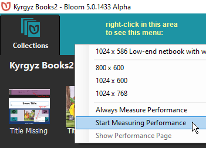

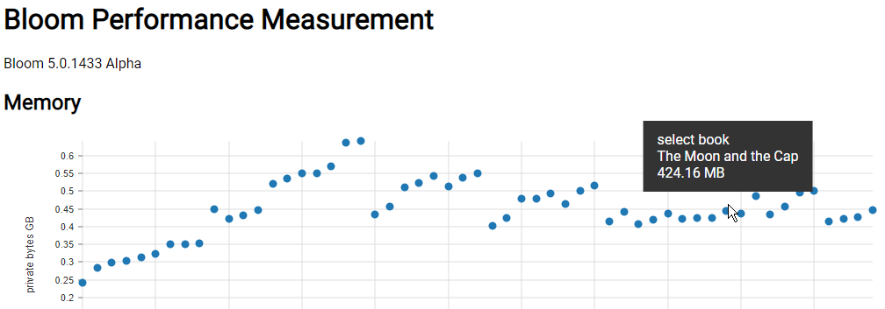

## BloomLibrary.org {#6063ef811ea94bc89f311047208bd70f}

When you download books from BloomLibrary.org that have audio, Bloom will now download the audio as part of the shell book.

We’ve improved what you see when you look at [template books on BloomLibrary.org](https://bloomlibrary.org/create/create-templates). It is now easier to understand what the template pages are for:

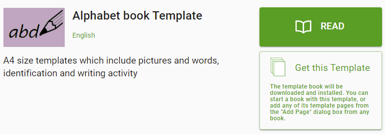

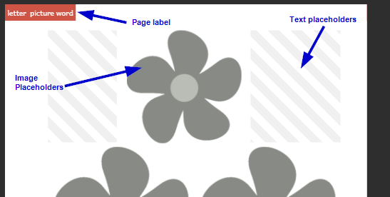

# 4.9 {#2dab991be0924600b15056df087bb940}

## Edit Tab {#0e381e6612d7439fbf976a0e16c90bbe}

Bloom now makes much better use of your computer’s memory. You should be able to work much longer, with much larger books, before encountering any memory limitations.

⭐**Talking Book Segmentation**. You can now type a vertical bar (|) to break up the recording of long sentences. This also works for splitting audio that you import. After recording or splitting, you will need to remove these vertical bars so that they don’t show when you publish the book.

The Talking Book tool no longer treats “Myanmar signed little section” (U+104A) as a sentence-ending character.

**13cm Square** page size. ([Feature Request](https://community.software.sil.org/t/square-books-a5-5-square/3543))

The list of page sizes now includes _13cm Square_ as one of the possibilities. This requires printing with A3 paper if you wish to produce booklets using this new page size. (Each printing would create 3 copies of the booklet.)

When you open a large book, the thumbnail representing the current page is now automatically scrolled into view.

In the Comic Tool, you can now set custom background colors for text boxes.

In the Comic Tool, you can now click a button to duplicate the current bubble.

When you hover over an image or image placeholder, Bloom now tells you what resolution image you need. This information can be useful to your illustrator.

## Copy Text from Source Bubble {#e5c8e490f20a4f35bcc1ab2fb1f0dacf}

We have added a Copy button to the Source Bubble. ([Feature Request](https://community.software.sil.org/t/allow-copying-text-from-speech-bubbles-with-comic-books/3216/9))

## Publish Tab {#7d94bbf02b704575bce4e3a207e399a0}

Login to BloomLibrary allows you to just click the Google button to use your Google identity (including sil.org accounts, for those of you who have that).

You can now provide a custom thumbnail for Epub publications. Place a file labeled `epub-thumbnail.png` in the books folder.

We can now provide custom “Full Bleed” layouts to Enterprise projects that need edge-to-edge printing at commercial print shops.

# 4.8 {#f1dc1c6cfc9141f3ba563f6627abe1d2}

## Edit Tab {#cda2e9b6d7184f45a8c3baf8fbc5a4cb}

⭐**Talking Book Text Playback Order**. You can now control the playback order of all the text boxes on a page, including comic book bubbles.

**Improved performance with very large books.** Some of you are creating terrific picture dictionaries with Bloom. These run into the hundreds of pages. However, the page thumbnail list gets very, very slow in these books. In 4.8, we’ve re-written that page thumbnail list from scratch, so that it is now much easier to edit these huge books.

**Original Title**

Bloom now has a way to declare the title of the original book upon which your translation is based, in the Credits page. It will automatically determine this if it can, otherwise you can type it in.

**Added a new “longpress” character for showing diacritics in alphabet books**

If you hold down “o”, the menu of special characters that pops up now offers ◌. This is useful in showing diacritics without arbitrarily showing a base character to show it with.

⭐**Widget Activities** ([Feature Request](https://community.software.sil.org/t/bloom-widgets/2528/6))

You can now embed little interactive activities in digital publications (web, Bloom Reader, RAB App). Many of these widgets already exist (they work with Apple’s IBooks and the Kotobee book software). You may also be able to make your own or commission a programmer. If this approach gains popularity, we’ll have a set of them to share within the Bloom community. To learn about “book widgets”, please see [this blog](https://blog.kotobee.com/book-widgets-everything-you-need-to-know/). To enable this feature, you need to go to Collection Tab/Settings/Advanced Program Settings and tick “Show Experimental Features”. Bloom requires that the widget be a zipped set of files ending in “.wdgt”. The files must include a file named “index.html”. We will be making this a bit easier in Bloom 5.0.

# 4.7 {#bbc40f9aa9de49ec8e2b4b2d766c4ff0}

## Edit Tab {#7e0a74a05af64152a58c8965026961fd}

⭐Import Audio ([Feature Request](https://community.software.sil.org/t/ability-to-add-pre-recorded-audio-files/958))

⭐Comic Tool ([Feature Request](https://community.software.sil.org/t/comic-book-feature/942)). Look out world, here come beautiful comics in minority languages!

Helpful tip: use CTRL + mouse drag to move bubbles, and ALT + mouse drag to resize them. Of course there are things to click on do to those things also, but if you’re doing a whole comic, these make you much more productive.

Limitation: Books that use any comic elements are limited to one language.

Limitation: Bloom cannot make ePUBs with comics.

Limitation: Unlike other Bloom Books, comic books do not auto-scale to different page sizes. That would mess up the bubble locations when the image underneath them changes size. Therefore, if you create a comic book with A5 size and then send it to Bloom Reader, we have to keep the A5 orientation, rather than switching to 16x9. So there would be black areas above and/or below each page.

_Known limitation in this release: If you turn a comic book into a Talking Book, it will play back in the reverse of the order that the bubbles were created. This is fixed in Bloom 4.8._

_Known limitation in this release: There is not yet a way to have an exclamation bubble with a tail._

_Known limitation in this release: When the Comic Book tool is visible, you can’t change the image. Just close the tool, set the image, then re-open the tool._

⭐Digital Comic Book Template. Use this when starting a new comic designed for screens.

⭐For some complex scripts, the size of language text in the Decodable Reader was too small. We added a font-size chooser under `Settings:Book Making:Special Script Settings:Font size when displayed in tools`.

## Publish Tab {#15f25cbba5b54c44b1f941ec0f0c347f}

In Publish: Bloom Reader screen, you can now decide which of the languages in a book you want to publish.

In all publish screens, if a book uses Bloom’s new Content Licensing system, Bloom will prevent publishing a language that has not yet been licensed for that book. This will prevent accidental violation of license agreements in which a publisher needs to limit which languages are published. For example, they may allow minority language translations to be Creative Commons licensed while relying on sales of the original English version for company revenue.

In Publish: ePUB, you can now add a summary/description to the ePUB metadata.

We added a way to export a single mp3 file for each page of the book. Right click on the left bar, then choose “Export audio files, 1 per page”.

## Collection Tab {#bb2bccc619b945f2a982e72fe0034c77}

We simplified book thumbnails to just show the image on the cover.

We have created a New Problem Report Dialog which is both more convenient for users and should help us get the information we need to be of help.

## Other {#6f3f11b8d64d48858cae584979d13c84}

⭐ _Really_ complex scripts. Bloom 4.7 is available in two versions. The new version, “Bloom CS 4.7”, supports those scripts that require the latest _graphite_ font rendering. We are still working out some performance kinks in Bloom CS, so only use it if you need it are are willing to help us find bugs.

# 4.6 {#c80635d99fe048a9a4ec3e7bd94cec12}

## Collection Tab {#a1ee0482d3f84ff2b288204c293b0def}

In Settings, we’ve added the option to use Kayah and Shan numeral systems.([Feature Request](https://community.software.sil.org/t/new-page-number-script-in-bloom/2227))

When opening a different collection, Bloom now offers you the last 9 collections you opened. ([Feature Request](https://community.software.sil.org/t/display-more-than-3-collections-in-the-open-create-collections-dialogue-box/1836))

## Edit Tab {#9d6c8a2ceef44d6b80099c4ba074582d}

⭐ We added a completely new **WYSIWYG Quiz** page. You can control formatting ([Feature Request](https://community.software.sil.org/t/control-font-size-on-quiz/969)), location in the book ([Feature Request](https://community.software.sil.org/t/bloom-reader-comprehension-quizzes-in-more-than-one-place/1968)), and the content of the heading. You can also record audio for all parts of it ([Feature Request](https://community.software.sil.org/t/the-ability-to-record-quiz-questions-and-answer-using-the-talking-book-tool/891), [Feature Request](https://community.software.sil.org/t/audio-questions-for-quizzes-for-non-readers/1452)).

⭐ Bloom can normally tell if you are working on a derived book or an original. But if it gets it wrong, you can now remove the derivation copyright and license using a new checkbox in the Copyright & License dialog ([Feature Request](https://community.software.sil.org/t/way-to-tell-bloom-that-my-book-isnt-really-a-derivative/2298)).

⭐ You can now marks books as Public Domain using CC0 ([Feature Request](https://community.software.sil.org/t/public-domain-option/1317), [Feature Request](https://community.software.sil.org/t/cc0-creative-commons/610)).

⭐ You can now paste hyperlinks into books which will work when people use the digital version of the book([Feature Request](https://community.software.sil.org/t/hyperlinks-in-bloom-books/1694)).

⭐ You can now copy text from language translation speech bubbles.

The “Add Page” dialog now clearly indicates which template pages are available only with Bloom Enterprise enabled.

### Books with many pages {#3cf84646d1da48318117e40a66dd0bd5}

We have improved Bloom’s ability to work with books that run into the hundreds of pages.

### Sign Language Books {#c0d292dfa5314cf3b12972c7b4396495}

We have improved computer performance when working with sign language videos. Page thumbnails no longer include the first frame for the video (this was hard on memory and CPU).

In the Publish:Upload screen, we’ve added a place to identify the language of your sign language videos.

We added a “Text above Video” template page.

### Talking Books {#7f79f20accd0494a83ec4759c4aed9f7}

You can now record audio for all the parts of a Quiz Page. ([Feature Request](https://community.software.sil.org/t/the-ability-to-record-quiz-questions-and-answer-using-the-talking-book-tool/891), [Feature Request](https://community.software.sil.org/t/audio-questions-for-quizzes-for-non-readers/1452))

We improved the smoothness of Talking Book playback by now playing only a single audio file per page. This means that highlighting is now based on timestamps, rather than on starting up individual audio files for each sentence. Talking books created with 4.6 require a Bloom Reader version that is up to date (latest v1.3).

## Publish Tab {#db634e9d2d4b463ebde731a24da12ad4}

### Bloom Reader Publish Preview {#2e6eea2826224e3faf786f03c4d82d66}

⭐ New, easier publish screen

We added a preview that lets you interact with the book before publishing to a real device.

We added new hints about publishing with USB and Wi-FI.

We’ve added the ability to limit Bloom shellbook downloads to BloomLibrary.org visitors in single country. If you need to publish books with that kind of restriction, please contact us.

### ePUB Publish {#916a0f8075eb4864a50867e93b0a7936}

⭐ New, cleaner ePUB publish screen

## User Interface {#96ce6d1fb42749b1bf7f0b35de430b7b}

We added smarts to Bloom’s user interface to use different fonts, as needed, in order to display various non-roman languages. This is not related to what you see in books, just the Bloom interface. Bloom now ships with Google’s “noto” fonts for Arabic, Bengali, Devanagari, Thai, and CJK (Chinese, Japanese, Korean).

This version is the beginning of a multi-version effort to move Bloom’s UI to a more consistent and contemporary visual design language. We have chosen to move towards Google’s [Material Design](https://material.io/design/), which is what users will be familiar with from their phones.

# 4.5 {#e3d07b876b614e19b7313cf1d74ac706}

⭐ We have adjusted the background colors in order to provide a higher contrast for those with poor screens, lighting, or vision ([Feature Request](https://community.software.sil.org/t/better-color-contrast-in-the-bloom-interface/828/7)).

## UI Languages {#b33104dd355e464293f52aa36a2ba86a}

⭐ Bloom’s programmers can now specify “fallback languages” for the Bloom user interface. Previously, the fallback was always English. Now, for example, if we have a UI translation in a Mayan language, we would set the fallback to Spanish. That way, if something on screen has not been translated yet, the user will see the Spanish, rather than the English.

## Edit Tab {#c2afeb7a9f6442a58be24aaac3e9af91}

⭐ Bloom has a way of changing the layout of a page to match one of the template pages. Now, in the “Choose Different Layout” dialog you can now tell Bloom to make that change for _all_ similar pages in the book. This makes it easy to, for example, add a place for a sign language video to all pages.

### Talking Books {#68579997e73a4ce781be4285d02ab13b}

⭐ In Bloom 4.4 we added the ability to record entire text boxes, instead of each sentence. Starting with Bloom 4.5, Bloom can find where in the recording each sentence starts, so that your book can still highlight individual sentences as they are read. We will be improving this feature in the next couple of versions. Currently Windows only. If the default settings don’t split your sentences well, see the helps for information on adapting your scripts, choosing a TTS language, and how to use CTRL+Click on “Check” to hear how the TTS language is reading your vernacular.

### Books for the Visually Impaired {#f49693021cb74b42b377bbfe9d996b39}

We have improved advice given in Image Description Tool, simplified it, and added a checkbox for stating that the image should not be given an image description (e.g., because it is purely decorative).

### Sign Language Books {#bf33608957fe4ec096bb2a50933d18dc}

⭐ The Sign Language tool sometimes has problems, particularly with memory use, so for now it is only available if you set Settings:Advanced:Show Experimental Features and set up Settings:Bloom Enterprise. But it’s certainly usable if you’re ready to start experimenting!

⭐ The Sign Language tool has been simplified.

⭐ The Sign Language tool now displays information about the video, including length, aspect ratio, and codec.

⭐ The Sign Language tool now has a tool for trimming the beginning and end of a video. Currently the trims are not permanent until you publish the book to ePUB, Bloom Reader, or a Bloom Pack.

You can now get a list of sign languages by entering “sign” in the “Lookup Language Code…” dialog.

Note: Some “2-in-1” laptops (like Microsoft Surface) have both a front and rear-facing camera. Bloom does not yet have a way to switch between these cameras. If the user doesn’t normally use the rear-facing camera, then a fix is to go into Windows Device Settings and disable the driver for the rear-facing camera.

### Publish Tab {#7582fe4dd376439291e1f1a4ce0e9b8f}

When publishing digital books, Bloom now removes unused branding images.

The PDF generator can now handle books with Device 16x9 layouts, and you can upload them to Bloom Library.

## 4.4 {#f058a003882548819066947c1a2ae90f}

For those of you helping us out by running and giving feedback on the Bloom beta channel, **thank you!** You are a vital part of the Bloom team. We are now moving on to building Bloom 4.5, and will release new editions of the 4.4 beta if you find any problems with it.

Here’s what’s new in 4.4:

### Settings {#ca785f637f2f4b5fa73b91d8f1d55b44}

⭐ The Settings dialog has a new tab named “Bloom Enterprise” which allows you to enter the new subscription codes.

### Edit Tab {#4a708c670c77412981e9efb823c0c6a1}

⭐ Cover pages have some improved default typography: Regular—&gt;Bold, line space 1.4 –&gt; 1.1 (national language 1.7–&gt;1.1), min-height: (1.8em –&gt; auto). This puts the two boxes closer to each other. _This works well for most scripts, but some will need to increase the line height._

⭐ When recording Talking Books, you can now choose to record whole text boxes at once. You can still record each sentence separately, as before. Note that during playback, if you record the whole box at once, the whole box will be highlighted at once. So what you may gain in naturalness, you may give up highlight synchronization. See the new “Record by sentences” checkbox in the Talking Book tool. **Books that use this feature will not be usable with earlier versions of Bloom.**

⭐ Impairment Visualizer. See an approximation of how images will look to readers with colorblindness or cataracts.

### Publish Tab {#8a763cfcde054d6eaaeb99f82ec7cd05}

Previously, if you had a large paper size (like A3), the booklet buttons would be greyed out but it wasn’t obvious why. Now, there is a message on screen explaining the situation.

⭐ Book Metadata form. In the ePUB tool, there is now a form you can open up that adds various metadata to to the ePUB. These include accessibility features and fields needed for submission to the Global Digital Library.

⭐ When uploading a book to BloomLibrary.org, you can now choose to upload a book’s audio (narration and background music).

⭐ When uploading a book to BloomLibrary.org, you can now specify features of the book to help people find it. Current options are “Accessible to the Blind”, “Accessible to the Visually Impaired”, and “Sign Language”.

## 4.3 {#7157a1be00d74b9badfc9507ea293b37}

### Settings {#0ed1ae5e8bc4493581bb32a5210ca89d}

⭐ In the “Lookup Language Code” dialog, you can now differentiate the language by declaring any of: Script, Region, or Variant (dialect). [[Feature Request ✔](https://community.software.sil.org/t/handling-dialects/629)]

### Edit Tab {#6882e70fd7844ffd968c5533b4f5e119}

⭐ You can now record talking books that are diglots or triglots. [[Feature Request ✔](https://community.software.sil.org/t/support-recording-multiple-languages-in-talking-book-tool/567)]

⭐ You can now add an “Instructions Page” to books. These are instructions for book creators, not book readers. They do not have a page number, do not contribute to page number advancement, and do not show up in PDFs, ePUB, or Bloom Reader publications.

### Publish Tab {#8d58f3de73f042108d6e2dced123f853}

Bloom now uses less memory when creating PDFs, and the “Use Less Memory (Slower)” option should be more effective.

### Branding {#ec5bda3e7d2a467893e56874834d82fa}

_Custom branding packs are part of Bloom Enterprise subscriptions_

⭐ Branding packs can now have “presets” that pre-fill front or back matter fields with boilerplate text.

⭐ It is now possible for a Branding pack to add an image at the top of the Credits page, before the Copyright. This image can contain text, but it won’t be able to adjust to different page sizes.

# Experimental Features {#b9a10288a4904812bd5c4c2b3f1ac7bc}

This release is a stepping stone for a more complete set of features for making books for those with visual and hearing impairments. These features are marked as:

- _Experimental_, meaning that you will only see them if you go to Settings:Advanced:Show Experimental Features
- _Bloom Enterprise_, meaning that you must choose a “Bloom Enterprise Project” in Settings:Project. Note that one of the choices there is “Local Community”, which makes all these features free to use for projects which are completely funded by the local community.

### Accessible Books for people with visual impairments {#48318b5a7b614a88a9e61a2d80cfaa30}

This work is funded in part by [Book Boost](https://allchildrenreading.org/challenge/book-boost-access-challenge/). Note that this is a work in progress, and there are a couple more tools we will be building for Bloom 4.4. [This query](https://issues.bloomlibrary.org/youtrack/issues?q=project%3A%20Bloom%20state%3A%7BReady%20For%20Work%7D%20%23%7BBook%20Boost%7D%20) will show you what is coming.

⭐ New _Image Description Tool_ allows you to type in a description of images, so that Talking Books can describe them to blind people.

⭐ New _Accessibility Checker_ gives you tools to check that your ePUB is accessible.

⭐ The ePUB generator has new options for making accessible books.

### Sign Language {#b4cc9d7c8f7c4c65a1ab3f2ef77cc83f}

Note that this is a work in progress, and there are many rough edges that we need to sort out. [This query](https://issues.bloomlibrary.org/youtrack/issues?q=project%3A%20Bloom%20state%3A%7BReady%20For%20Work%7D%20%23%7BSign%20Language%7D%20) will show you what we plan to do in the future, mostly in Bloom 4.5.

You can now use Bloom to make Sign Language books. One way to use this is to make **diglots** which people who sign can use to read, and people who read can use to learn to sign.

⭐ You can import pre-made videos

⭐ You can easily record videos right in Bloom using the new _Sign Language Tool_

⭐ You can start a book with a “Sign Language Template”

⭐ You can add “Sign Language Template” pages to a book

⭐ You can add custom Video objects to pages, just like you could previously with Text and Picture

At this time, video does not support sound. We know there will be requests for that, but we need to focus on finishing the sign language features.

## 4.2 {#98d3bb9037ef4bc9a9af510f7a73a7c1}

- Edit Tab
	- New “Motion Tool” allows you to specify pan/zoom effects of a page, to make a “Motion Book” in Bloom Reader. Then tick the “Motion Book” button when publishing to the Android Bloom Reader. What you’ll get is a book that is a normal talking book in portrait mode, then goes to sit-back-and-watch mode when you turn the device sideways.
	- New “Music Tool” allow you to choose background music and levels, to go along with your Motion Book.
	- We’ve reinstated the ability to zoom via CTRL+mouse wheel.
- Publish
	- Fonts are now embedded in Bloom Reader books, if their embedded metadata allows that.

## 4.1 {#e55b663cc1f343f3b7211b98c27077c3}

- Settings
	- You can now customize how Language 2 and Language 3 are displayed, just like you previously could for Language 1. [See original feature request](https://community.software.sil.org/t/option-to-use-national-language-for-filenames/211)
- Edit Tab
	- Enhance the “Paste Image Credits” function to include page numbers.
	- Allow “Change Layout” to be reached even in Device layout
	- Organize all page-related buttons together in lower left corner.
		- Move the unlocking button to a more obvious location
	- Move “unlock” button there, where it will be easier to find.
- Publish
	- Bloom now ships with the mp3 encoder (“LAME”), so you do not need to install that separately anymore in order to make talking books.
- Art Of Reading
	- AOR 3.3 offers the new, more permissive BY-SA Creative Commons License
- Bloom Reader
	- From “Add Page”, you can add a “Bloom Reader Quiz” page (one works with books published with a Bloom Enterprise subscription)
	- You can add bookshelves and sub-bookshelves (requires Bloom Enterprise subscription)

## 4.0 {#490d6063ca284046a04192a42cdac9d5}

- Publish Tab
	- Publish Book to [**Bloom Reader**](https://play.google.com/store/search?q=bloom%20reader&c=apps) Android app, which can get from the Play store or another user who has it installed.
	- **PDFs are now automatically compressed**, so they are often a small fraction of their previous size.
	- When you save a PDF, you can now choose CMYK coloring to satisfy some print shops.
- Collection Tab
	- When creating a new collection, Bloom now chooses the _primary_ country of the language as a default.
	- When choosing a language, Bloom no longer displays "alternative names* of languages, as some may be offensive.
	- Added a custom Front/Back matter choice for SIL PNG
	- Added a custom branding pack choice for ToMasewalTlahtol of Mexico.
- Edit Tab
	- You can now add moveable text blocks on top of images. Use this for comic books or kids’ books that fill the page with an image and then put text on top of it. This feature is still pretty rough, so **we’ve left it rather hidden**. Right-click on an image to add a moveable and resizable text block.
	- We’ve added a new zoom control in the upper left. We’ve removed CTRL-Mouse wheel zooming (sorry) because it appears that some people were doing it accidentally and then getting very confused.
	- Bloom now shows page numbers on the page, in the Edit Tab.
	- Left vs. right margins are now shown as they will on the printed book.
	- We have **reduced the time it takes to change pages**. This is still slow for large books like the picture dictionaries some folks are building.
- UI Localizations
	- Added Dari & Northern Pashto
	- Updated Spanish
	- Localization (translating the Bloom user interface) has moved from something you could do inside Bloom to something you do on the web, using crowdin.com. Use [this link](https://crwd.in/sil-bloom) to **sign up as a translator**. Each project must have at least one translator and one proofreader. Our policy is to require one of them to be a native speaker. Once a proofreader has “approved” a given string, it will flow into a future release of Bloom.
- OTHER
	- When Bloom is first run after your computer starts, there was a delay caused by .net. This could cause people to think Bloom wasn’t running, so they would try and run it again. Bloom will now show a simple splash screen instantly to indicate that it is coming. Currently on Windows, this feature is lost if you pin a running Bloom to the Windows taskbar. Instead, pin the icon from the desktop.
	- Changed “Vernacular” to “Local Language”
	- We removed Settings and Other Collection buttons from the Edit and Publish Tabs. They aren’t really needed there, and we think that having them only available on the Collections Tab promotes an understanding of what it is that they do.

## 3.9 {#a8f6c19a6e5f454882205c84393e9778}

- Custom Templates
	- ⭐ We’ve created a “Template Starter” template that lets you make a book full of template pages that you and others can reuse.
- Collection Setup
	- You can now change the UI language when Bloom runs for the first time. Previously, you couldn’t change it until you’d made your first collection.
	- Added new branding pack, ToMasewalTlahtol
- Edit Tab
	- ⭐ You can now enable automatic paragraph indent on styles.
	- ⭐ You can now control spacing between paragraphs.
	- ⭐ When you make books from a shellbook, Bloom now moves the original copyright and license to its own field. Thus preserved, you can now set your own copyright and license for the adaptation. Bloom does not yet verify that the new license is compatible with the original. If you add a book to a Source Collection, Bloom does _not_ take this step. Bloom assumes that what you are trying to do is to edit the book you just added in some way, not really create a new derivative.
	- ⭐ Text Box Formatting (under “Change Layout”)
		- You can now set the vertical alignment of text boxes (top, middle, bottom)
		- We have moved borders and background shading from the text styles to the Text Box Formatting
	- ⭐ You can now copy a page from one book and paste it into another. One use for this is for making template pages out of complex pages you’ve already created.
	- Text on cover pages (the large boxes where you can type anything) is no longer copied into derived books.
- Help
	- Added/updated some links to point to our new [community forum site](https://community.software.sil.org/c/bloom).

## 3.8 {#ffa586442eba49ebbdb998f373933e44}

- Windows Installation
	- Bloom now requires a newer .net, .NET 4.6.1. If your computer has received an operating system update in the past year, then you already have this.
	- We’ve made the Windows installer less likely to trigger over-eager anti-malware programs. If you still have problems, check out the [installation troubleshooting guide](https://community.software.sil.org/t/how-to-fix-installation-problems/17/3).
- Linux Installation
	- On Linux, you can now have alpha, beta, and release versions installed concurrently, just like on Windows.
- Settings
	- You can now set the numbering system used for page numbering to one of 25 styles.
	- We’ve added an “SIL International” branding option that puts that logo on the Title Page.
- Edit Tab
	- We have added A3 Landscape and A5 Landscape choices.
	- In “Change Layout”, you can now set the language of the text box. This will allow people making translations and glossaries in the back of the book to create a box, for example, which only holds the national language.
	- In the “Add Page box”, you can now add pages from the “Basic Book” and “Arithmetic” templates, regardless of the template your book started with. This feature will grow in subsequent releases so that it gets easier to combine pages from multiple template page collections.
	- We’ve added a button for superscripting selected text.
	- If you hold down ‘c’, © is now one of your choices (when not using a keyboard program like keyman).
	- Linux users can now record Talking Books.
- Publish Tab
	- We have upgraded Bloom to a new Firefox engine which reduces memory use, particularly when making PDFs.
	- PDF files that Firefox makes for Bloom can still be huge. If this is a problem for you, please see our [guide to shrinking your pdfs](https://community.software.sil.org/t/how-to-compress-a-bloom-pdf/24).
	- In the Upload section, you can now see the user ID you are logged into bloomlibrary.org with.
	- Linux users can now make Epubs.
- Bloom now saves backups of the html file (the file that contains the book’s layout and text). These are saved as “.bak” in the same folder. Should that file become corrupted by something like a power outage, Bloom will restore from the backup.
- Over a hundred other fixes and tiny improvements.

## 3.7 {#598e66620851478cbd002ead71e0be21}

- You can now “unlock” a shell book that you are translating, so that you can do things like:
	- add pages
	- delete pages
	- edit fields that are normally locked during translation

	To unlock the book, go into the toolbox (which lives to the right of the page in the Edit Tab). Click on the icon of gear, and tick the checkbox there. The book will remain unlocked only during the current editing session; the next time you come back to this book, it will be locked again.

- New or improved interfaces for Arabic, Bengali, Chinese, French, Hausa, Kiswahili, Indonesia, Nepali, and Russian.
- A new “Branding” collection setting allows organizations to specify logos, copyright, and license.
- The Copyright & License box now allows you to select the “Intergovernmental” version of the Creative Commons License.
- Leveled Readers now display the average sentence length, and you can set a maximum average sentence length for the book.
- When you drag the splitters to resize elements on the page, Bloom now shows a percentage indicator. You can use this number to set splitters to the same value on different pages, so that elements line up when they are on facing pages in the printed book.
- If you don’t have Keyman or the like running, then when you hold down a key, Bloom shows the “Special Characters” panel which show variants of the key you pressed. Normally, you use your mouse to aim at the one you want. However some laptops are now disabling the touchpad when a key is down. So with we now display little shortcut characters next to each choice. Pressing the indicated key selects the choice.
- When the page was zoomed in an using a smaller screen, the Special Characters panel was sometimes off-screen. Now it’s always visible.
- When you do Help:Report a Problem, Bloom now has a better approach to sending us the problem book, so that you can send us larger books than before.
- Previously, some text-heavy parts of the interface (like the descriptions of various Reader templates and how to use them) could not be translated into a different language. Now they can.
- A new “Super Paper Saver” Front/Back Matter pack puts the title page on the inside of the front cover, and the credits on the inside of the back cover.
- If no topic is set, the language name on the front cover is now centered.
- Wall Calendar now comes out right when made into a booklet, even when the selected Front Matter has an odd number of pages.
- Formatting changes are now saved, even if you delete the page before Bloom has a chance to save it.
- Languages that use a non-standard way of marking sentences (e.g. Thai uses a space) can now define that in the Leveled Reader setttings.
- Over 170 fixes and small improvements.

## 3.6 {#512629be4b6d4f98a966c2a852dd70d3}

- This version focuses on what we are calling “the toolbox”: a panel on the right side that you can open to do specialized tasks like working on decodable and leveled readers or recording audio for “talking books”.
- You can now hide or show the toolbox
- “Talking Book” recording is now controlled from a panel in the toolbox
- When setting up a new collection, Bloom now allows you to change the font.
- When setting up a collection, Bloom now always allows you to set the name of the project.
- “Add Page” button is now brighter and easier to discover.
- You can now “Undo” when in “Change Layout” mode.
- In the Format box, you can now type in any arbitrary font size. Previously, you were limited to choosing from the offered set of sizes. Note: you must press Enter after typing in size you want.
- Administrators of computer labs can now install Bloom for all users of the machine. From a command prompt running as administrator, run the installer with the “–allUsers” flag. “–silent” is also supported. This will put Bloom in the Program Files(x86) directory. Bloom will not attempt to update itself, nor will users be able to cause an update to happen.
- Many other fixes & tiny improvements.

## 3.5 {#e00db82a824c498ca472b6bc4eb28abe}

- You can now copy and cut images
- You can now hover over an image to get its dimensions, dots-per-inch, and color depth
- Bloom uses less memory when you have very large image files
- Better image memory handling
- Book folders no longer accumulate files for images that you aren’t using anymore
- Can now delete source books downloaded from BloomLibrary.org
- Faster bloomlibrary.org downloads
- New Arithmetic Template
- Better error report when the operating system blocks Bloom from touching a file due to weird file permissions
- New experimental EPUB option in Publish Tab (Enable from Settings:Advanced)
- New experimental Talking Book recording/publishing. Enable from Settings:Advanced. To start, right-click in text and choose “Record Audio”.
- Fixed Art Of Reading forgetting what language you want to search with.
- Fixed problem where black and white (1 bit) images were converted to 32 bit
- Fixed problem with publishing from a network drive
- Fixed problem where blank lines would disappear
- Several other small fixes

## 3.4 {#42931fb0b6ee4ca097ccffd12fe1db1e}

- If after creating a page you decide that you want a different layout than the one you original chose, you can now select “Choose Different Layout” and select a different one.
- If you have the latest [Art Of Reading](http://bloomlibrary.org/#/artofreading) installed (version 3.1), then you can now search for pictures in one of: Arabic, Chinese, Bengali, English, French, Hindi, Indonesian, Portuguese, Spanish, Swahili, and Thai.
- Bloom now supports Letter, HalfLetter, and QuarterLetter (North American) paper sizes.
- Fixed Problem where blank lines were removed.
- Dozens of Fixes.

## 3.3 {#136d3a31c0914917a71ebf7cf7ba67c1}

- All basic pages are now “customizable”. That means you can change the relative size of elements on the page, for example making the picture bigger and the text area smaller. You can also click the “Change Layout” button to add new elements to the page.
- When you select some text, Bloom now shows a small popup with buttons for bold, underline, and italic.
- Previously, Bloom used screen space to show a list of available pages you could add. Now, we’ve freed up that precious space and instead there is an “Add Page” button you click to see a list of pages you can add.
- The toolbar now rearranges itself as need so that everything is available on very small screens (netbooks).
- Books now default license to CC-BY (requested by All Children Reading).
- Books made from Leveled Reader template delivered via Leveled Reader Bloom Pack now have all the formatting locked down, preventing writers from altering the font, size, or spacing of the text (requested by All Children Reading).

## 3.2 {#e381fbedd65d432697704045e17e6be4}

- Support new Decodable Readers workflow. Instead of defining a set of letters plus sight words for each Decodable Stage, Bloom now allows you to specify one or more text files of “Allowed Words”.
	- These must be simple, unicode text files. Other formats are not supported: Word, LibreOffice, Excel, etc.
	- We have found that 1000 words works fine even on an old slow laptop. If you have much larger lists and a slow computer, there may be some lag while editing. Please let us know if this is a problem for anyone.
	- Complex characters in unicode can be [coded in more than one way](https://en.wikipedia.org/wiki/Unicode_equivalence). At this point, if the word list has a word code in one way, and the text in the book was entered a different way, Bloom will not recognize the word. Please let us know if this is a problem for anyone.
- Bloom’s Edit tab now always returns you the last page you were viewing in a book. This was a [UserVoice Request](https://bloombooks.uservoice.com/forums/153625-general/suggestions/6986831-open-to-the-last-edited-page-in-a-book)
- “Source text bubbles” in shell books have received a much needed makeover, including real tabs in a drop-down list of languages for books that have many source languages.
- In the set up dialog for Decodable Stages, Bloom now outlines letters from previous stages in orange. Previously, they were only bold and some users didn’t notice them.
- In the Collections tab, the selected book now displays a little triangle. Clicking on that shows a menu of things you can do with the book. More advanced items are still only available by right-clicking on the book.
- That Book menu now offers a “Copy Book” command.
- Both “Factory” and “Traditional” Front Matter packs now set the first content page to “1”

## 3.1 {#bf882bed14444ab4b922d4eef8f378a4}

Version 3.1 was a disciplined sustained & effort to improve hundreds of “little things” that could confuse or block people in certain situations from getting books created, translated, or printed. It also represents the first version where the Linux (Trusty and Precise) version is very close to parity with the Windows version.

## Important Notices {#2adfc84cb435417e955ae9e1c8afd2bb}

### Andika Replaced By “Andika New Basic” {#a5b46a3780db4575a62ad3e4fe3ae0ab}

- Many Bloom collections use SIL’s free “Andika” literacy font as their default typeface. When you create a PDF using Andika, styles such as bold, italic etc. are lost. This will happen with any font that doesn’t include a real bold/italic/etc face. This problem is outside of our control at this time (we’ve reported it to Mozilla). Happily, SIL has released a subset of Andika named [Andika New Basic](http://scripts.sil.org/cms/scripts/page.php?item_id=Andika_New_Basic). Bloom now installs this font for you and uses it by default. If your language is not fully supported by Andika New Basic, please choose another font, ideally one which includes built-in bold and italic. You can test your font by using CTRL+B to make some text bold, then going to publish and looking to see if bold makes it through to the PDF.
- Note, Bloom will automatically change the default font from Andika to Andika New Basic, if you have Andika set. It will only do this once, so if you choose to change it back to Andika, it won’t keep changing it. Note also that Bloom will not attempt to change any custom styles you may have created. If you need bold/italics to show up in a custom style, you’ll have to change away from Andika by hand.

### Keyman 9 {#efac247fff574bd8a8009268e529ba02}

- If you enable Keyman 9 while on a page, you’ll need to switch to another page and back before you can type.

### Printing Quality {#7330511b43844d3b9b5be6378cba3ec3}

- To get good printing reliability on Windows, install the [Free Adobe Reader](http://get.adobe.com/reader/enterprise/) software. On Linux, we are switching to the system’s default way of printing PDFs (which is normally GhostScript). On Windows, having Adobe Reader installed will also take care of some problems with showing images in preview of the PDF.

### The end of the line for Windows XP {#1eec9ec07bf14c7db3d19a784d845aac}

- Starting with Bloom 3.1, Bloom will no longer run on Windows XP. Sorry! As Microsoft has retired support for XP, it has become difficult for us to be limitted to program bits that work on XP. But Bloom 3.0 will continue to be available and works just fine. We don’t expect there to be any problems with someone using Bloom 3.0 on XP using books created by other people using Bloom 3.1.

## 3.1 Beta 3 {#04b734b8bfc94df8ae20279938a9ff77}

- Running the installer again does an uninstall/reinstall
- Added privacy notice to “Report A Problem” dialog
- Allow user to control which languages are advertised on bloomlibrary.org, when uploading
- Show source language names even if they aren’t part of the collection
- Fixed incorrect margins in PDFs
- Andika New Basics now part of Linux package
- 61 other minor fixes/improvements

## 3.1 Beta 2 {#4a38378fbbb0483085b4f8074ef145dd}

- Improved feedback during application updating
- Various memory-use improvements (more to come)
- Fix overlapping text bubbles
- Fix page numbering
- 52 other minor fixes/improvements
- New faster installer with automatic incremental upgrades. This will be getting some more attention for the next beta, including a re-install capability.
- Page thumbnails now show an “attention” icon if some text on the page overflows its box

## 3.1 Beta 1 {#40730b94a1a2487681e2af13a989069e}

- Includes the new “Andika New Basic” font, which includes real bold and italic faces. PDFs made with this show bold and italic, where PDFs created with “Andika” do not.
- CTRL+Click does a paste, and the pasted material is cleaned up, removing the extraneous line breaks that you get when copying out of a PDF.
- Window remembers un-maximized size and placement
- New Indonesian localization
- Updated Arabic, French, & Spanish localizations
- Added description texts to Leveled and Decodable Reader templates
- Added links to training videos in the Help menu
- Book name now shown in the title bar
- Higher quality creative commons logos
- Warns if your collection is in Dropbox
- Pasted images are now named “image1”,2,3, etc.
- Improved support for Paragraph-oriented fields (indention, numbers, prefixes) in hand-made templates.
- Support for text wrapping around images and captions in hand-made templates.
- When pasting large color images from Libre Office, automatically switch to jpeg if that will keep the file size small
- Hover over an image to see its file name, size, and dimensions
- We’ve reinstated integrations with the [Free Adobe Reader](http://get.adobe.com/reader/enterprise/) after the open source alternative we used in 3.0 proved unreliable. It is still available as a fall-back in situations where Adobe Reader is unavailable. On Linux, we are switching to the system’s default way of printing (which is normally GhostScript).
- In a field with the “RequireParagraphs” flag, pressing tab inserts an emspace instead of moving to the next tab.

### Bloom 3.0 is the last version for Windows XP {#5f4e81a8978b445b8149c7241787a587}

- Starting with Bloom 3.1, Bloom will require Windows Vista, 7, 8, 10, etc.

### Fixes {#a6cc9023ba2d4d0d93cfb18fabcfd0fc}

- Can now type with KeyMan 9 if (and only if) it was turned on before displaying the current page. In a future release we’ll remove that requirement.
- Fixed Booklet production of A6 Books
- Make Format dialog more localizable
- Fixed problem when deleting a box in a custom page.
- Fixed Image License changes made directly in Bloom are lost
- Fixed Text size is different on title page: “Language” is smaller than “Topic”
- Fixed Vertical Scroll Bars showing prematurely on small boxes in custom page
- Fixed insufficient space for French labels on thumbnails
- Fixed Font size of “second language” Book Title is lost after re-opening
- Many fixes related to book topic and different languages
- Overflow detector misfires on right to left text.
- Reinstated Chinese UI translation.
- Bloom no longer saves metadata you enter back to the original image. Too dangerous.
- Can choose TIFF images again.
- Bolding or underlined parts of words would introduce unwanted spaces.
- Stopped “Source Bubbles” from overlapping with other stuff by saying that unless the field takes up the full width of the page, only show the bubble when the cursor is in the field.
- Fixed problem with changing the collection name.
- Pasted images are now named “image 1”, “image 2”, etc., instead of having random names.
- Vaccinations book had lost its Creative Commons license image.
- Fixed problem with saving meta data into certain jpeg images.
- Decodable Reader If you change the letters of a stage then close the dialog by clicking “OK”, the toolbox tool doesn’t update to show the new letters
- Decodable Reader If a letter is in a letter combination in current the stage, DR should not automatically allow its constituent letters
- Bloom’s feature of making white transparent makes pdfs look awful in some previewers.
- Calendar Title Page font-changing widget in “Funding” box is non-functional
- Fixed bold items not using the same font as its surroundings when styles are customized.
- [Linux] Right-click on Main Tabs & other Menu Bar Selections causes focus shift
- [Linux] Edit page (sometimes) needs multiple refreshes
- [Linux] “Report A Problem” can’t report directly, has to go through email.
- [Linux] Art Of Reading instructions truncated
- [Linux] Problem typing in Art Of Reading search box
- [Linux] Some interfaces languages are listed multiple times.
- [Linux] Double clicking on a BloomPack didn’t run Bloom

## 3.0.106 Version Stable Release {#399834339db6466dad9d656be5b7204b}

- Fix problem with downloading Kande’s story
- Allow letters and sight words in Decodable Reader tool to be entered separated by commas
- For tall scripts like Devanagari, automatically increase the minimum height of fields to the line height

## 3.0.103 Version Stable Release {#a782cd451a614532b2d7596c5bfa4d05}

- Added links to training videos in the Help Menu.

## 3.0.102 Version Stable Release {#66d503b9b8524c018ca5e03c145fdf2f}

- Update French and Spanish User Interface localizations.
- Add explanatory texts to decodable and leveled reader templates.
- Fixed an error in the “Key Concepts” document.
- Decodable reader will now complain about words with letter combinations.(like “ch”) if they are defined but haven’t been taught at the current level, but only the consituents (like “c” and “h”) have.
- Fix display of a page number count in leveled reader tool.

## 3.0.101 Version Stable Release {#3a688fff33fc435c9efaa9fc6ad8ec1c}

- Adds Thai User Interface localization
- Adds Lao User Interface localization
- Fixed rare error when a page is being saved

## 3.0.100 Version Stable Release {#8b05f474cde04917b4cb9b721107c359}

## 3.0.97 Beta {#819d2ae101fe460fb53f0d282b143642}

- Update French UI Translation (thanks David Rowe)
- When importing, Bloom no longer
	- makes images transparent when importing.
	- compresses images transparent when importing.
	- saves copyright/license back to the original files
- Fix crash after closing settings dialog when no book is selected
- Fix insertion of unwanted space before bolded, underlined, and italicized portions of words
- Fix creative commons license on Vaccinations sample shell

### Fixes {#5c0a2c162cfe442a8727d89f3124cd62}

- Spaces are no longer inserted between bold or underlined parts of a word and the normal parts
- Fixed a problem that prevent renaming a collection
- Fixed Vaccination shell Creative Commons logo

## 3.0.93 BETA {#71f89a7d1e654ee1a99d84a7fdda680c}

### A couple known problems {#d6cdd10e20a34b6bb6bddbd2b75cfa93}

- If upgrading from Bloom 2, the Windows installer loses one of Bloom’s files. It will now notify you that this happened and ask you do reinstall and choose “repair”.
- We discovered that books with very large illustrations (e.g. 5 mb color files) are breaking the PDF’ing system. Bloom now detects this and gives you pointers on how to work around the problem, until Bloom itself can do so, in the future.

### Fixes {#15ae75a75f6040a0982867e64e2d8779}

- Fixed text in calendar day boxes
- Calendar grid lines are now uniformly thin
- Fixed a occasional crash when switching to a different user-interface language
- Tweak xmatter stuff to ease creating custom xmatter from installer

## 3.0.88 BETA {#2b3f1ee7e00646339f19d456319561f5}

- Users upgrading from Bloom 2 may need to uninstall first, or run the Bloom 3 installer twice. A message with instructions now appears if this is necessary.
- [UserVoice Suggestion] Introduction of A6 Portrait option. **Feedback appreciated**

### Front/Back Matter {#dacf5987f5154fd5b084898c14683185}

### Cover Page {#8fd3a58aab6d4731b00c88b8d7785745}

- Fields on the Cover can now grow to fit however many lines you need, because…
- The image on the Cover page will now automatically shrink so that whatever text you need can fit
- Front cover & title page can now show title in all 3 languages

### Title Page {#6b4412a1f60d450ab41b0ad205120870}

- [UserVoice Suggestion] Title page’s funding box can now grow, to use for a cheap Table Of Contents if Needed

### Credits Page {#d0a561011f324fb5acfbf4cba9c70e10}

- The Credits page now has more room for acknowledgments
- When selecting a Front/Back Matter pack in the Settings dialog, you can now read a short description of each one
- When you select a different Front/Back Matter pack, existing books will automatically use it if appropriate

### Other Front/Back Matter {#72d861bb8f2b4f5e9eeedd642b224c4c}

- Trial of a Front/Back Matter pack for SIL Cameroon, which is like “Traditional” but includes the ISO 639 code of the language
- Big Books now use the same Front/Back Matter pack as the rest of the collection. You can now delete the “instructions for teachers” page if you don’t want it

### Other {#69eb37fd526c46618db9ee4db672a65c}

- Big Books now include the “Custom” page template
- Removed the “A5 Portrait Bottom Align” option
- New shortcut keys (In the future we expect to introduce UI buttons for these things, but we are delayed because we need to do it without making the UI more complex):
	- CTRL+R: right-align
	- CTRL+L: left-align
	- CTRL+SHIFT+E: center text
	- ALT+CTRL+0: Normal
	- ALT+CTRL+1: Heading 1
	- ALT+CTRL+2: Heading 2

### Fixes {#b10b53faae9b4010ad1e66cd027f8b2d}

- Bloom will now be patient if Dropbox is temporarily locking the languagedisplay.css file
- Title page now updates immediately if you change country/province in Settings Dialog
- Format dialog tooltips no longer make Source Bubbles disappear
- Improved error messages when an html file can’t be opened
- Thai script is now larger in shell book source bubbles

### Linux Fixes {#19972f3ade514c339fa73868bcfa4ef9}

- Can now open book downloaded from Bloom Library
- Fonts are now listed in alphabetical order
- Crash due to deleted temporary html file has been fixed.
- We are working on a problem typing in the “Report Problem” dialog box.

## 3.0.80 BETA {#283a7c0f9dd041ec9ad1f9a9c0527f6f}

- Fix: “Open in Firefox” should now work even if you have spaces in the path
- Fix: BigBook National Language title was missing a parenthesis
- Fix: Was hard to insert an uppercase character using the long-press special character feature
- Fix: “Update Book” messed up custom pages
- Several Linux-only fixes

## 3.0.74 BETA {#91ba7612449b46f2917cdd76f73ff217}

- A new Front/Backmatter option is available, named “Traditional”. This puts the credits page on the back of the title page, rather than the inside of the front cover. This is good in cases where you pay by the page imprint, rather than by pieces of paper. You can select it from Settings:Book Making:Front/Back Matter Pack. ~~Once you have chosen this, you won’t see it on any existing books until you do these steps: In the Collection Tab, click on the little triangle, then select “Advanced: Do Updates of All Books”.~~

## 3.0.72 BETA {#7413552f17f645d18d454ff645c9c914}

- More French coverage of UI
- Better captioning of books with long names
- Calendar now has smaller margins, more room for text in day boxes
- Restored vertical centering in “just text” page

### Known Issues {#8951eac62103461093f1fb98dd5ae7dc}

- Fonts with modifiers like “Arial Narrow” cannot be shown. This appears to be a bug in Firefox (which is at the heart of Bloom). So for now we don’t offer these fonts in the font-picking menu.

## 3.0.70 BETA {#26b85486f8c14f42b30a6faedd50e7b2}

### New {#7acea5c389224d459c5a6c80162dc1e4}

- More Right To Left support. If the Vernacular language is right-to-left, PDF Booklets will be ordered so that pages are ordered back-to-front (see Settings:Book Making).
- New right-click menu on pages for removing and duplicating.
- Language picker: when picking a language and there are more than 2 countries, now says, .e.g. “4 countries”.
- Language picker: when picking a language, you can now have major spelling differences and it will still find the language.

### Fixes {#42854d466de54645bf7ffd2068c3faed}

- Fixed “sticky” scrollbar on page template list and Art Of Reading gallery.
- Fixed problems with opening books over a network (needs user testing in various environments, though).
- Fixed problems with the front-cover language.
- Fixed problem with booklet pdfs.
- Fixed problem with downloading and then using book templates that are a collection of re-usable pages, e.g. Gleny’s Water’s Primer Template
- Book colors will now always stay the same (until we add the option of selecting the color you want).
- Many other small fixes

### Known Issues {#4ab1b957c78d43d7b47e77052c03fc4f}

- The gear-shaped button that brings up the Format box has positioning problems; we’re working on a solution.

## 3.0.69 BETA (Windows Only) {#6983e8ca3ef7491cbef0bc07bdd6968e}

- The Help menu now has has a “Report Problem” command.
- Now installs the newly updated Andika version 5.
- Fixed problem with “Booklet Insides” publishing option.
- Fixed several issues in the Format dialog.
- Modifier keys no longer trigger the Special Characters popup.
- Several other minor fixes.

## 3.0.66 BETA (Windows Only) {#32f39723fb434fa78329b3a0fe4f8f78}

### Flexible Layouts and Styling {#3a41f7209b054baa971561987fb46ff6}

- Use the new “Custom” page template to make your own unique page layouts.
- Use “Duplicate” button to reuse your custom page within a book.
- You can now set a default font family for each of the languages in a book.
- You can now apply styles name (like Word / LibreOffice) to text boxes keep things consistent throughout the book
- You can now set the font family, size, line spacing, word spacing, justification, border, and background of each text box, along with all other boxes with the same “style”. Just click on the little “gear” icon in the lower left of a text box.

### Improved PDF Making {#fc388a3e670a4bbf83bb72dc07db7606}

- Bloom now uses the same rendering engine for both editing and pdf-making, eliminating WYSIWYG glitches of previous versions.
- New PDF engine renders fonts better.
- Languages requiring Graphite Complex-non-roman script rendering are now supported.
- Adobe Acrobat no longer needed to view PDFs in the Publish tab

### Other {#7968eda689284b66abd6156e36160a5b}

- Holding down a key now shows a “Special Characters Panel” that lets you select from similar characters. Use you mouse, mouse wheel, or arrow keys to select the character you want (see screenshot below).
- You can now right click on a book and export its contents to Word or Libre Office (most formatting will be lost).
- Bloom’s interface has new translations, in Arabic, Chinese, Tamil (India), Hindi (India), Telugu (India), and Kinyarwanda (Rwanda). French and Spanish translations have been updated.
- Andika Font is now installed along with Bloom

###Experimental Features in this release

- Decodable Reader Tool helps you develop a series of books that introduce a few letters at a time. _ Reads a folder for texts you have placed there, and suggests words to the writer that are “decodable” at each stage. _ Words that are not appropriate for the current stage are highlighted. _ You can export a file detailing each decodable stage: letters, sight words, and available words to use. _ Thanks to Norbert Rennert for sharing code from his Synphony engine.
	- See “Help: Building/User Reader Templates” for more information.
- Leveled Reader Tool helps you develop books for readers at various levels of ability by setting limits on the number of words per sentence, page, and book.
	- See “Help: Building/User Reader Templates” for more information.
- New “Custom” page that lets you divide up the page into text and picture portions. You can then just use the page, or treat it like a template for other pages in the book.
- Holding down a key now shows a “Special Characters Panel” that lets you select from similar characters.
- Languages can be marked as Right-To-Left. However, changing the page order is still up to you, using a PDF editor like Adobe Acrobat (or maybe use the RTL option in PdfDroplet)?
- Initial Linux Version (Precise and Trusty).

### Known Bugs & Limitations {#1b47e8eaaa044ce69e6b9c6d45595b42}

- “A5Portrait Bottom Align” does not layout correctly in bilingual or trilingual mode [BL-46].
- Page Template names are always shown in English.
- Books with Graphite complex-non-roman scripts cannot be printed directly from Bloom yet. Instead, open the PDF in Adobe Reader and print from there.
- Sample texts for use with the decodable reader must be saved as unicode text files.

## 2.0 RELEASE October 2014 {#4fca38e8cab0492b8c6549a0e6a02dea}

## 2.0.1038 BETA 23 July 2014 {#6d1e09078dd7452fa7da01e05a0b5d57}

A4Landscape with “Picture on top” now gives 70% of the page to the picture, was previously 45%.

## 2.0.1038 BETA 6 June 2014 {#90646367f9384c07a402d23b0422ff18}

Added ability to have

edit boxes, rather than FF’s

default, so you can do styling like paragraph indents. Needed for SIL-LEAD SHRP project.

## 2.0 1022 BETA 13 May 2014 {#f024705fe9dc4170b693d28322b8679d}

Templates can now have a markdown “readme” for telling people about the template. Select the Big Book or Wall Calendar templates to see how these are displayed.

## 2.0.1021 BETA 9 May 2014 {#428735304d074ccd86f86676744a13b4}

Can now publish books to books.bloomlibrary.org Can now get books at books.bloomlibrary.org and they will open in Bloom New Big Book template & Front matter Basic Book now auto-enlarges fonts if you make it A4Landscape (for making a5 books into Big Books)

## 1.1.574 18 Feb 2014 {#08075c784e794353bcefdeacc44f0197}

New experimental keyboard shortcuts: Bold=Ctrl+b, Underline=Ctrl+u, Italics=Ctrl+i, F6=Superscript, Ctrl+space=clear any of those. F7=Heading1, F8=Heading2. Pasting text with

