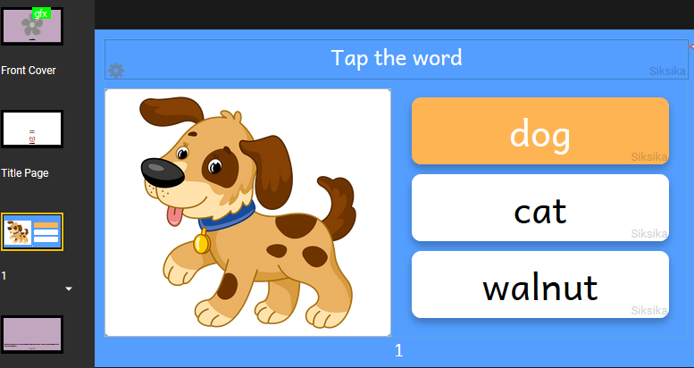
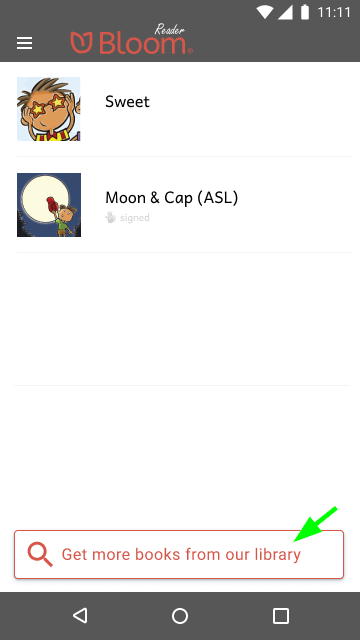
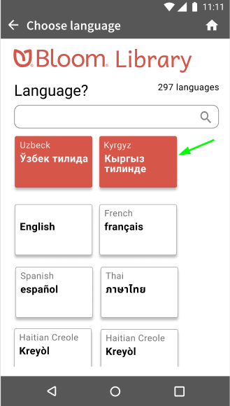
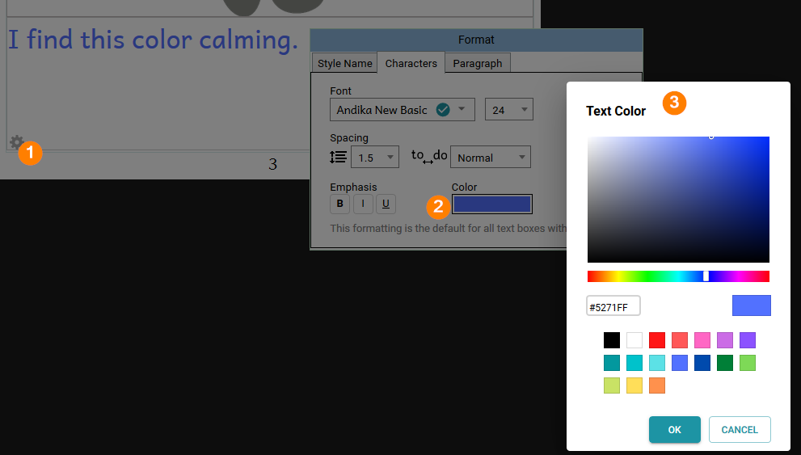
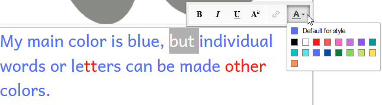
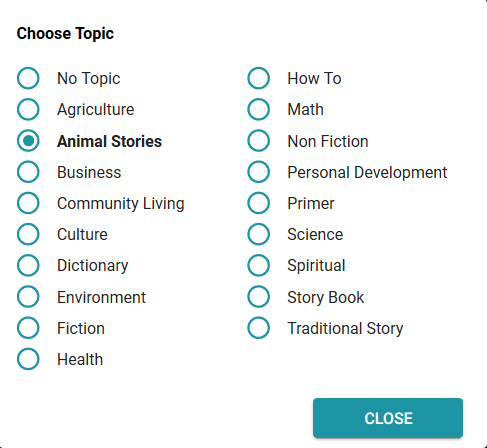
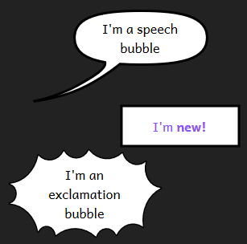
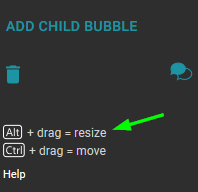

:::note

This version, Bloom 5.4, is the last version that will work with Linux and Windows 7, 8, and 8.1.

:::

## Simple Choice Activities {#d1e642d66d564770975702164b06bece}

We’ve added two new activities that you can add to your books. Just enter the correct answer in the first box. When someone reads the book, Bloom will shuffle the answers.

### Choose Word from Picture {#a7522644c0b24bc4b4e2d03f20357ddd}

### Choose Picture from Word {#1c0627ef95374d84b0d6bff9b0d2b409}

Are there other simple activities that you would like to have in your Bloom books? Feel free to request them in a [Feature Request](https://community.software.sil.org/c/bloom/featurerequests/16).  Note that a [Bloom Enterprise](https://bloomlibrary.org/page/create/page/feature-matrix) subscription is required to add new activities to a book.

:::tip

Enjoy [this 185 page animal alphabet book](https://bloomlibrary.org/new-arrivals/book/IGDR7iE7OY) that includes these new Simple Choice Activities.

:::

## Get More Books from Within Bloom Reader {#25150f857d294ed4ab6adb1f72a99969}

Finally, users can get more books into their Bloom Reader without going to a separate browser window. We’ve added a button at the bottom of the screen:

You then choose a language and Bloom Reader shows you books from BloomLibrary.org. It will remember your recent languages, so you don’t have to find them each time:

Once you pick a book, you can either download it into Bloom Reader or just read it online:

## Smarter Splitter {#de70537d74ce4ca68ce16095433faf20}

We heard you: getting image and text boxes to _just the right size_ was too hard. We’ve made the splitter smart in a couple of ways:

1) You can now double-click the splitter to make it snap to the position used by the previous page.

2) The splitter now “snaps” to some common locations:

- The position used by the previous page.
- The position that perfectly matches the image’s proportions.
- 1/4, 1/3, 1/2, etc.
- Square

3) Previously, the splitter moved by tenths of a percentage. Now, it moves only by full percentage points.

4) If you need more precision, hold down the CTRL key to go back to moving by tenths of a percent, ignoring snap points.

## Fixed Layout ePUBs {#8ec0aa36a08a4b5aaada1f990b9f0a4e}

Bloom can now create ePUBs in “Fixed” mode which asks ePUB players to preserve the page as you see it in Bloom. If you have a very simple book, Bloom will also let you choose the previous “Flowable” mode.

With this improvement, you can now publish overlay (comic) books as ePUBs.

:::caution

Note that if you make a Talking Book out of an Overlay (comic) book, ePUB readers will read bubbles in the order you created them. That won’t always be the correct order! We have an idea of how to improve things for Bloom 5.5.

:::

See [here](https://docs.bloomlibrary.org/ePUB-notes) for more information about the state of Bloom-to-ePUB publishing.

## Color Chooser {#790ecf6457f14013a5aceac811989c6c}

We improved the color chooser and made the same chooser available everywhere you can set a color, including text, background colors in the overlay tool, and cover colors.

## Text Color in Styles {#ff621bf1d21f4877a38624307b9b515c}

As before, you can also color individual words and letters:

## Modernised Topic Chooser {#160efe2e19c040a6a2b8adcc2211dbf1}

## “Needs Copyright” Button {#aa5dac85bc6d400783781f410bdef7bc}

We’ve noticed that sometimes people forget to add a copyright, which later prevents them from publishing the book to BloomLibrary.org. Now Bloom shows this button to prompt you.

## Overlay Tool {#8208a44b54ea46caa737a063dd6c74d4}

- We’ve added a new Bubble shape, “Rectangular”:

- We added hints to remind you about two important shortcuts:

- You can now click on the background image in order to change it.
- If a bubble somehow ends up off-screen, Bloom will move it back on screen the next time it loads the page.

Note that a [Bloom Enterprise](https://bloomlibrary.org/page/create/page/feature-matrix) subscription is required to add new Overlay (comic) images to a book.

## Other Improvements {#118605b2d74e4b749b18f97353ab6abc}

- Previously, there was a slight difference in text size between the Edit Tab and what Bloom would actually publish. You could see this even just in the Collection Tab preview. Where this mattered was that a line might break in a different place. We have fixed this difference in favor of the published versions,  so that if a book is re-published using this versions of Bloom, the layout will be the same as it was previously. But if you look in the Edit tab, changes may be visible from what you would have seen in the Edit tab in previous versions.
- Bloom’s experimental spreadsheet import/export now retains a book’s metadata.
- We added experimental spreadsheet import/export for Talking Books. Note that a [Bloom Enterprise](https://bloomlibrary.org/page/create/page/feature-matrix) subscription is required to use the spreadsheet commands.
- We made it feasible to use leading spaces in a Talking book to make the left edge of a text box vary in order to do things like conform to the image to the left of the text. While we don’t _like_ this approach, it is currently the only way to achieve this.
	- Don't highlight leading/trailing whitespace of current audio segment.
	- Collapse multiple whitespace in translation bubbles.
- When Bloom makes a BloomPack, it now includes any audio in the books.
- Bloom now shows the Sign Language name on the cover. Note that the name only appears once there is at least one recording, and only after the book has been reloaded.
- You can now access the “Scripts & Variants” settings for a Sign languages. The “scripts” part is not relevant, but this allows you to define a language as a regional dialect of a more widely known Sign language.
- If you download and translate a book, Bloom now gives you the same cover colors as the original.
- SIL has deprecated Andika New Basic since Andika now contains all of its characters. We are gradually switching everything over to Andika in a way that we think will be invisible to users. For this release, we switched Bloom Reader & Viewer to come with Andika built in.
- We improved sorting of books in BloomLibrary.org. By default, books now sort from newest to oldest. For particular collections, we can change this to sorting by title with good number sorting so that numbered series will show in order.
- BloomLibrary’s “stats” pages now have a “People Reached Digitally” Stat

- We added a way for advanced users to override the image compression we do when we publish books.
- We added a 6” x 9” paper size.
- You can now set text to right-align:

- You won’t notice it, but we did months of work preparing Bloom to move to a modern browser component. This investment will reduce our maintenance cost and unlock some new capabilities in the future.
- We introduced a new layout to most of our “Publish” screens. In the next version, we’ll complete this transition by rewriting the PDF/Print and Web Upload screens to fit this new system. In the end, the publish screens will be much more uniform so that if you learn one, others will be more familiar.
- You can now paste in text formatted in “small caps” from Microsoft Word

## The End of Linux Updates (for now) {#45015bc2ab4e4c30b0a5b756af04a637}

Bloom 5.4 is the last version of Bloom for now. Ideally, in several years, we hope (but do not promise) that we will again have the technology and staff required to ship new releases for Linux (and Mac).

**Technical Details**: Bloom started as a Windows-only application, using .net technologies plus an embedded web browser. Unfortunately, a software key component (_geckofx_) stopped development a few years ago. GeckoFX was the magic that allowed us to embed a Firefox Browser in our .net application. Bloom relies on over a thousand other open-source libraries, and increasingly, we cannot make use of _their_ updates and fixes, because our browser is stuck in 2018. We have only a small amount of resources to spend, and we can't justify spending an increasing amount of it going against the tide. Bloom 5.5 uses a modern embedded browser, _WebView2_ from Microsoft.

We will eventually get Bloom to a state where its UI is no longer a hybrid of .net and browser UI. With each version, we are retiring some .net UI and replacing it with browser UI. When this process is complete, then new cross-platform possibilities will open up, be it a .net/electron or something else. Microsoft may also deliver _WebView2_, for Linux and Mac (they list this on [their roadmap](https://docs.microsoft.com/en-us/microsoft-edge/webview2/roadmap), in a non-committal way).

See also:

[Installing Bloom on Linux](/installing-bloom-linux)

