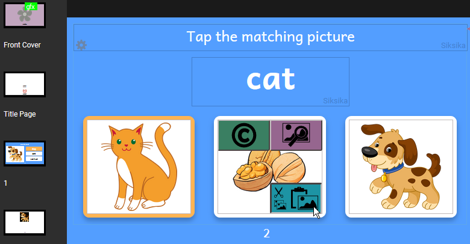
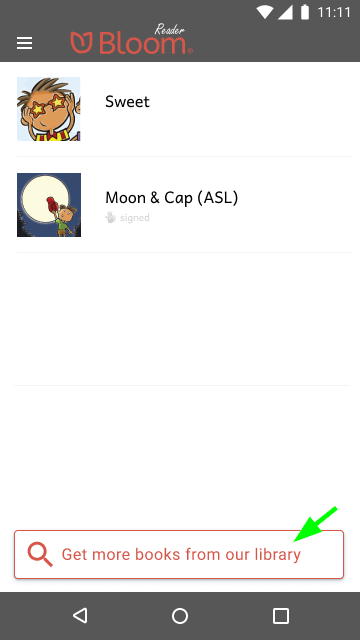
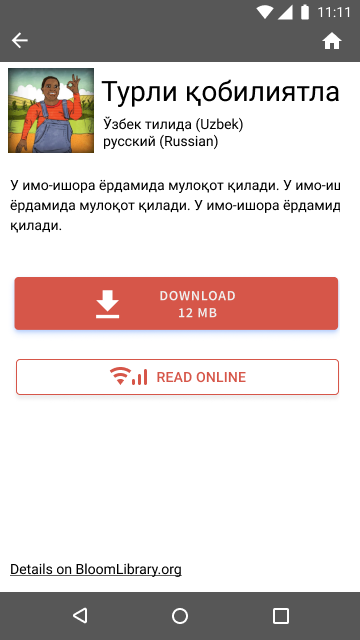
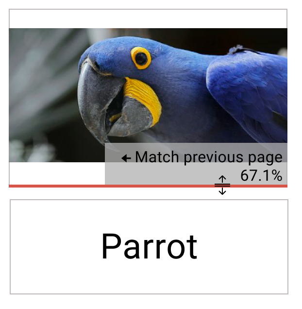
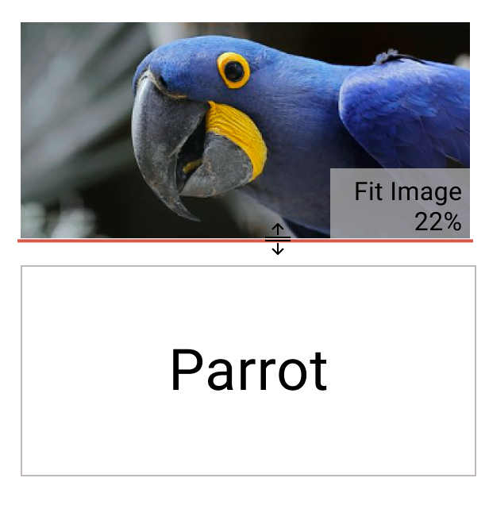
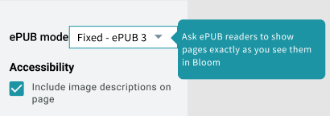
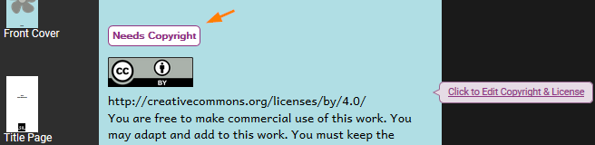
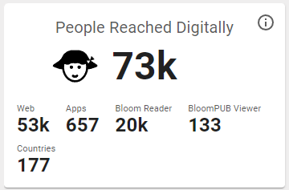
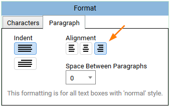

## Simple Choice Activities

We’ve added two new activities that you can add to your books. Just enter the correct answer in the first box. When someone reads the book, bloom will shuffle the answers.

## Get More Books from Within Bloom Reader

Finally, users can get more books into their Bloom Reader without going to a separate browser window. We’ve added a button at the bottom of the screen:

You then choose a language and Bloom Reader shows you books from BloomLibrary.org. It will remember your recent languages, so you don’t have to find them each time:

Once you pick a book, you can either download it into Bloom Reader or just read it online:

# Smarter Splitter

We heard you: getting image and text boxes to _just the right size_ was too hard. We’ve made splitters smart in a couple of ways:

1) You can now double-click the splitter to make it snap to the position used by the previous page.

2) The splitter now “snaps” to some common locations:

- The position used by the previous page.
- The position that perfectly matches the image’s proportions.
- 1/4,1/3, 1/2, etc.
- Square

3) Previously, the splitter moved by tenths of a percentage. Now, it moves only by full percentage points.

4) If you need more precision, hold down the CTRL key to go back to moving by tenths of a percent, ignoring snap points.

## Fixed Layout ePUBs

Bloom can now create ePUBs in “Fixed” mode which asks ePUB players to preserve the page as you see it in Bloom. If you have a very simple book, Bloom will also let you choose the previous “Flowable” mode.

With this improvement, you can now publish overlay (comic) books as ePUBs.

## Color Chooser

We improved the color chooser and made the same chooser available everywhere you can set a color, including text, background colors in the overlay tool, and cover colors.

## Text Color in Styles

As before, you can also color individual words and letters:

## Modernised Topic Chooser

## “Needs Copyright” Button

We’ve noticed that sometimes people forget to add a copyright, which later prevents them from publishing the book to BloomLibrary.org. Now Bloom shows this button to prompt you.

## Overlay Tool

- We’ve added a new Bubble shape, “Rectangular”:

- We added hints to remind you about two important shortcuts:

- You can now click on the background image in order to change it.
- If a bubble somehow ends up off-screen, Bloom will move it back on screen the next time it loads the page.

## Other Improvements

- Bloom’s experimental spreadsheet import/export now retains a book’s metadata.
- We added experimental spreadsheet import/export for Talking Books.
- We made it feasible to use leading spaces in a Talking book to make the left edge of a text box vary in order to do things like conform to the image to the left of the text. While we don’t _like_ this approach, it is currently the only way to achieve this.
	- Don't highlight leading/trailing whitespace of current audio segment.
	- Collapse multiple whitespace in translation bubbles.
- When Bloom makes a BloomPack, it now includes any audio in the books.
- Bloom now shows the Sign Language name on the cover.
- If you download and translate a book, Bloom now gives you the same cover colors as the original.
- SIL has deprecated Andika New Basic, since Andika now contains all of its characters. We are gradually switching everything over to Andika in a way that we think will be invisible to users. For this release, we switched Bloom Reader & Viewer to come with Andika built in.
- We improved sorting of books in BloomLibrary.org. By default, books now sort from newest to oldest. For particular collections, we can change this to sorting by title with good number sorting so that numbered series will show in order.
- BloomLibrary’s “stats” pages now have a “People Reached Digitally” Stat

- We added a way for advanced users to override the image compression we do when we publish books.
- We added a 6” x 9” paper size.
- You can now set text to right-align:

- You won’t notice it, but we did months of work preparing Bloom to move to a modern browser component. This investment will reduce our maintenance cost and unlock some new capabilities in the future.
- We introduced a new layout to most of our “Publish” screens. In the next version, we’ll complete this transition by rewriting the PDF/Print and Web Upload screens to fit this new system. In the end, the publish screens will be much more uniform so that if you learn one, others will be more familiar.
