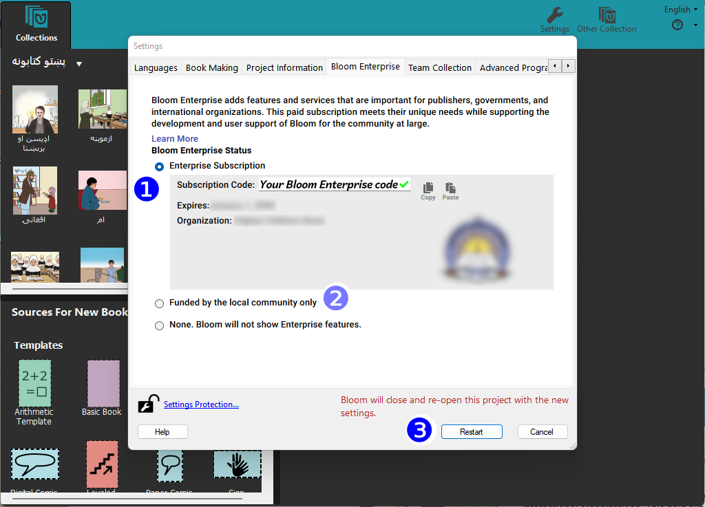
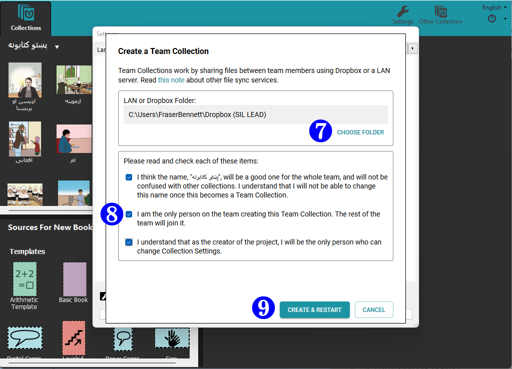
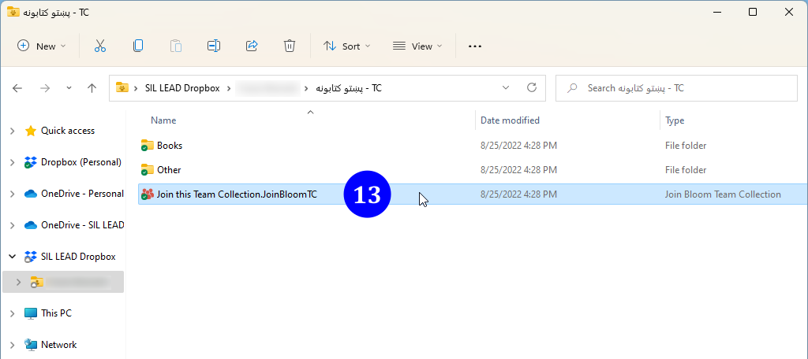

To create a Team Collection, you start with an existing Bloom collection and convert it into a Team Collection. In this guide, we will walk through the process of converting an existing collection into a Team Collection.

The basic steps are:

1. The team designates a Team Collection Administrator
1. The Administrator converts a Collection into a Team Collection
1. The Administrator shares the Team Collection with the other team members
1. Other team members join the Team Collection

Let’s look at each step in turn.

## Before you begin {#e90273e0a5624c619c271d35d943aa0f}

Before you begin, make sure:

- The latest version of Bloom is installed on your computer, **and** you have registered it with a distinct email address.
- You have a Bloom Collection that you want to convert to be a Team Collection.
- You have a Dropbox account.
- The Dropbox app is installed on your computer. If the Dropbox app is not installed on your computer, see [Setting Up Dropbox on Your Computer](/team-collections-setting-up-dropbox).

	:::note
	
	Dropbox is free for most users, so you may want each team member to have his or her own Dropbox account. If this is a problem (for instance, if you have a limited number of high-capacity Dropbox accounts available), it is possible for all your team members to use the same Dropbox account. 
	
	:::
	

## Step 1: The team designates a Team Collection Administrator {#c66469a5defd4920adc51e3a43af9dac}

Your team must decide who will be the Team Collection’s _Administrator_. The Administrator is the one who will convert the collection into a Team Collection and share it with the other team members. 

:::note

In addition to setting up the Team Collection and sharing it with the other team members, the Team Collection Administrator has sole control of all Team Collection settings, including the default font, Bloom Enterprise subscription code, and “xmatter” (front and back matter) book settings. The Administrator also has control over any Leveled Reader and Decodable Reader settings. 

:::

## Step 2: The Administrator converts the Collection into a Team Collection {#d29740fcdcfd40d7804294b33f66c04d}

The next step for our Administrator is to convert the "regular" Collection into a Team Collection. The collection can be an existing one with books already in it, or it can be a newly created, empty collection. 

:::note

If your team has multiple copies of the exact same book or even multiple copies of several books, the team should carefully determine which book is the most up-to-date version of each title. The team should gather those books together and pass the “master copy” to the team administrator who will place these books in their Bloom collection.

:::

Once you have the base collection prepared, there are four steps to the process:

1. Open the Collection Settings in Bloom
1. Enable Bloom Enterprise features
1. Enable Team Collections
1. Create the Team Collection

Let's look at each step in detail.

### 2.1 Open the Collection Settings in Bloom {#e0cdf1c10f91453ba596fe6b5657cd58}

Open the Collection in Bloom, and click on **Settings** in the "Collections" toolbar (make sure you are in the “Collections” mode, not "Edit" or "Publish").

### 2.2 Enable Bloom Enterprise features {#e20fb62f9ba44e5e944a477dd3d60204}

Team Collections is a Bloom Enterprise feature. Navigate to the **Bloom Enterprise** tab of the Collection Settings. 

Click the **Enterprise Subscription** radio button and enter your Bloom Enterprise subscription code **❶**. 

:::note

If your project is funded entirely by a local community, you can enable Bloom Enterprise features by clicking “Funded by the local community only” ❷.

:::

**Restart** Bloom ❸.

### 2.3 Enable Team Collections {#06325dc8841a41ca951ef5c67281d42b}

Team Collections is an experimental feature that must be enabled. After Bloom restarts, return to the Collection Settings and navigate to the **Advanced Program Settings.** 

Tick the **Team Collections** box ❹. 

**Restart** Bloom **❺**. 

### 2.4 Create the Team Collection  {#4e59155062ed4f5ebde71045b8ed20c8}

After Bloom restarts, return to the Collection Settings. This time, you will see a new tab for **Team Collections**. When you activate it, you will see a warning message:

> **⚠** This is an **experimental** feature. Please contact us at [experimental@bloomlibrary.org](mailto:experimental@bloomlibrary.org) so that we can talk over your needs and make sure that this feature is ready for you.

Click the **CREATE A TEAM COLLECTION** button **❻.**

Now Bloom will present another dialog box titled “Create a Team Collection”, with two sections.  

The first section lets you choose a location for the team collection’s “shadow folder”. You can accept the default location suggested by Bloom, or you can click **CHOOSE FOLDER** **❼** and navigate to another location within your synchronized Dropbox folder. 

:::note

The **shadow collection folder** is a special folder of compressed files stored in Dropbox, which Bloom uses to synchronize files between team members’ computers. See How Team Collections work for more details.

:::

:::caution

Make sure that the folder you choose as your shadow folder (the “LAN or Dropbox Folder”) is NOT one of the following: 
- a folder that is already a shadow folder (i.e., DON’T choose a folder that contains a `.JoinBloomTC` file)

- a Bloom collection working folder working collection (i.e., DON’T choose a folder that contains a `.bloomCollection` file)

- a folder that already contains a folder with the same name as the shadow folder you are trying to create

:::

Next, take a moment to read and make sure you understand the three items in the second section **❽**. Then, tick the three boxes showing you have read and understood these notices. 

If you are satisfied that everything is correct, click **CREATE & RESTART** **❾**. 

Bloom will create a special “shadow folder” in your shared Dropbox folder and begin to add the books in your Collection to it. Be aware that if your collection of books is very large, this may take some time.

After Bloom has finished creating the cloud collection folder, Bloom will restart. Now you should see the Team Collection notice in the tab bar:

## 3. The Administrator shares the Team Collection with the other team members {#fc32002511f04c6fad08415be980e85b}

For others to collaborate on your Team Collection, you need to share your Team Collection folders with them. You do this by sharing with them the synchronized folder that contains your cloud collection folder. Assuming you are using Dropbox on Windows, you can do this by right-clicking the team collection shadow folder _in Windows File Explorer_ (10a) and then clicking **Share…**. (10b).

:::note

The shadow collection folder contains a special file called `Join This Team Collection.JoinBloomTC`. (This file might appear as simply `Join This Team Collection`, if you have Windows File Explorer set to hide filename extensions.) The Administrator can rename this file (for instance, to translate it into another language), but the file **must** retain the `.JoinBloomTC` filename extension.

:::

:::note

If you are using Windows 11, you will probably need to choose **Show more options** (10b) from the right-click context menu, then choose **Share…** (10c) from the larger menu. 

:::

Enter the email address of each person you want to invite. Make sure the recipient will have **editing** privileges for the folder. (This is the default setting.) You can also type an introductory message **(11)**. Then Click **Share** **(12)**. Each team member will receive an email notification from the Administrator about the shared folder. (If the recipient has the Dropbox app installed on their computer, there will also be a pop-up message.)

## 4. Other team members join the Team Collection {#f2aa79dfaa414d9f8f188d1c7ef62e52}

To join a Team Collection, other team members do the following: 

1. Make sure that Bloom is registered.

	:::note
	
	If the user’s Bloom installation is not registered, he or she can register it by clicking the **Registration…** line under the Bloom Help menu (marked with a **(?)** icon).  
	
	
	:::
	

1. Add the shadow collection to his or her Dropbox by clicking **Add** in response to the Administrator’s invitation.
1. Locate the shadow collection folder in the Windows File Explorer and open it.
1. Locate and double-click the `Join this Team Collection.JoinBloomTC` file **(13)**.

:::caution

It is essential to double-click `Join this Team Collection.JoinBloomTC` **in Windows File Explorer**, not in the Dropbox interface in a web browser. 

:::

:::note

The Administrator may have changed the name of the file, but it will still have a `.JoinBloomTC` filename extension. 

:::

Next, Bloom will present a dialogue box allowing the user to join the team collection. Click **Join** **(14)****.**

Next, Bloom will launch itself and copy the working files from the shadow directory into a new working directory.

:::note

If the user already has a collection with the same name as the Team Collection, Bloom will present a dialogue box allowing the user to _Join and Merge_ the Team Collection_._ This action will cause this team member’s private collection to be merged with the Administrator's team collection. Note that during the merge process, the Administrator’s settings will overwrite the member’s collection settings.

:::

After Bloom has copied all the files into a working collection, Bloom will restart and open the new collection. All the team members should see the Team Collection badge in the toolbar. 

## What next?  {#c33b6d8a90f64a82aa6a83911a6d4e10}

Working with a Team Collection is like working with a regular Bloom Collection, but you need to check books out in order to edit them. When you’re finished making edits, check them in again so that your teammates can work on them. For more details, see [Working with Team Collections](/working-with-team-collections). 

