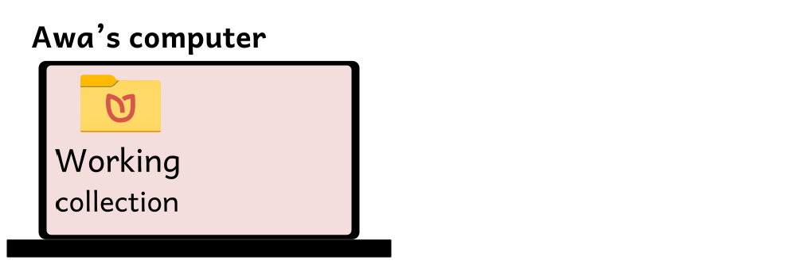
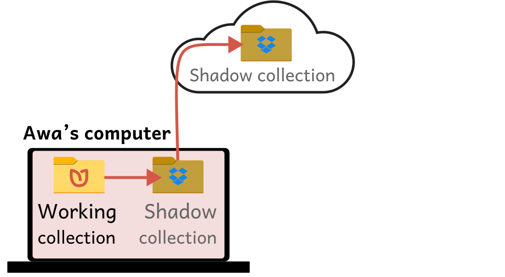
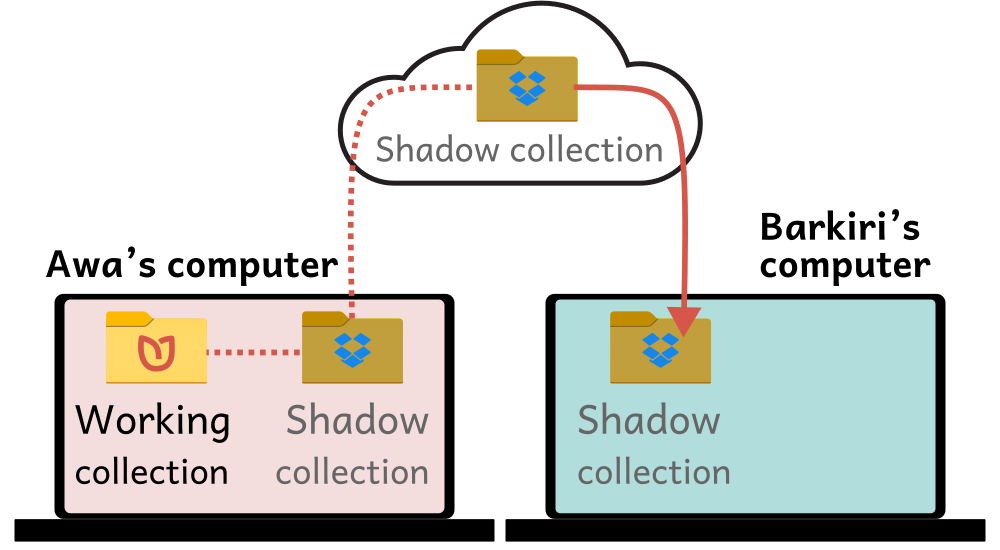
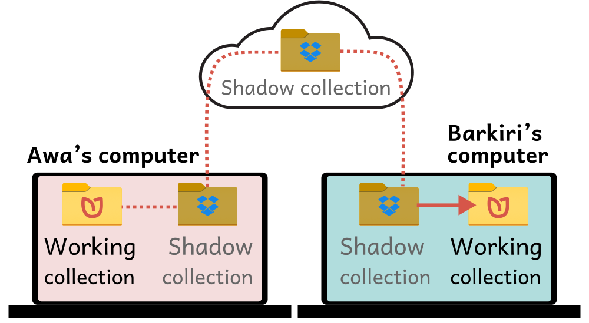
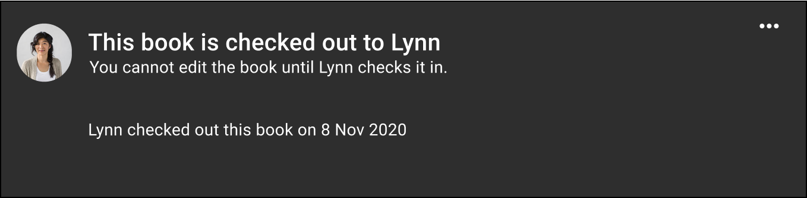

A **Bloom Team Collection** is a normal Bloom Collection that is shared among team members through the synchronized cloud storage service [Dropbox](https://www.dropbox.com/) or a local area network. By synchronizing files across computers, each person who works on a book has the latest version available. **We recommend this system for any project where more than one person touches a book before it is published, and where everyone has adequate internet access.** 

## System requirements for using a Team Collection {#898b75ce07734a0891bf3512030894b4}

- A Bloom Enterprise subscription, **OR** you can affirm that your project is fully funded by a local community
- Bloom 5.1 or greater. (It is recommended, but not required, that all the team members use the same version of Bloom.)

	:::caution
	
	Each team member must register his or her copy of Bloom with a unique email address.  
	
	:::
	

- A [Dropbox](https://www.dropbox.com/) account. The [free version of Dropbox](https://www.dropbox.com/basic), which provides 2GB of storage space, should be sufficient for 100–1000 typical Bloom books.

	:::note
	
	These instructions focus on using Dropbox to synchronize Team Collection files. If you want to use a local network share instead of Dropbox, contact the Bloom team at experimental@bloomlibrary.org. 
	
	:::
	

## How Team Collections work {#013b2b088f3d4b98a03331c3953ed52f}

A Bloom Team Collection has two parts. The first part is a normal Bloom collection of working files. This is a folder that contains one or more Bloom books, each in its own folder, as well as special files used by Bloom. 

The second part is a special **shadow collection folder**, which is created for the Team Collection by Bloom. Bloom synchronizes the shadow collection and the working files. The shadow collection is also synchronized between your computer and the Dropbox cloud storage service, which synchronizes it to other team members’ computers.

:::note

A **shadow collection folder** (sometimes called a “shadow collection” or “shadow folder”) is a special folder that contains compressed copies of all the Team Collection files. The shadow collection folder is stored in a cloud-synchronized local directory on your computer. 

:::

For example, let’s say Awa has a collection of books on her computer (Figure 1): 

Awa’s collection is a Team Collection, so Bloom creates a shadow collection folder on her computer from her working files. The shadow collection is also synchronized to the Dropbox file-sharing service (Figure 2). 

Awa shares the shadow collection folder with her teammate Barkari using Dropbox. Now Awa and Barkari both have a shadow collection folder on their computers (Figure 3).   

When Barkari launches a special file in the shadow collection folder, Bloom copies the Team Collection files from the shadow collection on his computer, to create a working collection. Now Barkari can edit books in the collection, too. 

Whenever Awa or Barkari change something in the working collection on their computers, Bloom copies the changes into the shadow collection, and Dropbox copies the changes to the other one’s computer. In this way, they can both work on the collection, even though they are using different computers. 

## Checking books in and out {#a9f312d9f6f94e5aae10c9abc8ac8069}

In a Team Collection, each book has a **status**. There are three possibilities for a book: 

- **Available for editing**

- **Checked out by you**

- **Checked out by someone else**

Only the person who has a book checked out can make changes to it. Whenever one user checks out a book for editing, Bloom uses Dropbox to notify the other team members that the book is checked out. After the user checks the book back in, Bloom notifies the other team members that the book is available for editing again. 

This checkout system ensures that team members do not develop multiple conflicting versions of a book that must be painfully reconciled later. 

## What if I don't have Internet access all the time? {#e1f5496e509a49039de3d7113d05fd97}

You do not need continuous internet access to use Bloom team collections. You only need to be connected to the internet when you check books in and out. Your internet service does have to be sufficiently fast and reliable to transfer books to and from Dropbox.

### Why Dropbox?  {#2e254141a368476083ba215f25f14ab8}

Team Collections works with Dropbox because we have found that it works more reliably and efficiently for this purpose than other commercial filesharing services do. In particular, Dropbox lets other team collection users know when a teammate has updated a book more reliably than Google Drive does. Even more important, when you change part of a book, Dropbox transmits only the parts of the book that have changed rather than the entire book. This is helpful in places with less than super-fast internet.

## For more information {#941774967d44426fb364b298f1d498ce}

- [Getting started with Team Collections](/team-collections-getting-started)
- [Working with Team Collections](/working-with-team-collections)
- [Team Collections FAQs](/team-collection-faq)
- [Team Collections: When things don’t go according to plan](/team-collections-problems)
- [Team Collections: Advanced Topics](/team-collections-advanced-topics)
