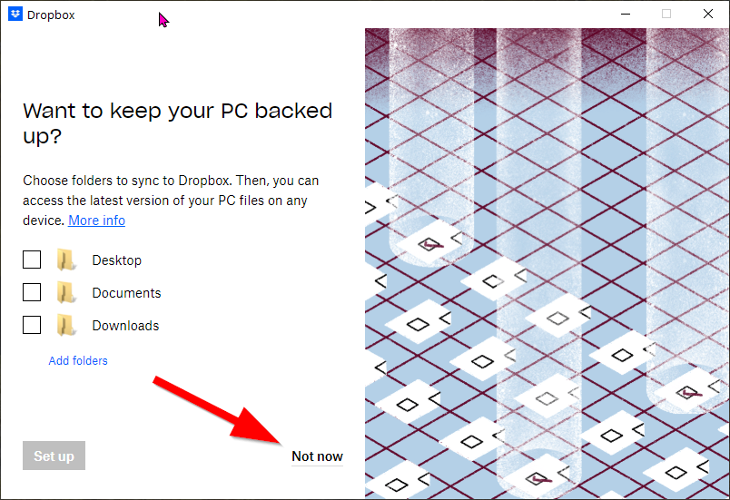

As a Cloud service, Dropbox can operate entirely through a web browser interface. However, in order to use Bloom Team Collections, **you need to also install the Dropbox App on your computer.**  The Dropbox App allows you to access your Dropbox files through your computer’s file manager (in Windows, that’s File Explorer). It also allows Bloom to synchronize your Team Collection between Bloom’s working files and the Team Collection’s cloud collection folder. 

In this guide, we’ll walk through the process of installing the Dropbox app on a Windows computer. 

When you sign into Dropbox initially, you may see this dialogue box. Click on the Download button to get started.

If you don’t see that sign, then from your web interface in Dropbox, click on your account icon (1), then click on “install Dropbox app”(2).

You’ll see:

`DropboxInstaller.exe` will download. After download, double-click on the file to install it. You may need to register a phone number to your account. After that you should see:

Other steps may be presented. Eventually, you’ll get to:

If you only have a basic Dropbox account, you must choose the first option.

Next, Dropbox will want to add several large folders to be automatically backed up. It is very likely that the space requirements for backing up these folders will surpass the allotment of a Basic Dropbox account.

If you only have a Basic Dropbox account, uncheck those boxes and click “Not now” to proceed.

You’ll see a warning:

Click to **Continue to Dropbox**.

Dropbox will create a folder on your computer to hold synchronized files. On most computers, this will be located at `C:\Users\<your username>\Dropbox`. 

That’s it! Now you can store your Bloom Team Collection cloud collection folders in your synchronized Dropbox folder, and enjoy using Bloom Team Collections. 

