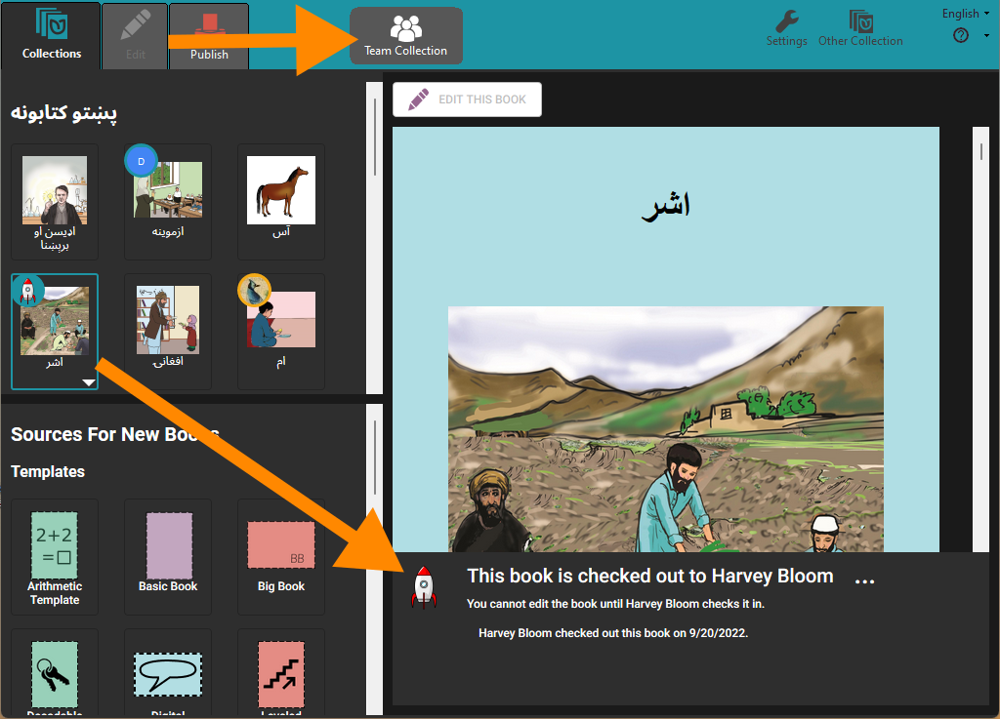
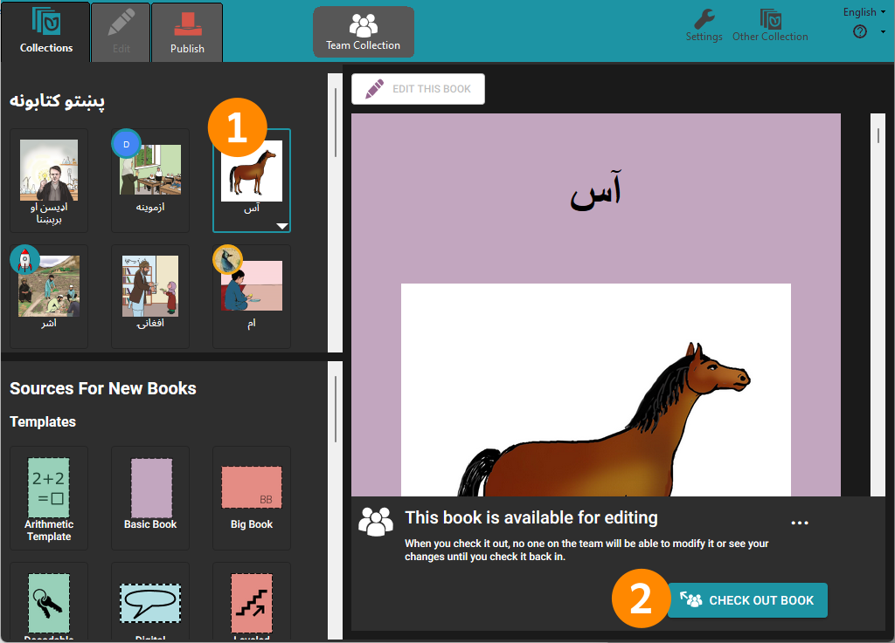
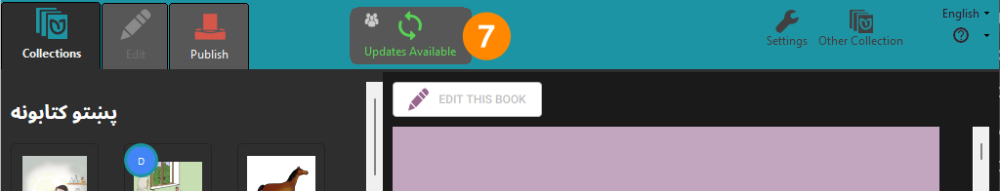

## Checking In & Checking Out Books {#0767f6bd94384cacbb8670f5258dca0e}

When you open a Team Collection, the first thing you will notice is a “Team Collection” badge in the toolbar. You will probably also see colored circles on some of the book thumbnail images. These circles indicate which books are checked out for editing by members of your team.

When you click on a book thumbnail, Bloom will display who has the book checked out. Books that are checked out to other team members are not available for editing. (Notice that the “Edit” tab is gray, meaning that you cannot click on it to edit the book.) 

---

In the example below, team member Awa Issa sees that the book “**آس**” is **available for editing** and wishes to edit that book. She clicks the thumbnail image **(1)**, and then clicks **CHECK OUT BOOK** **(2)**.

The book’s status immediately changes to **This book is checked out to you**, and Awa is now permitted to edit. Awa can click the **Edit** tab (3) or the **EDIT THIS BOOK** **(4)** button to begin editing the book. 

While Awa has this book checked out, other team members will see in the book’s status panel that Awa has the book checked out. Awa’s teammates cannot edit the book until after Awa has checked it back in.

When Awa is finished editing the book, she can check it back in. First, she types a brief note about the changes she made, to let her team members know what she has done **(5)**. (This step is optional.) Then she clicks the **CHECK IN BOOK** button **(6)**. 

The book is now available to the other team members to make further edits.

:::caution

**Slow internet connections can cause status update delays**
The status panel of a book may take some time to update over slow internet connections. When this happens, it is possible that two people may start to edit the same book at the same time. This will cause an editing conflict.  If an editing conflict occurs, Bloom will determine one team member to be the “winner” and will put the other team member’s edited book into a special _Lost and Found_ folder. (If this happens, see [Retrieving a book from Lost and Found](/team-collections-advanced-topics#3f4663c924424e6b93158710b7d00ea2).) 

If your team members do have poor internet access, you may wish to schedule the work through email or other means to lessen the potential for editing conflicts.

:::

### Making avatars for your team {#9406d3d3e8d54f6fbb2527a291ef17c9}

Bloom marks the thumbnails of books in a Team Collection with an initial letter of the name of the user who has a book checked out, or a small image (called an “avatar”) to represent the user:

How does Bloom know what to show? In the Bloom Registration, there is a field for name and email.  

Make sure each user has a correct and unique email. From that, Bloom can generate an avatar that uses their initials. If you want to have a picture instead of just initials, you can register your email address at [gravatar.com](https://gravatar.com/).

## Manually updating your team collection {#14c82c0008c84aec96da51ff3de9b317}

If another team member checks in a book, the Team Collections badge may say **Updates Available**. To get the latest version of the collection’s books right away, click on the **Updates Available** badge **(7)**. 

## Book history {#6970e9c0baf0447782bbcae7d4b94869}

Clicking on the Team Collection badge in the toolbar lets you see a history of changes. 

---

