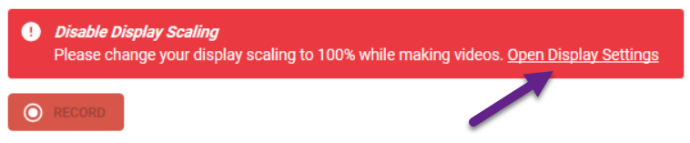
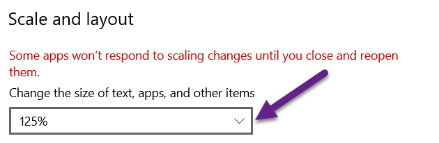

When publishing your Bloom book to video, if the display settings of your monitor have “scaling” applied, then Bloom will give a warning and will disable the RECORD button.

To disable the scaling for your monitor, click the link “<u>Open Display Settings</u>”.

Now, scroll down until you see “Scale and layout”. There you will find a percentage % set to something greater than 100%. 

Click the down-arrow:

Click on 100%:

Your scaling is now set to 100%. This is the same as saying that scaling has been disabled. 

For Bloom to recognize that your scaling has changed, you need to exit the Publish tab, then return to Publish. 

The RECORD button will now be enabled. Click the RECORD button to begin your recording:

[My Books](c4a9afcd-19e8-4002-8af8-33e89de90668)

	When you are logged into your Bloom Library account, there is a convenient way to view all of the books you have uploaded to the library. 

	First, you must **Sign In** to your Bloom Library account:

	

	1. **Click on the blank avatar symbol in the top right corner.**
	2. **Click on** **`Sign In / Sign Up`**.

	Bloom Library will present two options: you can **`Sign In with Google`** , or you can **`Sign In with email`**: 

	

	After signing in, your avatar will be displayed in the top right corner.

	

	1. Click on your avatar.
	2. Click on **`My Books`**.

	Following this, all of your books will be presented. 

