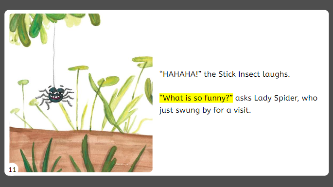

:::tip

This feature will not be available until Bloom 5.7

:::

# Default {#b552e6f9633048a79814e34d6ed09524}

Supported formats: all

Supported page layouts: all

# Zero Margin Ebook {#ef973a7b538e48df8563aac5b4fab104}

Supported formats: 16x9 Landscape ebook

Supported page layouts: “Picture on Left”

Features

- no page numbers
- vertically centered text

# Rounded Ebook {#0c82de1c003a4a30bd725260b627db2b}

Supported formats: 16x9 landscape ebook

Supported page layouts: “Picture on Left”, “Picture on Right”, **todo…**

Features: page number in lower left, on top of image when image is on left

Example: <iframe width="100%" height="450px" allow="fullscreen" allowFullScreen={true}
  src="https://bloomlibrary.org/bloom-player/bloomplayer.htm?url=https://s3.amazonaws.com/bloomharvest/educationforlife@sil.org/a99038d6-116d-4579-bc02-94124b0a55d6/bloomdigital/index.htm&initiallyShowAppBar=false&paused=true&allowToggleAppBar=true&independent=false&host=docs.bloomlibrary.org"></iframe>

#  {#f976a018aaf04045969007409be97a3d}

