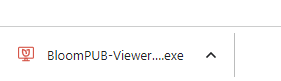

These days — for very good safety reasons — Windows makes it difficult to install programs that are not widely used. The BloomPUB Viewer is one such program. In this article, we will give steps to overcome the difficulties associated with installing BloomPUB Viewer.

We will show you how to:

- Bypass the caution message on Chrome when downloading the BloomPUB Viewer.
- Bypass the caution message on Windows Defender.

## Step 1: On the CREATE tab of Bloom Library, click DOWNLOAD BLOOM {#5881a5521a2f4c1abd978bf3a0681d76}

## Step 2: Click the link for “BloomPUB Viewer for Windows” under “Related Software” {#909fcd17fc7e4f84a2ee782d9c9b6d18}

Your browser will open up a webpage on github.com. This page contains links to _all_ versions of the BloomPUB Viewer program (current and previous versions). 

Typically, you will want to install the _latest_ version. The latest version will always be listed at the top of the page. It will be marked “Latest”:

## Step 3: Click the arrow beside “Assets” {#791db2e4af094ecaa6d9b3b6487f4ae1}

To access the link to the actual installer program, click on the arrow ► beside “Assets” to reveal all of the files.  

The arrow will change from ► to ▼.

## Step 4: Click on the very first setup file in the list {#e1266c95309a4153bc81a9dc7050788f}

:::caution

Your browser may now present a File Explorer dialogue so you can Save the program to any location you wish, or your browser may automatically begin to download the program. 

:::

After the program has finished downloading, typically, it will show up at the bottom of your screen like this: 

In the picture above, the exclamation mark **`!`** is indicating that the installer program for BloomPUB Viewer is potentially dangerous. Remember, this is only because BloomPUB Viewer is not used by many people. The program is safe.

## Step 5: Click the arrow beside the “Discard” button and then click “Keep” {#487edc26e6014fedaaaeee0b8f776da2}

If your browser marked the BloomPUB Viewer installer as potentially dangerous, the default action your browser will suggest is to _discard_ the installer. But since we know BloomPUB Viewer is a safe program, we need to override this default action and instead _keep_ the downloaded file.

To do so, click on the arrow beside the “Discard” button, and choose “Keep”:

Now, the downloaded program will now no longer show the red `!` mark:

:::tip

In the above examples, we are using the web browser **Chrome**. Be aware that other web browsers (e.g. Edge, Firefox) will have slightly different ways of unblocking potentially dangerous installer programs.

:::

## Step 6: Click on the downloaded program {#89970abe221c447d8ed4274728fe3c6c}

Click on the downloaded program to install it.

At this point, Windows Defender will probably halt the installation and will present a screen to alert you to a potentially dangerous program. 

By default, this screen offers only one button: “Don’t run”. 

:::caution

Remember, if you download some other program which you are not 100% sure is a safe program, then always click on the “Don’t run” button. 

:::

## Step 7: Click on “More info” {#1cc898a699a34c47bb44d6dd81f77564}

Since you know that “BloomPUB Viewer” is a safe program, you can click on “More info”:

## Step 8: Click on “Run anyway” {#03ba8d156fc144ec9209027d313c26a8}

Windows Defender now shows an additional button, “Run anyway.” 

Click on this.

The program will now install and launch:

