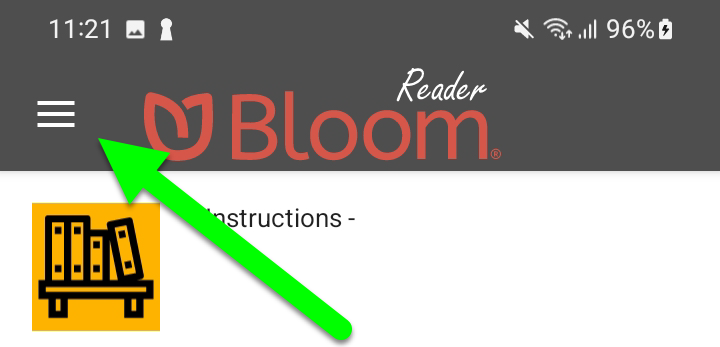
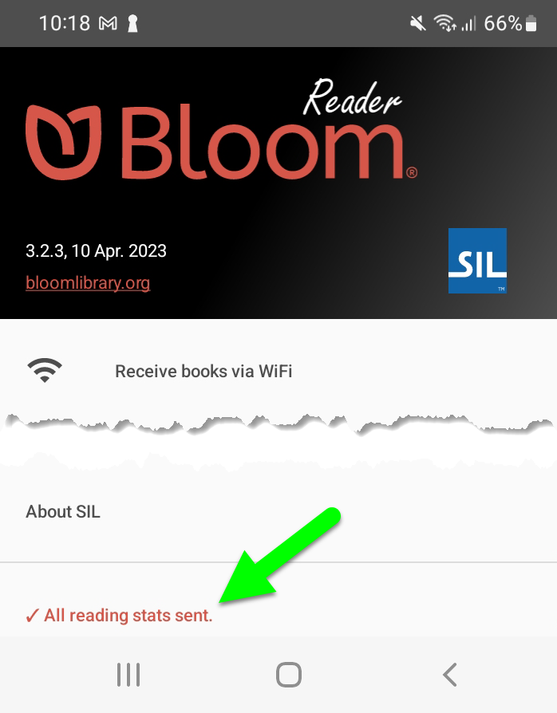

In a “customer interview,” Richard said

> It’s a bit confusing sometimes for clients like us, the idea of tagging and branding books. Perhaps their kind of documentation around that could be clearer. We recently suggested it would be useful to know what the analytics fields are so that a new client will know exactly what the app is able to report and not able to report. A more user-friendly approach with the documentation around the product. (**Tagging/branding books: does that have to do with the types of books, like biography or fiction?)** No, tagging is more to do with saying who owns the books. Who PAID for the project? In PNG where we’ve had two phases of the Rise Project plus two other projects, we need to differentiate those books in the database so those users can brand the books in different ways so that you know these books were from a particular project. [It’s a] nice problem to have because we’re using it in more places for different projects for different donors, different provinces. They need to improve the documentation around it so it’s clearer. At the moment we rely on SIL-PNG to do all of that. We don’t do it in-house. We give them the books; say it's for this project. But then when we have to extract the data from the database, we need to say okay, these books are for Rise 1; these books are for Rise 2. These users are for that other project; so we're kind of still feeling our way with that.

# Summary {#b0e5acd8a00642c885a4608952bfd96b}

| **❶** | The analytics page opens with the **Overview** selected. For greater specificity, click on the arrow to access a dropdown list of other analytics for your organisation.  |
| ----- | ------------------------------------------------------------------------------------------------------------------------------------------------------------------------- |
| **❷** | By default, analytics are shown for **ALL TIME**. To see analytics for a particular date range. click the calendar button and choose a start and end date.                |
| **❸** | To download a PNG image of the page, or a detailed CSV file, click the corresponding icon.                                                                                |

### Events that we measure {#6731ec339fee41c5b10a3848d3035992}

- All Bloom Player contexts (Bloom Library, Bloom Reader, BloomPub Viewer, RAB apps)
	- Pages read
	- Was the last (numbered) page in the book read? (This is some indication that the entire book was read. But note that it is possible just to flip past pages, or to move randomly through the book. So it wouldn’t be hard to cheat this system.)
	- Time spent
	- Comprehension Quizzes. This includes how many questions were present and how many answered correctly.
	- Duration of audio and video playback
	- Book branding
- Bloom Library
	- Downloads
- Bloom Reader specific events
	- Installations
- No events at this time
	- Shared book
	- Shared bookshelf
	- Shared APK
	- Share Link to app on Play Store
	- ePUB

### User information that we collect {#df805fac7c624034b2386a0a5f87715a}

- Web
	- IP address (--> city / country?)
- Bloom Reader only
	- Named device ids
		- ANALYTICS_DEVICE_PROJECT
		- ANALYTICS_DEVICE_ID
	- Location
		- `latitude`, `longitude`, `locationSource`, `locationAccuracy`, `locationAgeDays`
		- We record the locations available from each of the standard providers (network, gps, and passive) explicitly.  But for the standard location for this report, we mainly want the most recent location we can get; precision is not very important. 
		However, we know from experience that in poor countries, IP address doesn't give us reliable location, and we expect that WiFi and other networks will be similarly unreliable as means of location. So if we have a reasonably recent high-precision location we will take that in preference to a lower-precision one that may be even more current. (Elsewhere we request one location per hour from GPS, if available, to ensure that the "last known location" for the GPS provider will be reasonably recent.)
	- [Distribution Source](/bloom-reader-distribution-tags)
	- Hardware info
	- Android version?

### How your project can get analytics {#b53d29129ea74442b6c6d118e2aacddc}

- BloomLibrary bookshelves
	- /stats
	- CSV & PDF download
- Advanced low level access to analytics data
	- SQL access
		- [Available Fields](/analytic-fields)

### Difficulties getting analytics {#e88158be7e314caea85bc8217b37fd05}

- Getting analytics from devices that are normally offline
	- No internet (talk about Bloom Reader offline)
- Effect of blocking cookies?
- Firewalls
- No events on EPUB

### Privacy Issues {#c41cf67c2137426fb875b6275d5aa00d}

- No emails
- IP addresses?
- Cookies
- GPS resolution
- GPS opt in/out
- Device hardware IDs
- Named Device IDs

# Analytics Fields {#c2e2aaf25f2a4507a6f130a1c0c12791}

[Analytics Fields](/analytic-fields)

# Internet Connection Issues {#3b3ffb59d443404989a2c87bf9d2bbfa}

## How much bandwidth? {#a2162aee401349f49dba03f0b6b77d7b}

These are the most common analytics events sent by Bloom Reader:

- Bloom Reader started
- Bloom Reader backgrounded
- Book Opened
- Book Closed

Each event is less than 3KB. So a person who runs Bloom Reader, reads 2 books, then quits will send less than 18KB.

## What if the user is not connected to the internet? {#0b3df2601fd64fc1a921de9826faf100}

If the user is not connected to the internet, Bloom Reader will cache their events. The cache is limited to 1000 events.

To prompt Bloom Reader to send all of its events _right now,_ open the menu:

At the bottom of this screen, you will see Bloom Reader’s progress in sending the events:

