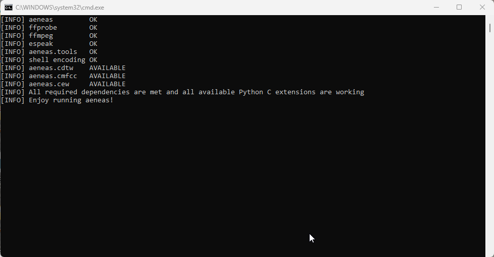

:::note

This page describes how to install aeneas on a Windows computer for use with Bloom. **aeneas** is an additional, free software package which Bloom uses to divide recorded audio for a text box into sentence-sized chunks. 

:::

## Recording audio by text box {#b5407eb108fb4d97b4d5cea74ab7cb12}

Bloom has two methods for recording audio narration for a book: **by sentence** and **by text box**. Bloom’s usual way of recording narrated audio is one sentence at a time. Bloom will highlight each sentence and allow you to record audio for that sentence.  

However, if you record a whole text box at once, the recording usually sounds more natural. If there is more than one sentence in the text box, Bloom uses an extra software package called **aeneas** to split the recording into sentences.

To enable recording by text box, tick the check box that says **Record by whole text box, then let Bloom split it into sentences later**. Bloom will highlight the entire text box. 

 

If you do not have the aeneas software package installed on your computer, Bloom will display a warning in the lower portion of the Talking Book tool controls, saying **To split recordings into sentences, first install the** [**aeneas**](https://github.com/sillsdev/aeneas-installer/releases/tag/v1.7.3) **system.** 

## How to install aeneas {#9a04c47a775746d0be2db16cf442995b}

1. Click the link under “aeneas” in the Talking Book Tool’s warning box,  or navigate to this webpage to download the [aeneas ](https://github.com/sillsdev/aeneas-installer/releases/tag/v1.7.3)software: [https://github.com/sillsdev/aeneas-installer/releases/tag/v1.7.3](https://github.com/sillsdev/aeneas-installer/releases/tag/v1.7.3)

1. Click the **`aeneas-windows-setup-1.7.3.exe`** link to download the software.

1. Find the downloaded [**`aeneas-windows-setup-1.7.3.exe`**](https://github.com/sillsdev/aeneas-installer/releases/download/v1.7.3/aeneas-windows-setup-1.7.3.exe)  installer program (probably in the **Downloads** folder) and double-click it to launch the software installer. Windows will show you a User Account Control window, asking whether you want to allow the app to make changes to your device. Click **Yes**. 

The aeneas tools setup wizard will start.

1. Click **Next** to follow the steps of the setup wizard. **Do not make any changes to the default installation settings unless you are sure what you are doing.**

1. When you reach the “Ready to Install” screen, click **Install.** You will see a number of installation status screens, including some in the Windows command line.

Eventually, you will see a “Completing the aeneas tools Setup Wizard” screen.

1. Restart your computer.

Now you can record an entire text box in Bloom, and let Bloom automatically split the recording into sentences. 

