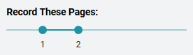

:::note

The following are known problems and limitations in this feature.

:::

## Known Bug: **Sign Language video may be skipped in videos that  are only a portion of the book** {#9b870396711b43abb9f45d893c7acfc9}

When you record an entire SL book, and then playback the recording, all is well.

But if you select a portion of the book:

_and_ if the first page you specify contains a sign language video, then that sign language video won't be included in the final video recording of the book.  

Issue: [BL-11248](https://issues.bloomlibrary.org/youtrack/issue/BL-11248)

## Limitation: Bloom does not currently playback any audio from embedded videos {#52a16e91c8714398aa459085a738c84b}

Currently, Bloom only supports videos that are silent, i.e. for Sign Language. But some SL videos contain dubbed audio narration, e.g. [this book](https://bloomlibrary.org/sign-language/book/XkmlHhNZ7T). When recording such books in Publish to Video, the audio is lost.

Issue: [BL-11249](https://issues.bloomlibrary.org/youtrack/issue/BL-11249)

