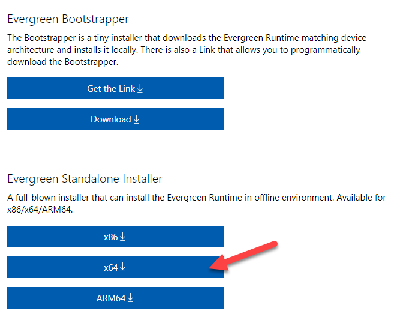

Bloom 5.5 and later requires the Microsoft WebView2 Runtime “Evergreen Standalone” to be installed. If your computer regularly receives Windows Updates, you will already have this. Otherwise, follow these instructions:

# Only for you? {#8c2000ada2d046f5852f01db766ce634}

Click [here](https://go.microsoft.com/fwlink/p/?LinkId=2124703) to get a small program from Microsoft. When you run it, it will download and install whatever you need. It may mention “Microsoft Edge” instead of “Webview2”, that’s fine.

# Want to save bandwidth by getting an installer you can share with others offline? {#000ea21dae6641f6ad5f132942f9ed79}

Click [here ](https://developer.microsoft.com/en-us/microsoft-edge/webview2/)for a page that will let you download a large (~140mb) installer that you can share with others. When you get that page, click the one that says “x64”:

