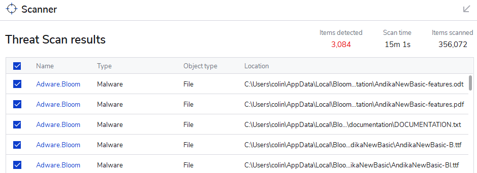

# Introduction to the problem {#cfcdd04f0abd46cf8b021bdcac920ed9}


Bloom works great with the antivirus program that is built into Windows, which is called “Windows Defender”. Most people don’t need or want anything more than that.


However, some people choose to add a second antivirus program. These programs often wrongly say that Bloom is a problem. Bloom has a small audience, so these programs don’t recognize it. They assume the worst and start interfering with it. For example, you might see:





If your antivirus program is complaining about Bloom, do not write to us about it — there is nothing we can do. Instead, if you trust Bloom, you can tell your program that Bloom is OK. This is sometimes called “whitelisting”.


In this article, we will show you how to do this in a couple of different programs. 


# General Instructions for Whitelisting Bloom {#72f57368ca7741a1ac8b2694561692a3}


When you install Bloom, it adds a special folder to your computer. The path to this folder will be:


```javascript
C:\Users\YOUR USER NAME\AppData\Local\Bloom
```


Every antivirus or antimalware program provides a way for you to tell it that **Bloom** is _safe_. You do this by telling your antivirus or antimalware program that this Bloom _folder_ is safe. 


For some programs, you will add the Bloom folder to a list of “allowed” folders. 


For other programs, you will add the Bloom folder to a list of “excluded” folders.


In either case, the result is that your program will no longer scan the Bloom folder looking for virus threats or Adware threats. 


Each antivirus program will have its own method for doing this. Here are two:


[link_to_page](2bba8ea6-d1e7-4b69-9fb9-007054aa2fb1)


[link_to_page](57d2314c-e205-429e-9060-c12244e53126)

