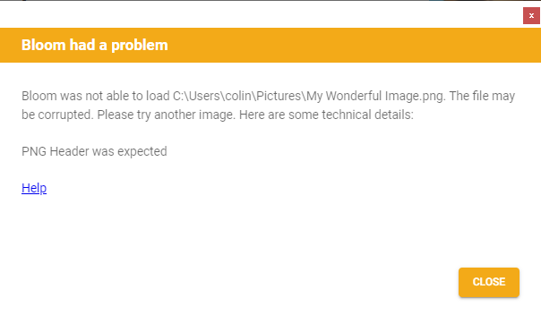

If you try to import an image into your Bloom book but the image is _corrupt_, Bloom will show you an error message similar to this one:

Any number of things could cause image corruption, but the most likely cause is that the image was downloaded from a dubious (unreliable) source on the internet. 

In such cases, you need to look for an alternate image from a more reputable source.

If, however, the image rejected by Bloom was, in fact, _not_ taken from the internet but was instead generated using reputable software on your computer or came from a common source like your digital camera or scanner, then Bloom should probably have been able to import the image.

In this case, you can request that the Bloom team examine the image to determine why Bloom rejects it.

Send an email with the image to [issues@bloomlibrary.org](mailto:issues@bloomlibrary.org). 

