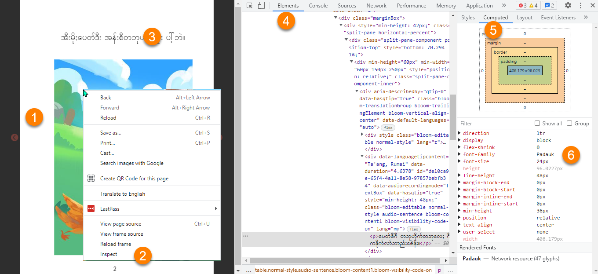
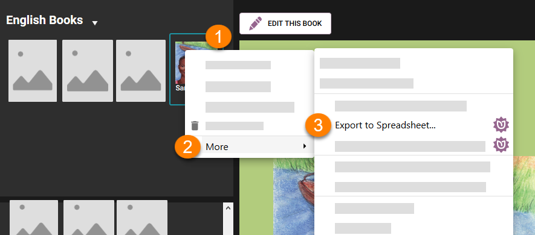
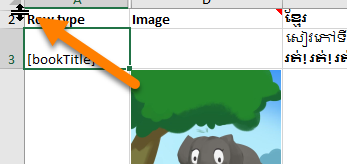
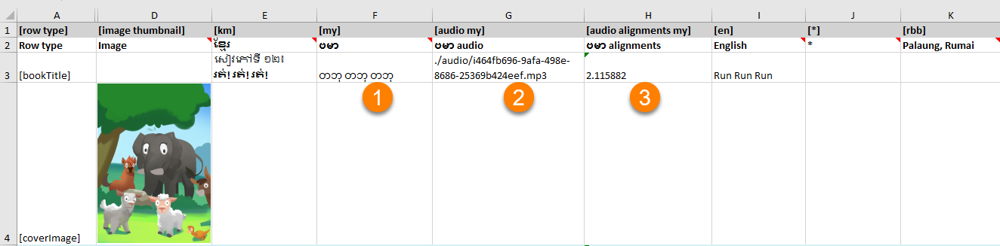
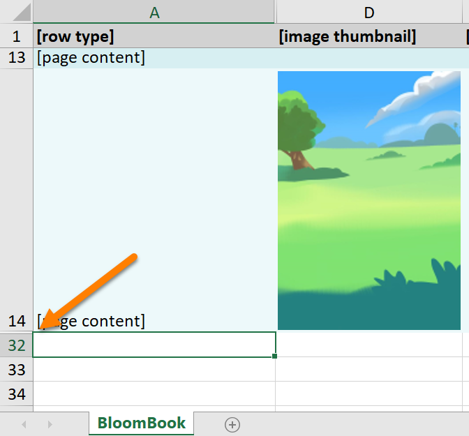
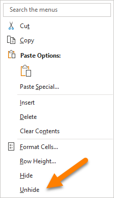
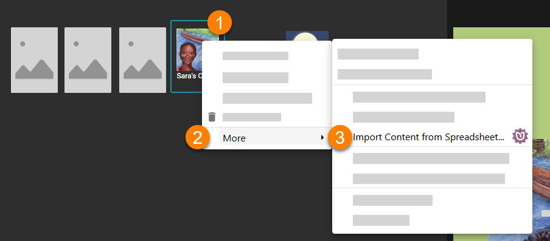

:::caution

These notes describe how to repair a book which has been uploaded to Bloom Library with the wrong language code. 

This process is intended for the Bloom Librarian or for an experienced Bloom support person. The procedure below is _not_ intended for public consumption.

Be sure to use the latest version of Bloom Beta.

:::


Sometimes, a Bloom book is uploaded with incorrect language codes. 


For example, a book which is in **Palaung, Rumai** (code “**rbb**”), is incorrectly tagged as **Burmese** (language code “**my**”).


The following procedure will repair the book.


# Step 1: Set up a collection with the correct language code {#be5792fd22eb41318b4fff02992db3b7}


Create a Bloom Collection with the correct language code — in this case, Palaung, Ruma [rbb].


:::tip

Hint: it is probably best to set both language 1 and language 2 to the same language in case there is any “stickiness” to the display language of the original book.

:::


# Step 2: Set the collection font to match the original {#919ae8b0dd2c4a8ca19992278f0f54e8}


If you don’t know the font, this is a bit tricky:

1. Go to the book on Bloom Library and click READ.
1. Right-click and choose **Inspect**.
1. Click on some text.
1. In the Elements tab…
1. click Computer…
1. The font name should display below.




# Step 3: Enable Spreadsheet Import/Export  {#d491d7be56d94217a6b1f032d5c71ed6}

1. Tick the **Spreadsheet Import/Export** box in the Advanced Program Settings.
1. Set Bloom Enterprise Status to “Funded by the local community only”.

# Step 4: Download the problem book(s) {#d22d9d8695014cf8a077dcde186fce76}


Bloom will put the book(s) in:


```javascript
C:\Users\USER NAME\AppData\Local\SIL\Bloom\Collections\Books From [BloomLibrary.org](http://bloomlibrary.org/) 
```


:::caution

Do _not_ make derivative books from these downloaded books because this will change the copyright and licensing from the original and create a new book ID.

:::


# Step 5: Move book(s) to the collection {#738b7d718d324f358608a1ec242969a1}


Close Bloom.


Using Windows File Exporter, _move_ all of step 3’s downloaded books _from_ the above downloads folder _into_ the Bloom collection folder created in step 1.


In this way, you are more-or-less replicating the state of the book the uploader had on their computer before they uploaded the book. More importantly, Bloom will retain the original book ID.


# Step 6: Export the book to a spreadsheet {#7c22772d905f4513b3bf610a21f8b2fb}


Open Bloom, select the book, and right-click to access the **`Export to Spreadsheet…`** function. 





# Step 7: Unhide row 1 {#49832cb981ed476991eafffe8e72f11d}


Hover your mouse just above the number 2 until you see the symbol pointed to below:





Click and drag the mouse to pull down and reveal row 1. 


# Step 8: Find the columns incorrectly tagged {#4cda02613acc40cbacbc889f7b7293d4}


Potentially, there are three: 

1. a column for the **text**;
1. a column for the **audio**
1. a column for the **audio alignments**

For example;





# Step 9: Correct the language codes and descriptions {#9c99572a64d84f30bc519cbe0122a6f6}


Put in the correct language code and descriptions for all columns incorrectly tagged, for rows 1 and 2. 


For example, change “my” to “rbb” and “ဗမာ” to “Palaung, Rumai”:


# Step 10: Change the empty column {#afbb740ebcff4ce0805b7bcf72d439a2}


There will be an _empty_ column for the correct/target language. You should see “[blank]” in several of its cells. 


You need to re-tag this empty column to match the _incorrect_ language tag. The reason for this is so that all the data which was incorrectly tagged will be _removed_ from the book when you import the spreadsheet back in the book. 


:::🚧

Deleting this column will not do the trick.

:::


# Step 11: Unhide the xmatter rows {#621524ea9046458abf15508620d9ad5d}


Scroll to the last visible row. You should see a discontinuous number. This indicates there are hidden rows. For example:





Select the last rows above and below, right-click, and choose Unhide





# Step 12: Verify the xmatter pages {#76b69a52803247748fe719e3c0f8270c}


It’s hard to predict what you’ll find here, but generally speaking, the credits and licensing should mostly appear in [*] column, with some others data appearing in the column for whatever national language the book used.


# Step 13: Import the spreadsheet {#3d6fa26de1034bb4b6ec80e2fb374ab8}


Import the spreadsheet back into the same book to update it. 





:::caution

Note: a backup of the original book will be placed in: 
`C:\Users\USER NAME\AppData\Local\Temp\bloom pre-import backups`

:::


# Step 14: Verify the book {#bd247ba8e00f4b29922b0c13036424b2}


Verify each page of the book, including audio. 


# Step 14: Upload to Bloom Library {#e62c973ad60040708ecc93e6d1b5b236}


The upload should find a match to the original book. If it does not, either the original book was removed from Bloom Library, or you mistakenly created a derivative of the original (see Step 5 above). 

