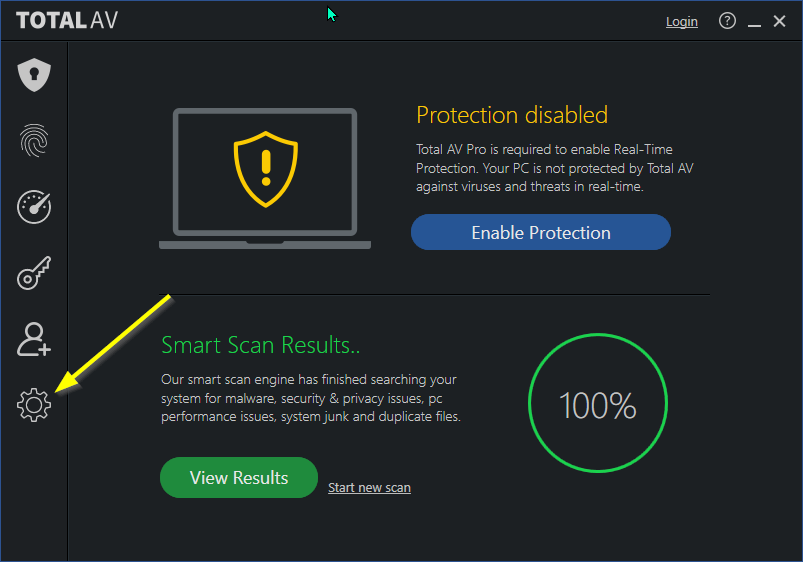
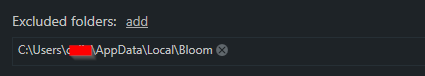

# Total AV {#67ded4ca342c468ab1fdfc6255e4ca88}

To begin, click on the **gear icon** to go to program settings:

Next, in the (1) Antivirus Scans tab, click to (2) add an Excluded folder:

Navigate to the Bloom folder under \AppData\Local\ and click Select Folder.

The Excluded folder list will now have Bloom: 

