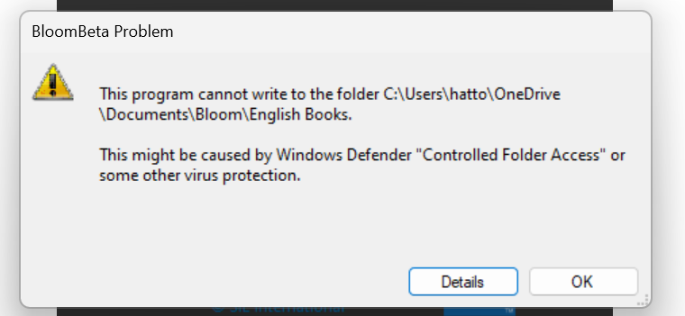
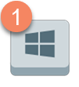
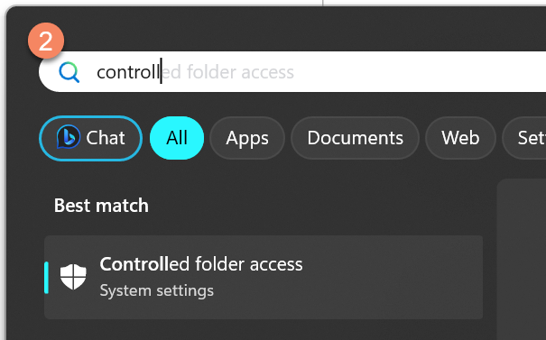
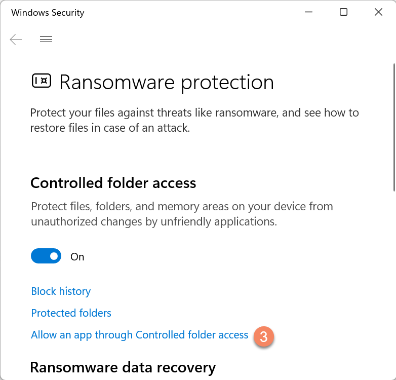
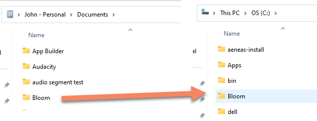
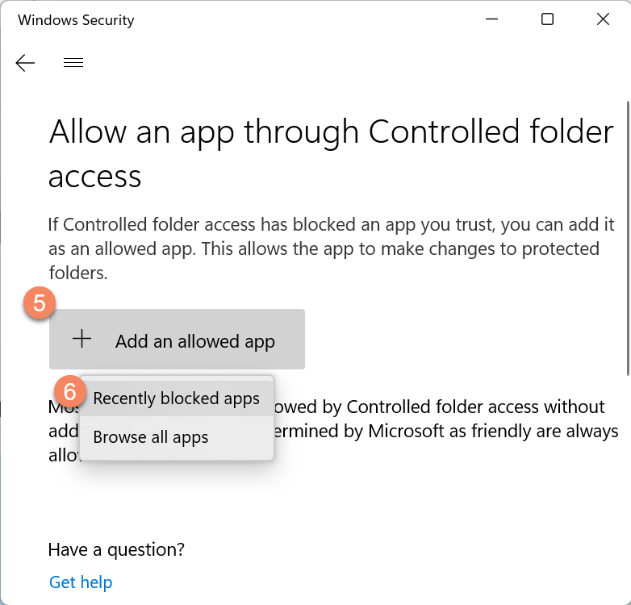
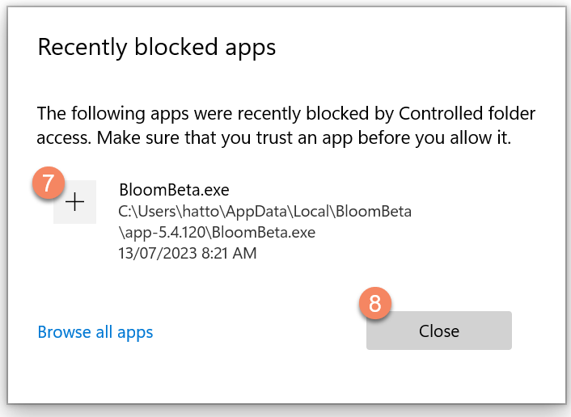

Microsoft Windows 10 & 11 have a security feature called “Controlled Folder Access”:

> Controlled folder access in Windows Security reviews the apps that can make changes to files in protected folders and blocks unauthorized or unsafe apps from accessing or changing files in those folders.

Bloom is not well-known enough to be “known” by Microsoft, and so if you turn on this security measure, Bloom will not be able to write to your Bloom files inside of your “My Documents”. Bloom checks for this problem and shows a notice like this:

You have three options:

## Option 1: Turn off “Controlled Folder Access” {#9ac2ed38622f424184876aec2aa376a9}

1. On your keyboard, press the Windows key

and then type “controlled folder” followed by the Enter key:

 2. Confirm that “Controlled folder access” is set to “On”. If it is “Off”, then something else is causing the problem, and you can stop reading these instructions.

 3. Click the toggle button that says “On”. It will switch to “Off”

 4. Now run Bloom again.

## Option 2: Move your Bloom collections folder out of “My Documents” {#a191f24b4c27424587acfb06f13b60c7}

If you move your Bloom collections folders somewhere that Windows is not “controlling”, then it will not interfere. However, Bloom will fail to be able to make new Collections, because it only knows how to make them under “My Documents”. So one way to solve the problem is to use the following “Option 3” temporarily to make any collections you need. Then move your collections folders somewhere that is not “Controlled”.

## Option 3: Tell Windows to allow Bloom {#753bae5344764a5eb719cb97c2fbaea6}

:::caution

This approach is not practical because you will need to do it each time Bloom updates itself. It may not be clear to you that this happened and you may not remember having read this notice. So then you will suddenly get hard-to-understand error messages and be stuck.

:::

To tell your Windows that you trust Bloom, do the following steps:

1. On your keyboard, press the Windows key

and then type “controlled folder” followed by the Enter key:

 2. Confirm that “Controlled folder access” is set to “On”. If it is “Off”, then something else is causing the problem, and you can stop reading these instructions.

 3. Click “Allow an app through Controlled folder access”

 4. A dialog will appear asking if you want “Windows Security” to make changes to your device. Select “Yes”.

 5. Click “Add an allowed app”

 6. Click “Recently blocked apps

 7. Click the “+” next to “Bloom”

 8. Click “Close”

 9. Finally, run Bloom again. This time it should open without an error.

