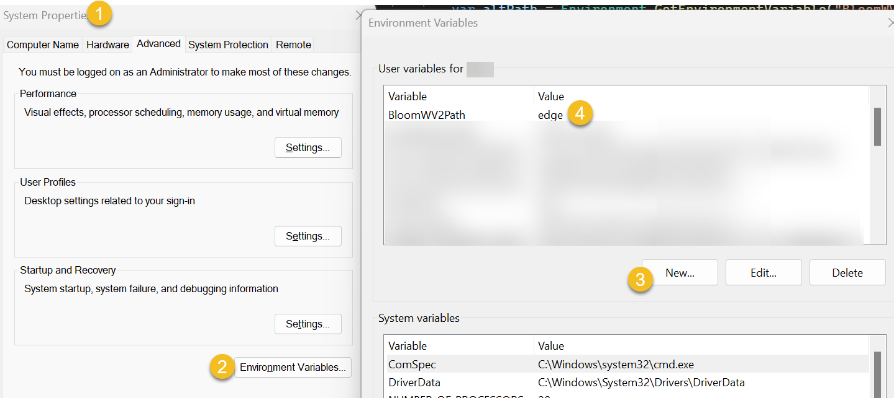

:::tip

Please get in contact with us ([mailto:issues@bloomlibrary.org](mailto:issues@bloomlibrary.org)) if you get directed here by Bloom. Even if the following instructions work for you, we need to know that this is actually happening to someone!

:::

Bloom’s user interface is powered by the same browser engine as Microsoft Edge, which is named “WebView2”. If WebView2 were to get damaged in some way, Bloom would not be able to run.  It would direct you to this web page.

If this happens to your, here are some things to try:

Click “Modify”, then “Repair”:

# If the repair doesn’t work {#f275483d6cd94e20a669424e17cc7b61}

:::tip

Please get in contact with us ([mailto:issues@bloomlibrary.org](mailto:issues@bloomlibrary.org)) if you get this far. Even if the following instructions work for you, we need to know that this is actually happening to someone!

:::

We have seen a situation where the above does not fix the problem, and have prepared a “nuclear option”: tell Bloom to use the WebView2 that comes with Microsoft Edge.  To do this, create an environment variable named “BloomWV2Path” and set it to “edge”:

Close these windows and run Bloom again.  If this doesn’t work, or even if it does, Please **[Problem Internal Link]**.

