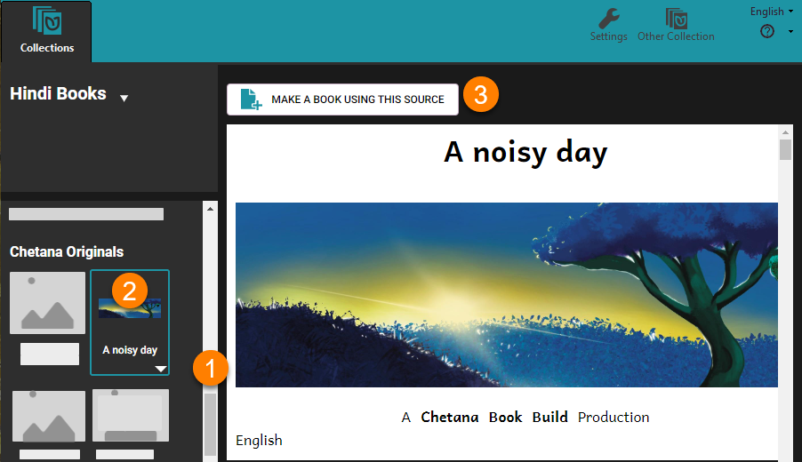

Several organizations utilize Bloom to create a set of self-authored books and then oversee their translation into other languages.

Most commonly, these organizations employ the following simple workflow:

1. New books are authored in a particular chosen majority language such as English, French, Russian, Hindi, etc. This collection of original books constitutes a type of “source” or “parent” collection. Some users may wish to divide their source books into multiple source collections. See [Show Another Collection](/show-another-collection).
2. The books in this “source” or “parent” collection are then translated (and/or adapted) into various other local languages in various “derivative” or “daughter” collections.

Source book collections should be made visible. See [Show Another Collection](/show-another-collection). 

## Make an adaptation of a book {#b0222b901f3c4af4ac57db65f9050812}

To adapt one of your books:

1. In the bottom right quadrant, scroll down past Templates, past Sample Shells, and past any books in the Books From [BloomLibrary.org](http://bloomlibrary.org/), until you see your parent collection and its books.
2. Select the book.
3. Click MAKE A BOOK USING THIS SOURCE.

:::tip

Warning: If you use Windows File Explorer to create a copy of a Bloom book, that will lead to many problems; that copy will _not_ be a “Bloom-approved” copy of your original book.

:::

