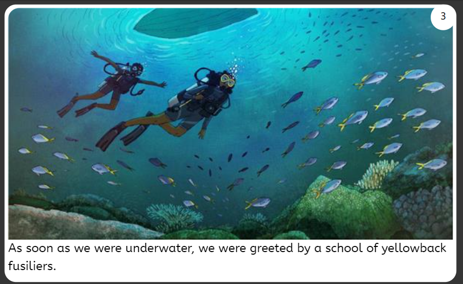
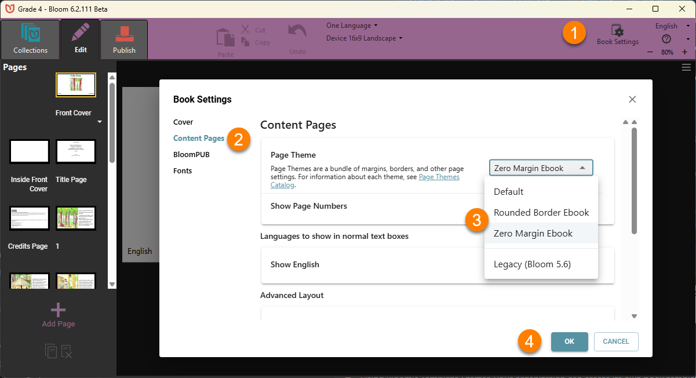
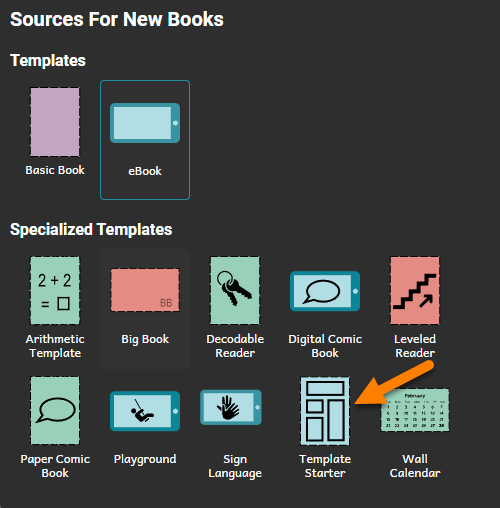
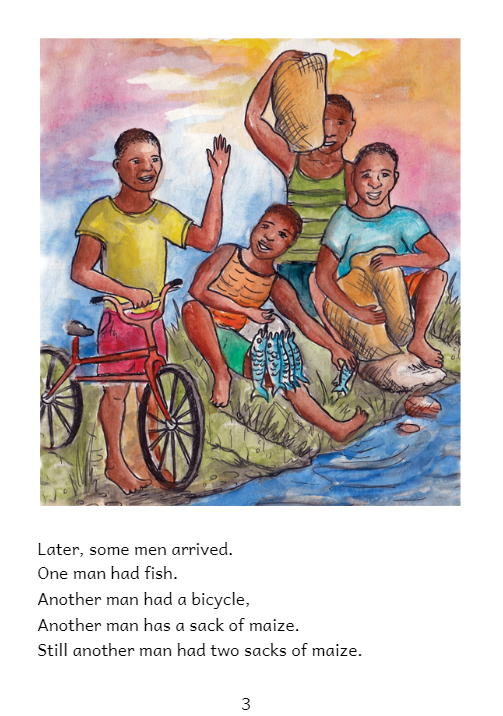

In addition to the custom branding (logos etc.) that will display on places like the front and back cover of your organization’s books, there are additional design characteristics that your organization should think about and decide upon _before_ going too far down the road toward publishing books. 

Here are some features your organization should decide on:

- Preferred book size(s) and layout(s) for each reading level and/or target audience.
- Image size, resolution, and placement for each reading level and/or target audience.
- Font choice and font size for each reading level.
- Paragraph indent, alignment, and spacing.
- Whether to include special features like audio narration and image descriptions.
- How your books will be consumed and distributed. If, for example, your target audience will mostly use the ePUB format, please consult [this article](/ePUB-notes).

The advantage of deciding on the above design characteristics is that your books will then have a consistent “style” to them for each reading level and/or target audience. 

Of course, this style should be tested with your intended audience to ensure your books are the most impactful.

In this article, we will briefly highlight two organizations that have adopted different design characteristics for their books.

# Education for Life {#61413ffc86754103ac248a99068041fd}

Education for Life (EFL) is a team of Bloom fans in Papua New Guinea. To best reach their target audiences, they have focused mainly on digital ‘Talking Books’ to be enjoyed on Android devices using Bloom Reader. Since their books are not designed for print, EFL has set their books to have either no margin or a narrow margin. This allows them to exploit the entire canvas on a page fully:

To achieve a consistent look for their books, EFL designed a number of their very own book templates. Two of EFL’s most popular e-book templates are now available Book Settings:

:::tip

Using Bloom’s **Template Starter**, your organization can create its own book templates to ensure a consistent style:

:::

 

# Little Zebra books {#5d11d49b499549b2a5df94ee41749657}

In contrast to EFL, all Little Zebra books are designed to be printed:

# Review {#0d4f7ee76f04419e9802b218bbdd86f0}

There are no right and wrong ways to format books, but some formats will better serve the goals of your organization than will others. The key questions to ask before beginning to make books in Bloom are:

- Who is my main target audience, and
- How will that target audience access and use these books?
