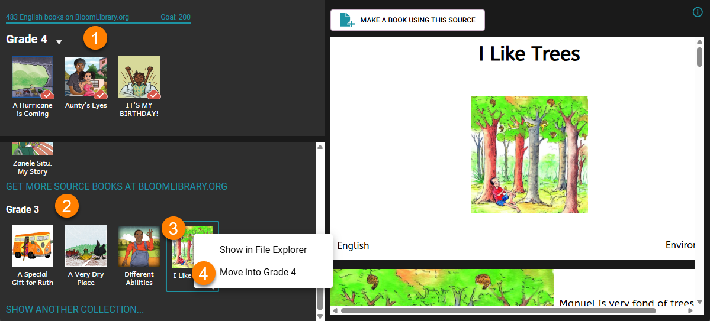

This command moves a book out of one collection and moves it into a different collection. 

For example, a book might be in the collection for “Grade 3” book, and you then decide that this book more properly belongs in the “Grade 4”  book collection.

1. Open the collection you want to move the book into, e.g. the Grade 4 collection.
2. Add the collection where the book currently resides (e.g. the “Grade 3” collection) to the list of collections shown under “Sources for New Book”. To do this, see [Show Another Collection](/show-another-collection).
3. Select the book you wish to move.
4. Right-click on the book and choose “Move into ___”.

:::note

Note: if the book you wish to move in a Team Collection, the book must be Checked Out by you before you move it.

:::

