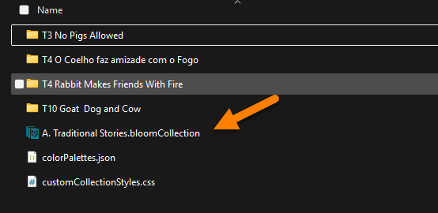
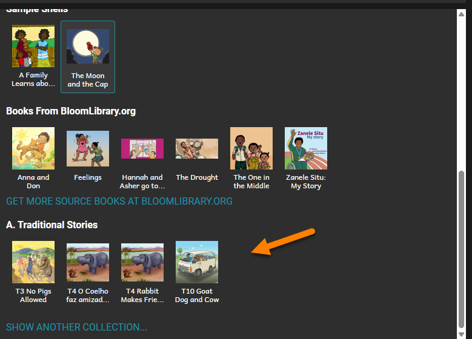

When you have multiple book collections, there are two basic types:

- **Source** collections containing original books.
- **Derivative** collections containing adaptations or translations of the original books in the source collections.

An original book is the “first edition” of the book. (If this book is made available to be translated or adapted, we refer to it as a [shellbook](/shell-books-in-bloom).) 

An **adaptation** of a book is the same story “packaged” differently. For example, you might publish an original A5 version of a story for printing, and an adaptation of this same story in Device16x9 format. See, for example, the “[Cat and Dog](https://bloomlibrary.org/EFL-education-for-life-org/EFL-CatandDog)” series on Bloom Library. 

A **translation** of a book is the same story translated into another language.

:::note

When you make either an adaptation or a translation of a book, Bloom assigns a new unique book ID to the new book. This ensures there is no confusion when the book is published to Bloom Library.  

:::

To make an adaptation of a source book, you need to make the Source collection visible to your Derivative collections. This is done using the **SHOW ANOTHER COLLECTION** command.

1. Navigate your mouse to the bottom left quadrant of the Bloom program.
2. Click the scroll bar and scroll down completely to the bottom.
3. Click on SHOW ANOTHER COLLECTION.

Bloom will open Windows File Explorer to the Bloom folder. There you will find all of your Bloom collections. 

For example:

Now, you must:

1. Open the collection folder you want to become visible.
2. Find the file ending with `.bloomCollection` and click on it.
3. Click Open.

The selected collection will now be available in the lower quadrant of the Bloom editor:

