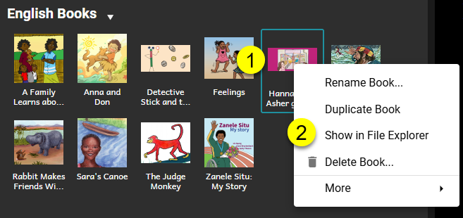

Il y a deux raisons de vouloir partager un livre Bloom avec un collègue :

1. [Partager pour Visionner/(/share-books#2694bb19df12808793f5cc4059dd76e1).
2. [Partager pour Éditer/(/share-books#2694bb19df1280829781c2bc578a3e5c).

# Partager pour Visionner {#2694bb19df12808793f5cc4059dd76e1}

Bloom propose de multiples façons pour partager votre livre avec d'autres personnes à des fins de visualisation ou de lecture.

Voir [Edition](/publish-tab).

# Partager pour Éditer {#2694bb19df1280829781c2bc578a3e5c}

La méthode principale pour collaborer avec des collègues sur les livres Bloom — c.-à-d. le partage de l'édition réelle de ces livres Bloom — est en utilisant la fonctionnalité de Bloom [Collections d'Equipe](/team-collections-intro). Pour cette fonctionnalité il faut un [abonnement Bloom] (/about-bloom-subscriptions).

Si toutefois vous n'avez **pas** d'abonnement à Bloom, vous ne pourrez pas utiliser cette fonctionnalité. Dans ce cas, vous pouvez toujours partager un livre avec un collègue, mais vous devrez le faire « manuellement ».

:::note

Lorsque vous partagez des livres en dehors d'une Collection d'Équipe, vous devrez gérer la propriété du livre au sein de votre équipe d'édition, et savoir quel membre de l'équipe a la dernière copie de chaque livre.

:::

## Qu'est-ce qu'un Livre Bloom ? {#2694bb19df128097aa29ed41ca0e39ce}

Un « Livre Bloom » est en fait une collection de **plusieurs** fichiers placés sous un dossier « livre ». En fait, certains dossiers de livres peuvent contenir des centaines de fichiers individuels. Si vous souhaitez partager un livre Bloom avec une autre personne pour qu'on puisse le modifier, vous devez copier le dossier du livre entier et tout son contenu avec cette personne.

Pour accéder à ce dossier, vous devez :

1. Faites un clic droit sur la vignette du livre.
2. Cliquez sur **Afficher dans l'Explorateur de Fichiers**.

Vous pouvez maintenant copier l'intégralité du dossier du livre et le partager avec votre collègue. Si le dossier livre existe déjà sur l'ordinateur de votre collègue, il doit le remplacer par la nouvelle version plus à jour.

:::note

Rappelez-vous que vous et votre collègue devez suivre qui a la dernière copie de ce livre.  Gardez également à l'esprit que chaque livre de Bloom a un ID de livre unique. Voir ceci [article](/derivatives).

:::

