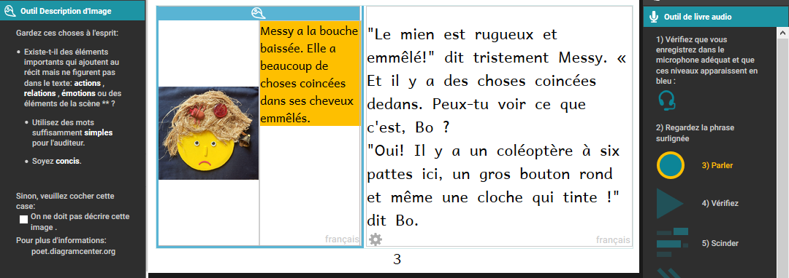

# Création de livres accessibles

Les livres accessibles sont des livres électroniques qui ont des caractéristiques pour rendre leur contenu plus facilement aux personnes ayant une déficience visuelle. Ces caractéristiques comprennent l'enregistrement audio du texte, la description des images et la taille du texte qui peuvent être modifiées par la personne qui lit le livre. Bloom peut vous aider à créer des livres avec ces fonctionnalités et qui répondent aux normes techniques d'accessibilité.

# À quoi s'attendre dans ce module

Dans ce tutoriel, vous apprendrez comment :

- Créer des descriptions d'image,
- Enregistrer l'audio du texte dans le livre et dans les descriptions d'image,
- Évaluer si les images ont besoin d'être ajustées pour une déficience visuelle, et
- Choisir les images qui seront plus faciles à percevoir

---

# Activation de l'outil de description de l'image

Pour accéder à l'outil de description de l'image, cliquez sur l'icône du menu en haut à droite de l'écran. 

La barre d'outils s'ouvrira. Si l’outil de description de l’image n’est pas listé en haut, cliquez sur le bouton « Plus…» en bas de la barre d’outils. 

Ensuite, activez le **Outil de Description de l'Image** en cliquant dans la case à cocher.

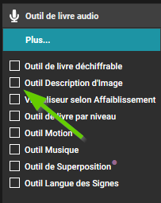

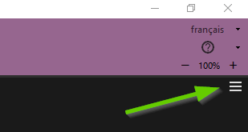

# Créer des descriptions d'image

Maintenant que l'outil de description de l'image est ouvert, un espace sera ouvert à côté de l'image pour ajouter une description de texte. Vous pouvez maintenant taper le texte qui décrit l'image. Si vous n'êtes pas familier avec la façon d'écrire des descriptions d'image, vous pouvez visiter : [poet.diagramcenter.org](http://poet.diagramcenter.org/).

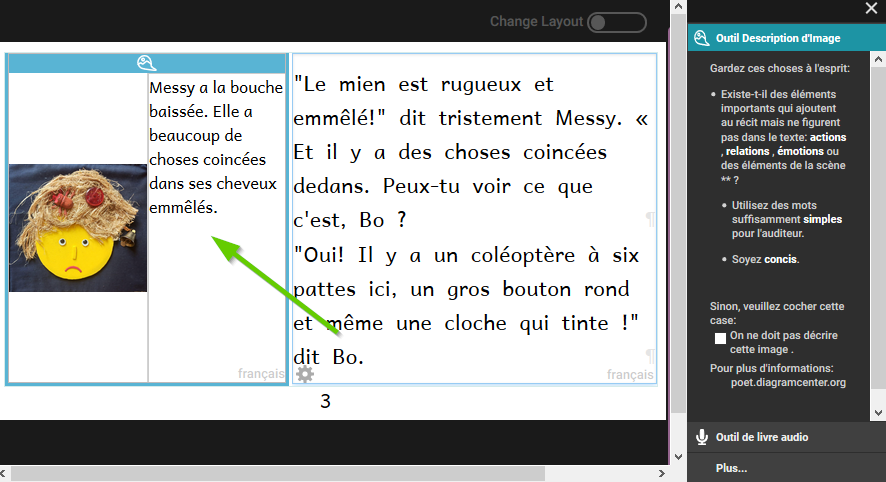

Une fois que vous êtes satisfait de la description de l'image, vous pouvez fermer l'outil de description d'image en cliquant sur X au-dessus de la fenêtre de l'outil de description d'images.

# Enregistrement audio des descriptions de texte et d'image

_Apprendre à utiliser Bloom_ indique comment enregistrer le texte dans un livre. Ces instructions commencent à la page 149. Le processus est le même pour l'enregistrement de l'audio du texte de description de l'image. Pour rendre un livre accessible, vous devez enregistrer tout le texte ainsi que toutes les descriptions d'image. Ici, nous allons vous montrer comment enregistrer les descriptions d'image. Commencez par basculer l'outil actif de l'outil de description d'image vers l'outil de livre parlant.

Si nécessaire, utilisez le bouton Suivant et Retour pour passer d'une zone de texte à l'autre. Si vous enregistrez par phrase, les boutons Suivant et Retour bougeront une phrase à la fois.

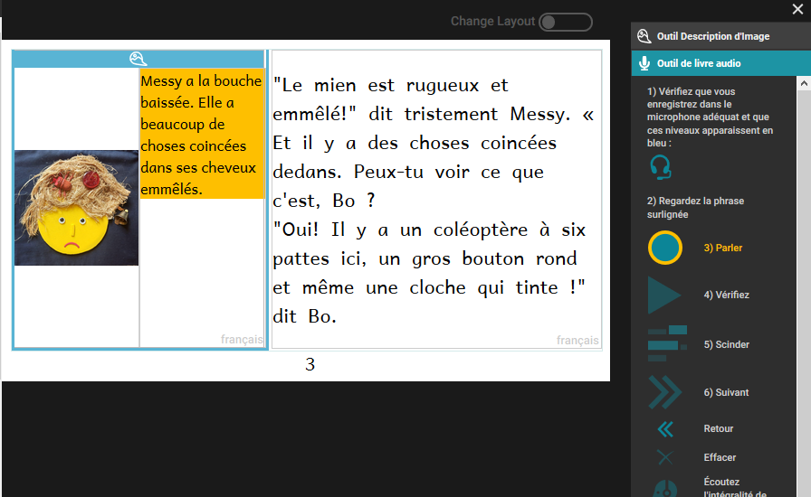

---

# Enregistrement par phrase ou par zone de texte

Bloom vous permet d'enregistrer une phrase à la fois ou d'enregistrer l'ensemble de la zone de texte à la fois. Certains interlocuteurs trouvent que l'enregistrement entier de la zone de texte tout à la fois donnera un meilleur enregistrement. Pour d'autres, il vaut mieux enregistrer une phrase à la fois. 

Vous pouvez expérimenter les deux approches pour déterminer lequel est le mieux adapté à vos besoins.

Certains utilisateurs de Bloom aiment s'enregistrer à l'aide d'autres équipements audio que le microphone de leur ordinateur. Ils transfèrent ensuite ces fichiers audio sur leur ordinateur et les importent dans Bloom. Cet audio importé doit correspondre à une zone de texte entière. 

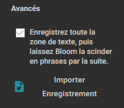

# Enregistrement des descriptions des images par zone de texte

:::tip

Cette section suppose que vous enregistrez votre audio sur votre ordinateur avec le paramètre Avancé « Enregistrez toute la zone de texte ».

:::

Lisez à haute voix le texte surligné plusieurs fois jusqu'à ce que vous soyez familier avec le texte. 

Lorsque vous êtes prêt à enregistrer, cliquez et maintenez enfoncé le bouton **Parlez** et commencez à lire le texte surligné. Pendant que vous enregistrez, le bouton devient jaune. 

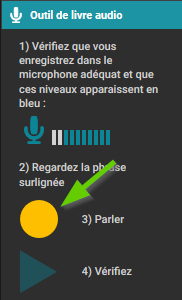

Lorsque vous avez fini de lire, relâchez le bouton **Parlez** et Bloom arrêtera l'enregistrement. Maintenant, cliquez sur le bouton Vérifier pour vérifier votre enregistrement.

# Activation du Visualiseur selon Affaiblissement

Le Visualiseur selon Affaiblissement est un autre outil pour créer des livres accessibles. Activez cet outil en cliquant sur Plus... dans le Panneau d'outils et en sélectionnant Visualiseur selon Affaiblissement. 
Cet outil vous permet de sélectionner plusieurs filtres qui vous montreront à quoi ressemble l'image à une personne ayant plusieurs types différents de déficience visuelle.
Utiliser cet outil, vous pouvez évaluer si une image doit être modifiée de manière à ce qu'il soit plus facile d'interpréter pour les personnes ayant ce genre de déficiences visuelles.
Bloom n'a pas d'outil pour éditer des images. Si une image doit être modifiée, vous devrez utiliser un autre programme pour faire cela.

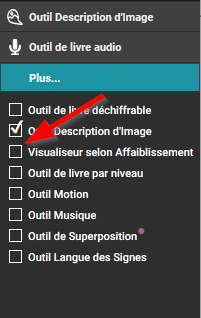

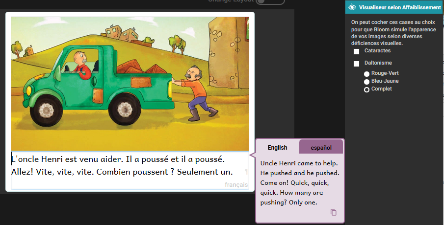

# Activation du Visualiseur selon Affaiblissement

Le premier choix montre à quoi ressemble l'image à quelqu'un avec des cataractes.

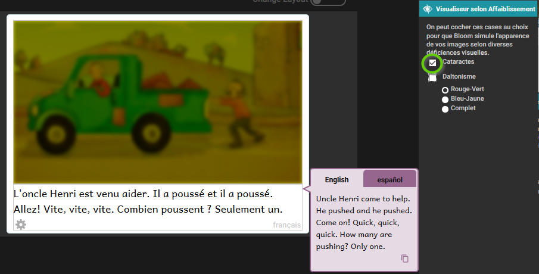

Pour la cécité des couleurs, il y a trois possibilités. Le premier montre à quoi ressemble l'image à quelqu'un qui a une cécité de couleur rouge-verte.

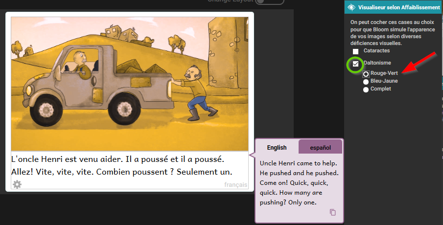

La deuxième option montre à quoi peut ressembler l'image à quelqu'un qui a une cécité bleue-jaune.

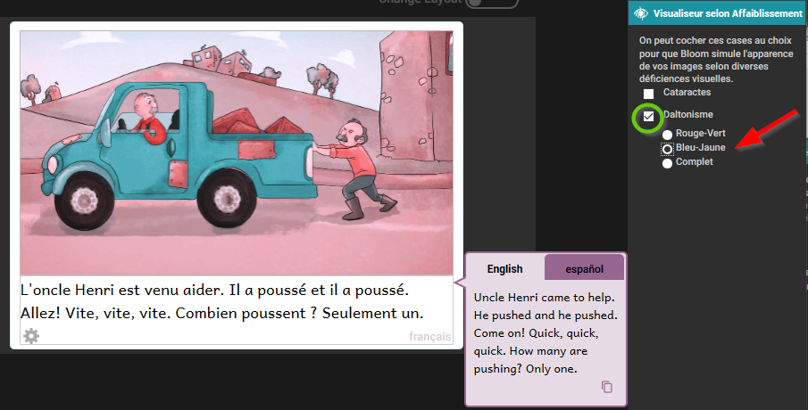

La troisième option montre à quoi peut ressembler l'image à quelqu'un qui a une cécité de couleur complète.

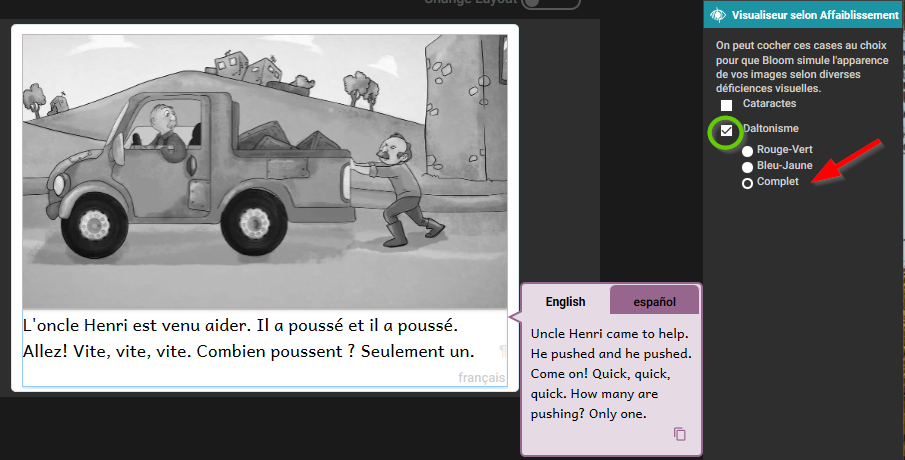

# Considérations générales pour le choix des images

Choisir des images qui sont appropriées pour les lecteurs à faible vision est un sujet complexe, mais nous pouvons considérer certains principes généraux.

- En général, les images simples sont préférables.
- Les graphiques devraient être relativement grands pour les rendre plus faciles à voir.
- Il est utile pour les objets et les fonctionnalités clés d'avoir un contour noir.
- Les dessins en noir et blanc (comme dans la collection "Art of Reading") servent bien, mais même certains ont plus de détails que d'autres.
- Si des couleurs sont utilisées, elles doivent être des couleurs qui contrastent bien les unes avec les autres.
- Dans les dessins au trait, les lignes doivent être épaisses et noires. Utilisez des images en noir et blanc plutôt que en niveaux de gris.
- Les photos ont souvent beaucoup de détails qui peuvent être difficiles à distinguer. Utilisez-les seulement si elles sont simples et pas trop détaillées.

Maintenant, nous allons comparer certaines images pour fournir quelques exemples de ces principes.

# Considérations pour le choix des images : Quantité de détails

Voici quelques exemples d'images avec plus de détails par rapport aux images moins détaillées. Toutes les ces images proviennent de "Art of Reading". Il vaudrait mieux utiliser les images avec moins de détails.

Images avec moins de détails à gauche et plus de détails à droite:

Exemples supplémentaires d'images avec moins de détails à gauche et plus de détails à droite :

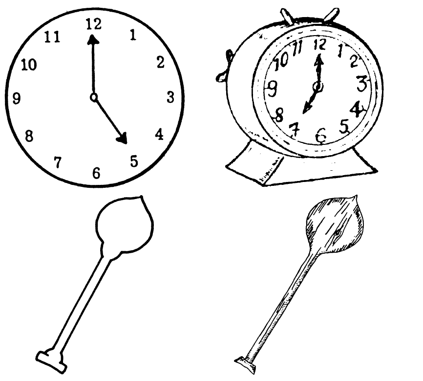

# Considérations pour le choix des images : Épaisses lignes noires

Ces images de "Art of Reading" illustrent des images qui ont des lignes noires épaisses et solides comparées aux images avec des lignes plus fines et moins distinctes. Il vaudrait mieux utiliser des images avec des lignes épaisses, solides. Images avec des lignes plus épaisses et solides à gauche et plus minces lignes moins distinctes à droite :

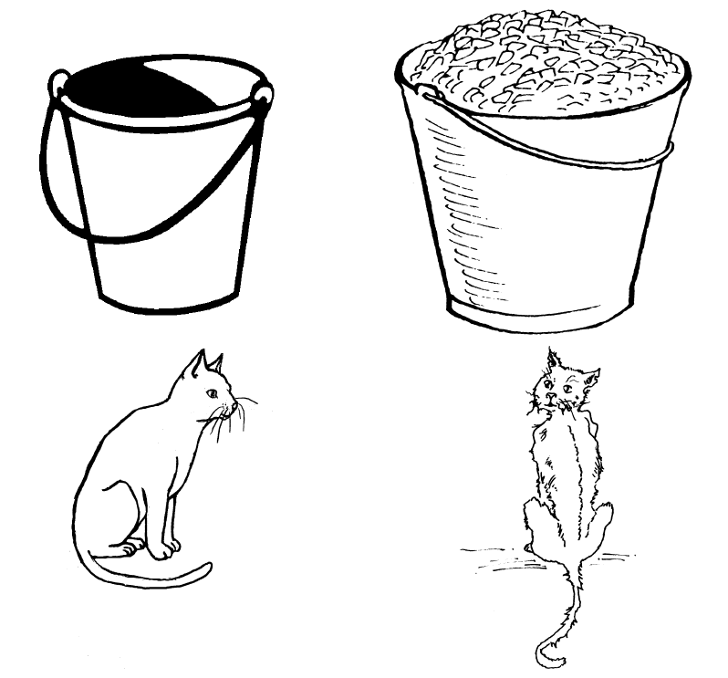

Images supplémentaires avec des lignes plus épaisses et solides à gauche et des lignes plus fines et moins distinctes à droite:

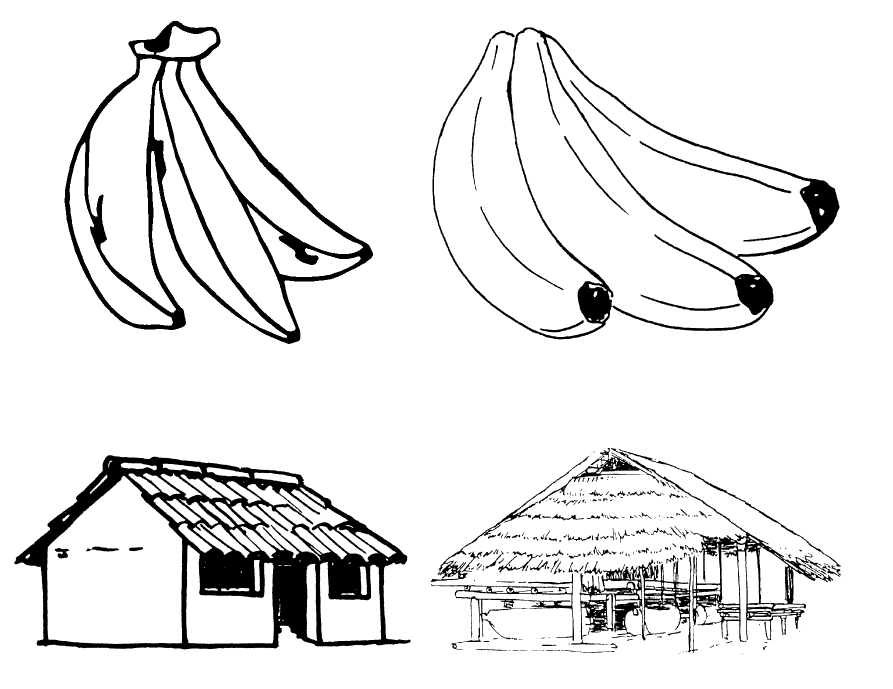

# Considérations pour le choix des images : Couleur et photos

Nous aimons tous les photos et les illustrations en couleur, mais elles sont visuellement plus complexes. Ci-dessous vous pouvez comparer les plans de ligne à une photo ou une illustration de couleur ou une illustration de couleur plus simple à une plus complexe. Il est généralement préférable d'utiliser des images plus simples.

Images plus simples à gauche et plus complexes à droite :

Images supplémentaires plus simples à gauche et plus complexes à droite:

# Résumé

Dans ce module d'entraînement, vous avez appris à :

- Accédez aux outils de livres accessibles dans Bloom,
- Créer des descriptions d'image,
- Enregistrer l'audio du texte dans le livre et dans les descriptions d'image,
- Évaluer si les images ont besoin d'être ajustées pour une déficience visuelle, et
- Choisir les images qui seront plus faciles à percevoir.
