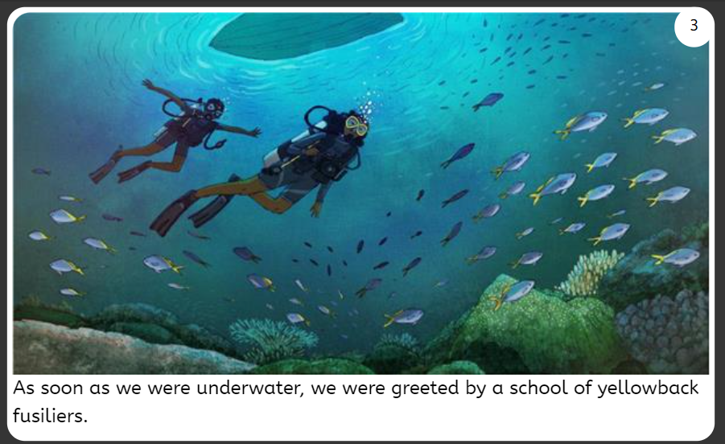
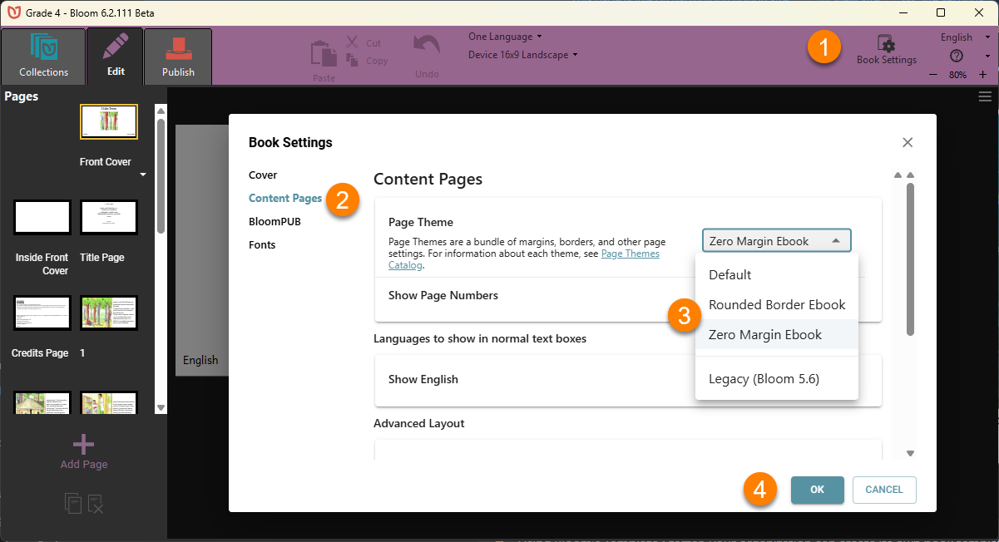
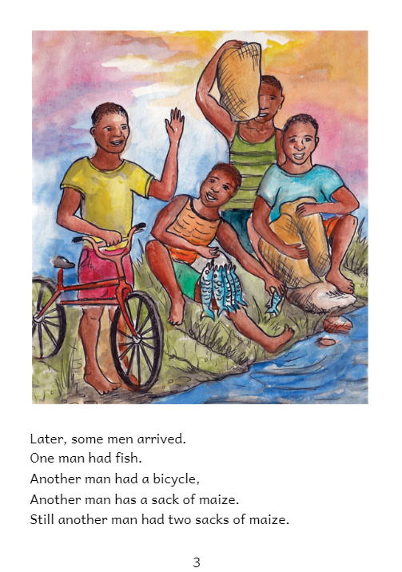

En plus de la marque personnalisée (logos, etc.) qui s'affichera par endroits tels que la couverture avant et arrière des livres de votre organisation il existe des caractéristiques de conception supplémentaires que votre organisation devrait considérer et décider _avant_ de progresser trop loin vers la publication de livres.

Voici quelques fonctionnalités à décider par votre organisation :

- Taille(s) de livre préférée(s) et mise(s) en page pour chaque niveau de lecture et/ou public cible.
- Taille d'image, résolution et placement pour chaque niveau de lecture et/ou public cible.
- Choix de police et taille de police pour chaque niveau de lecture.
- Retrait du paragraphe, alignement et espacement.
- S'il faut inclure des fonctionnalités spéciales telles que la narration audio et les descriptions d'image.
- Comment le public va accéder à vos livres et comment on va assurer leur distribution. Si, par exemple, votre public cible va utiliser principalement le format ePUB, veuillez consulter [cet article] (/ePUB-notes).

Le grand plus en prenant ces décisions par rapport aux caractéristiques de conception ci-dessus est que vos livres auront, par conséquent, un « style » cohérent pour chaque niveau de lecture et/ou le public cible.

Bien sûr, en testant ce style avec le public prévu vous allez pouvoir assurer le plus grand impact pour vos livres.

Dans cet article, nous allons brièvement mettre en évidence deux organisations qui ont adopté des caractéristiques de design différentes pour leurs livres.

# Éducation pour la Vie {#61413ffc86754103ac248a99068041fd}

Education for Life (EFL ou Éducation pour la Vie) est une équipe de fans de Bloom en Papouasie-Nouvelle-Guinée. Pour atteindre au mieux leurs publics cibles, ils se sont concentrés principalement sur les ‘Livres Audio’ numériques à apprécier sur des appareils Android en utilisant Bloom Reader. Puisque leurs livres ne sont pas destinés pour l'impression, EFL a fixé le format de leurs livres ou sans marge ou bien avec une marge étroite. Cela leur permet d'exploiter pleinement la toile entière d'une page :

Afin d'obtenir un look ou style cohérent pour leurs livres, EFL a conçu un certain nombre de leurs propres modèles de livre. Deux des modèles de livres électroniques les plus populaires de EFL sont maintenant disponibles dans les Paramètres du Livre :

:::tip

En utilisant le **Starter de Modèles** de Bloom, votre organisation peut créer ses propres modèles de livres pour assurer un style cohérent :

:::

# Little Zebra books {#5d11d49b499549b2a5df94ee41749657}

Contrairement à EFL, tous les livres de Little Zebra sont conçus pour être imprimés :

# Revoir {#0d4f7ee76f04419e9802b218bbdd86f0}

Il n'y a pas de bonnes et de mauvaises façons de formater les livres, mais certains formats serviront mieux que d'autres les objectifs de votre organisation. Les questions clés à poser avant de commencer à créer des livres dans Bloom sont :

- Qui est mon public cible principal, et
- Comment est-ce que ce public ciblé va accéder à ces livres et les utiliser ?
