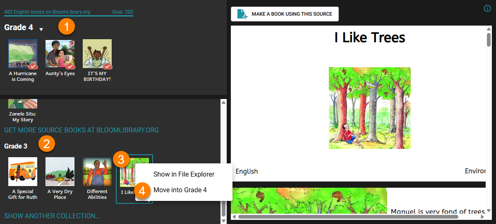

Cette commande prend un livre d'une collection et le déplace dans une autre collection.

Par exemple, un livre pourrait se trouver dans une collection de livrets « 3e année/CE1 » et on décide par la suite qu'il convient mieux à la collection « 4e année/CE2 ».

1. Ouvrez la collection dans laquelle vous voulez déplacer le livre ; par exemple la collection de 4e année/CE2.
2. Ajoutez la collection où se situe le livre actuellement (p. ex. la collection « 3e année/CE1 ») à la liste des collections qui s'affichent sous « Sources pour un Nouveau Livre ». Pour ce faire, voir [Afficher une Autre Collection](/show-another-collection).
3. Sélectionnez le livre que vous souhaitez déplacer.
4. Faites un clic droit sur le livre et choisissez « Déplacer vers ___ ».

