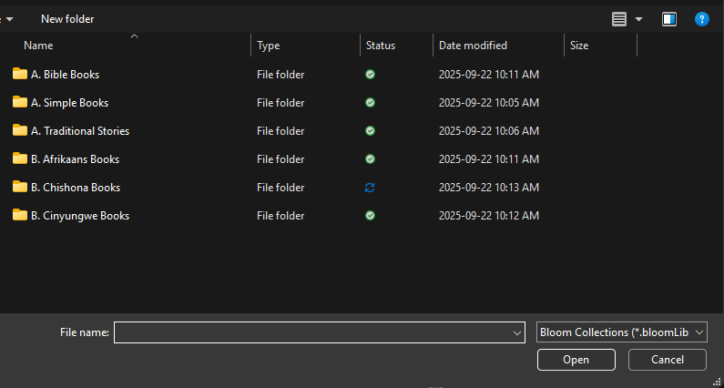
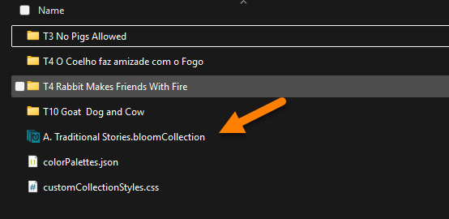
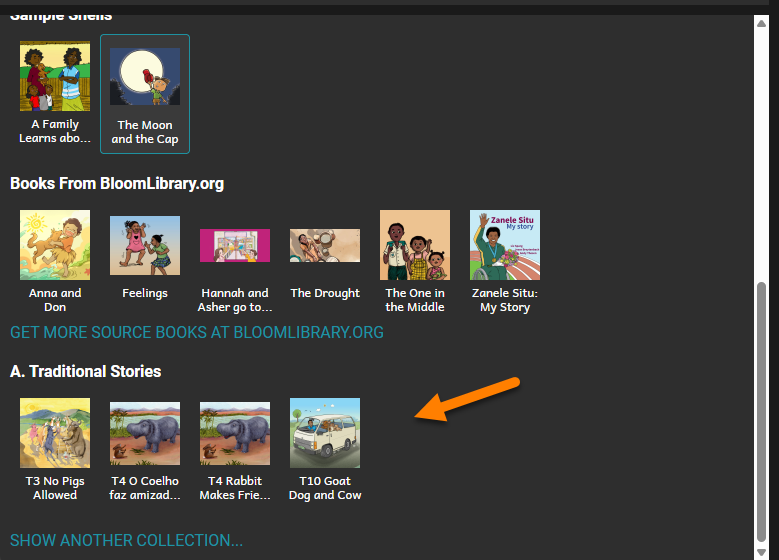

Lorsqu'on a plusieurs collections de livres, il y a deux types de base :

- Collections **Source** contenant des livres originaux.
- Collections **Dérivées** contenant des adaptations ou traductions des livres originaux dans les collections sources.

Un livre original est la « première édition » du livre. (Si on rend ce livre disponible pour la traduction ou adaptation, nous l'appelons [shellbook](/shell-books-in-bloom).)

Une **adaptation** d'un livre est la même histoire avec un « emballage » différent. Par exemple, on pourrait publier pour l'impression une version A5 originale d'une histoire et une adaptation de cette même histoire au format Device16x9. Voir, par exemple, la série « [Cat and Dog](https://bloomlibrary.org/EFL-education-for-life-org/EFL-CatandDog) » dans la bibliothèque Bloom.

Une **traduction** d'un livre est la même histoire traduite dans une autre langue.

:::note

Lorsqu'on réalise une adaptation ou traduction d'un livre, Bloom donne un nouvel identifiant unique au nouveau livre. Cela évite toute possibilité de confusion lors de la publication du livre dans la bibliothèque Bloom.

:::

Pour créer l'adaptation d'un livre source, on doit rendre la collection Source visible à vos collections dérivées. On fait cela en employant la commande **SHOW ANOTHER COLLECTION**.

1. Déplacez la souris vers le quadrant inférieur gauche du programme Bloom.
2. Cliquez sur la barre de défilement et descendez tout en bas.
3. Cliquez sur AFFICHER UNE AUTRE COLLECTION.

Bloom va ouvrir l'Explorateur de Fichiers Windows dans le dossier Bloom. Vous y trouverez toutes vos collections Bloom.

For example:

Maintenant, il faut :

1. Ouvrir le dossier de collection que vous souhaitez rendre visible.
2. Repérer le fichier se terminant par `.bloomCollection` et cliquer dessus.
3. Cliquer sur Ouvrir.

La collection sélectionnée sera maintenant disponible dans le quadrant inférieur de l'éditeur Bloom :

